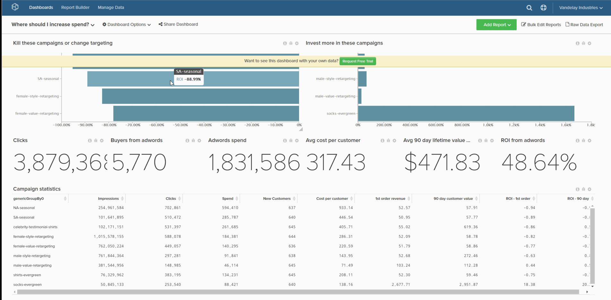

# ダッシュボードの削除

ダッシュボードリストが散乱しすぎないようにしたい場合は、不要になったダッシュボードを削除できます。 これは、次の 2 つの方法のいずれかで実行できます。

1. [を使用 `Account Settings` ページ](#account)  — このメソッドにはが必要です [管理者権限](../../administrator/user-management/user-management.md).

1. [を使用 `Dashboard Options` メニュー](#do) ：このメソッドを使用するには、ダッシュボードを所有しているか、編集権限が必要です。

## でダッシュボードを削除 `Account Settings` ページ {#account}

1. クリック **[!UICONTROL Account Settings** > **Dashboards]**.

1. ダッシュボードのリストで、削除するダッシュボードをクリックします。

1. クリック **[!UICONTROL Delete Dashboard]**.

例：

<!--{: width="703" height="346"}-->

## でダッシュボードを削除 `Dashboard Options` メニュー {#do}

1. 次をクリック： **[!UICONTROL Dashboard Options]** メニューを使用して、製品内で利用できます。

1. ドロップダウンで、 **[!UICONTROL Delete]**.

1. 確認するメッセージが表示されたら、「 **[!UICONTROL Delete]**.

例：

<!--{: width="703" height="347"}-->
