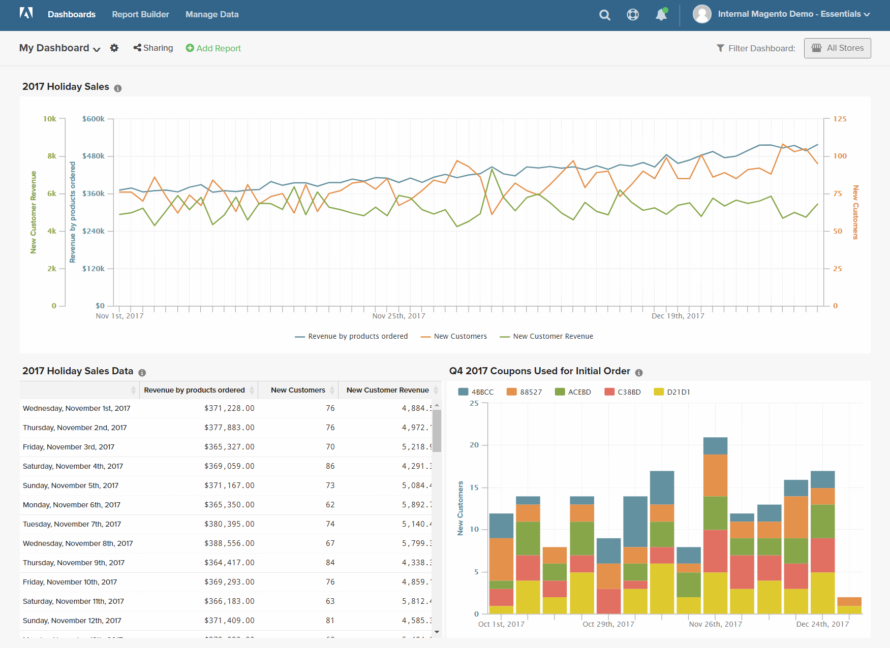
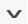
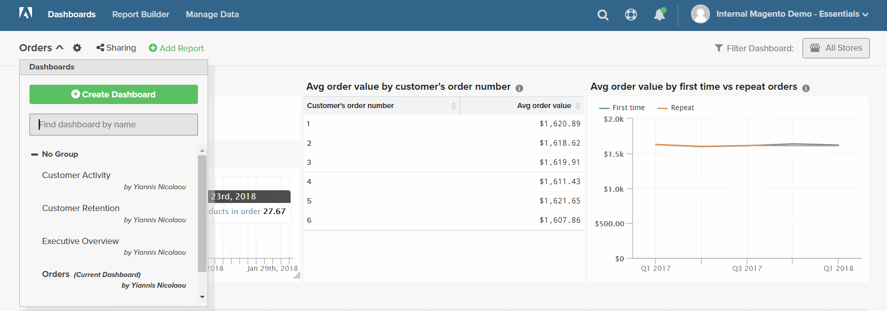
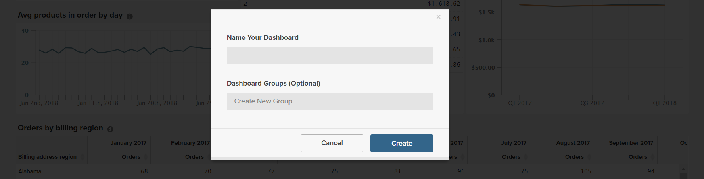
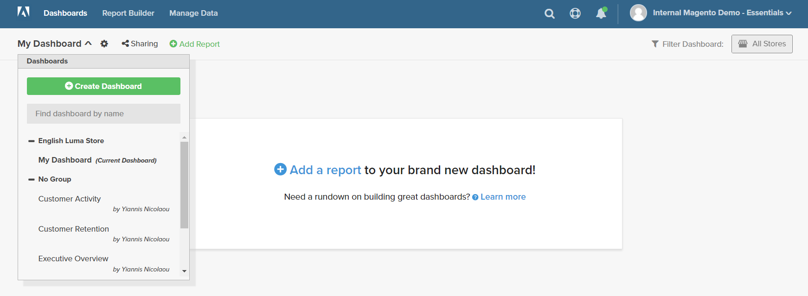
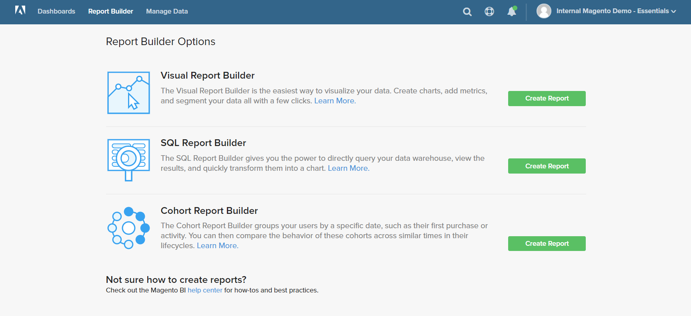
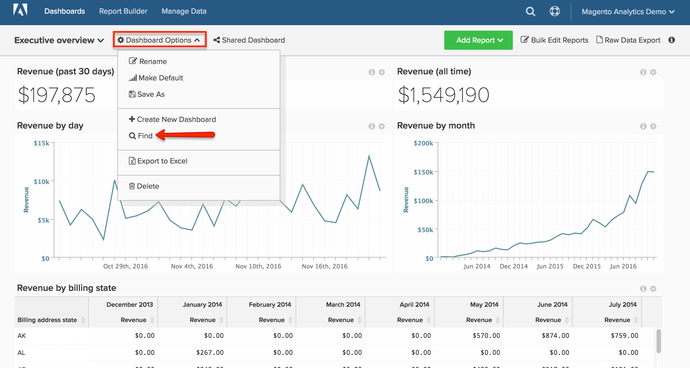

# ダッシュボード

[!DNL Adobe Commerce Intelligence] ダッシュボードでは、ストアのパフォーマンスと販売活動を一目で素早く確認できます。 個々のダッシュボードは、ほかのユーザーと共有し、論理グループに整理することができます。 他のユーザーに対して異なるレベルの権限を設定することもできます。

レポートを作成し、ダッシュボードに追加し、データをExcelにエクスポートするのは簡単です。 チャートやレポートは、ダッシュボード上の位置にサイズ変更したりドラッグしたりできます。

## ダッシュボードの作成 {#createdash}

ダッシュボードは、レポートビルダーで作成した分析用のテーマ別のバケットとして共有できます。 これにより、チームのコラボレーションを促進し、組織全体の信頼できる唯一の情報源を維持できます。

*管理者または標準ユーザー*&#x200B;の場合は、`Dashboard Options` ドロップダウンをクリックして「`Create New dashboard`」を選択すると、ダッシュボードを作成できます。

作成するダッシュボードの外観は完全に自分で決めることができます。 ダッシュボードの要素は、ニーズやワークフローに合わせて、任意の方法で配置したりサイズを変更したりできます。

### ダッシュボードの作成

1. メニューで、**[!UICONTROL Dashboards]**&#x200B;をクリックします。

1. デフォルトのダッシュボードの名前は、ダッシュボードヘッダーの左上隅に表示されます。 下向き矢印（）をクリックして、使用可能なオプションを表示します。

   

1. **[!UICONTROL Create Dashboard]**&#x200B;をクリックします。 次に、次の操作を行います。

   * ダッシュボードの`Name`を入力します。

   * ダッシュボードの`Group`を作成するには、グループの名前を入力します。

     例えば、Commerceのインストールに複数のストアビューがある場合は、各ストアビューにグループを作成できます。

   * **[!UICONTROL Create]**&#x200B;をクリックします。

   

   * 新しいダッシュボードの名前が左上隅に表示されます。 下向き矢印（）をクリックして、オプションを表示します。 グループを作成した場合、新しいダッシュボードがリストのグループの下に表示されます。

### レポートを追加

1. レポートを追加するには、次のいずれかの操作を行います。

   * ページの&#x200B;**[!UICONTROL Add a report]** プロンプトをクリックします。

   * ダッシュボードヘッダーで、**[!UICONTROL Add Report]**&#x200B;をクリックします。

     

1. **[!UICONTROL Create Report]**&#x200B;をクリックして&#x200B;**[!UICONTROL Report Builder Options]**&#x200B;を表示します。

   

## ダッシュボード上のアイテムの配置

* グラフまたはレポートのサイズを変更するには、右下隅を新しいサイズにドラッグします。

* グラフまたはレポートを移動するには、カーソルが十字に変わるまで、タイトルまたはヘッダーにカーソルを合わせます。 次に、位置にドラッグします。

## ダッシュボードの管理 {#managedash}

**[!DNL Manage Data** > **Dashboards]**&#x200B;では、所有しているダッシュボードのユーザー権限を管理したり、不要になったダッシュボードを削除したり、デフォルトのダッシュボードを設定したりできます。

### ダッシュボードの共有 {#sharingdash}

組織全体で[!DNL Commerce Intelligence]を真に拡大し、貴重なインサイトを提供するために、Adobeでは、作成したダッシュボードを他のチームメンバーと共有することを推奨しています。 *ページの上部にある「*」オプションをクリックすると、所有しているダッシュボードを`Share Dashboard`と共有できます。

ダッシュボードを共有する場合、組織全体または個人ごとに権限を割り当てることができます。つまり、レポートを表示および編集できるユーザーを決定できます。

>[!NOTE]
>
>`Read-Only`人のユーザーは、直接共有されたダッシュボードにのみアクセスできます。ダッシュボードを自分で検索して追加することはできません。 ループに入れるのを忘れないでください！

### 共有ダッシュボードへのアクセス {#accessshared}

*管理者または標準ユーザー*&#x200B;で、アカウントに共有ダッシュボードを追加する場合は、**[!UICONTROL Dashboard Options]**&#x200B;をクリックし、ドロップダウンで&#x200B;**[!UICONTROL Find]**&#x200B;をクリックします。

<!--{: width="1000" height="535"}-->

### ダッシュボード設定の管理

1. メニューで、**[!DNL Manage Data** > **Dashboards]**&#x200B;をクリックします。

1. 該当する場合は、新しい`Dashboard Name`を入力します。

1. ダッシュボードを特定の`Dashboard Group`に割り当てるには、グループのリストから選択します。

   **`Permissions`**

   すべてのユーザーにダッシュボードへの同じレベルのアクセス権を付与するには、次の操作を行います。

   1. **`Shared with`**&#x200B;で、次のいずれかのオプションを選択します。

      * `View`
      * `Edit`
      * `None`

   1. 確認を求められたら、**[!UICONTROL OK]**&#x200B;をクリックして、各ユーザーの権限レベルを更新します。

   1. 個人の権限レベルを変更するには、リスト内のユーザーが権限レベルを変更します。 変更は自動的に保存されます。

   **`Default`**

   1. このダッシュボードを[!DNL Commerce Intelligence] アカウントのデフォルトにするには、**[!UICONTROL Make Default]**&#x200B;をクリックします。

   **`Remove`**

   1. ダッシュボードを削除するには、**[!UICONTROL Delete Dashboard]**&#x200B;をクリックします。
