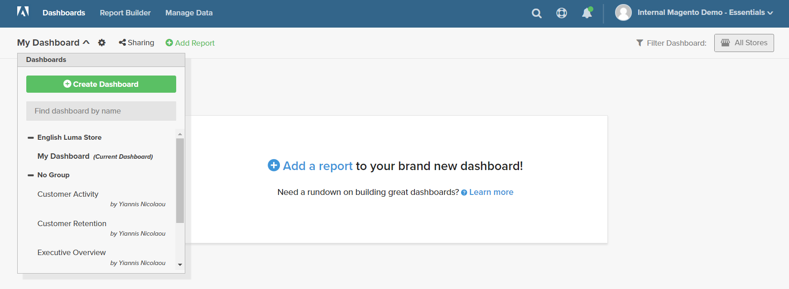
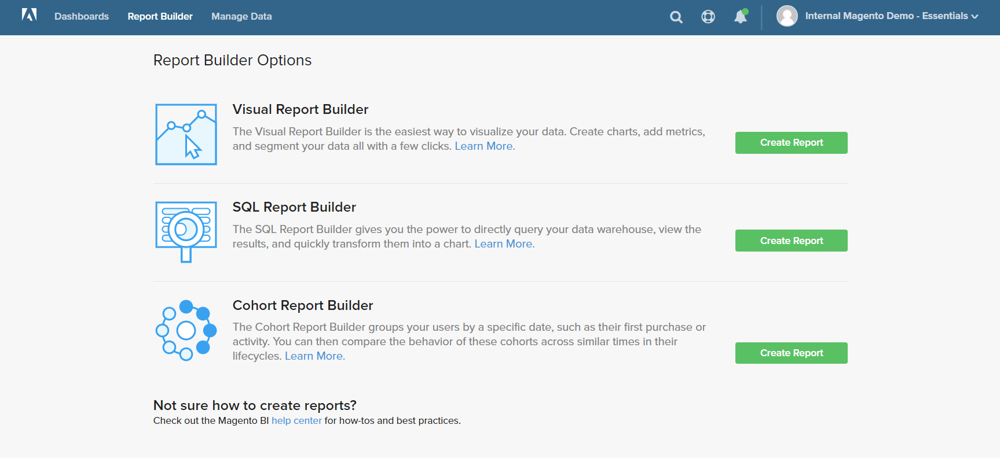

# ダッシュボード

[!DNL Adobe Commerce Intelligence] ダッシュボードを使用すると、ストアのパフォーマンスと販売アクティビティを一目で確認できます。 個々のダッシュボードは、他のユーザーと共有し、論理グループに整理できます。 他のユーザーに対して異なるレベルの権限を設定することもできます。

レポートを簡単に作成してダッシュボードに追加し、データを Excel にエクスポートできます。 グラフとレポートは、サイズを変更したり、ダッシュボード上の位置にドラッグしたりできます。

## ダッシュボードの作成 {#createdash}

ダッシュボードは、Report Builder で作成する分析に対して共有可能な、テーマを設定したバケットです。 これにより、チームに対して、組織全体で単一の情報源の共同作業と維持を促すことができます。

*管理者または標準ユーザーの場合*、ダッシュボードのドロップダウンをクリックして `Dashboard Options` を選択することで、ダッシュボ `Create New dashboard` ドを作成できます。

作成するダッシュボードの外観は、完全にユーザー次第です。 ダッシュボード内の要素は、ニーズやワークフローに合わせて自由に配置およびサイズ変更できます。

### ダッシュボードの作成

1. メニューで「**[!UICONTROL Dashboards]**」をクリックします。

1. デフォルトのダッシュボードの名前は、ダッシュボードヘッダーの左上隅に表示されます。 下向き矢印（）をクリックして、使用可能なオプションを表示します。

   

1. 「**[!UICONTROL Create Dashboard]**」をクリックします。 次に、以下の手順を実行します。

   * ダッシュボードの `Name` を入力します。

   * ダッシュボードの `Group` を作成するには、グループの名前を入力します。

     例えば、Commerceのインストール環境に複数のストア表示がある場合、ストア表示ごとにグループを作成できます。

   * 「**[!UICONTROL Create]**」をクリックします。

   

   * 新しいダッシュボードの名前が左上隅に表示されます。 下向き矢印（）をクリックして、オプションを表示します。 グループを作成すると、新しいダッシュボードがリストのグループの下に表示されます。

### レポートを追加

1. レポートを追加するには、次のいずれかの操作を行います。

   * ページの **[!UICONTROL Add a report]** プロンプトをクリックします。

   * ダッシュボードのヘッダーで、「**[!UICONTROL Add Report]**」をクリックします。

     

1. 「**[!UICONTROL Create Report]**」をクリックして **[!UICONTROL Report Builder Options]** を表示します。

   

## ダッシュボード上のアイテムの配置

* グラフまたはレポートのサイズを変更するには、右下隅を新しいサイズにドラッグします。

* グラフやレポートを移動するには、カーソルが十字型に変わるまで、タイトルまたはヘッダーにカーソルを合わせます。 次に、適切な位置にドラッグします。

## ダッシュボードの管理 {#managedash}

**[!DNL Manage Data** > **Dashboards]** では、所有しているダッシュボードのユーザー権限の管理、不要になったダッシュボードの削除、デフォルトのダッシュボードの設定を行うことができます。

### ダッシュボードの共有 {#sharingdash}

組織全体で [!DNL Commerce Intelligence] を真に拡大し、貴重なインサイトを提供するために、Adobeでは、作成したダッシュボードを他のチームメンバーと共有することをお勧めします。 *所有しているダッシュボードを共有するには* ページ上部の「`Share Dashboard`」オプションをクリックします。

ダッシュボードを共有する際に、組織全体または個々に権限を割り当てることができます。つまり、誰がレポートを表示および編集できるかを決定できます。

>[!NOTE]
>
>`Read-Only` ユーザーは、直接共有されているダッシュボードにのみアクセスできます。自分でダッシュボードを検索して追加することはできません。 それらをループに保つことを忘れないでください！

### 共有ダッシュボードへのアクセス {#accessshared}

*管理者または標準ユーザーで* アカウントに共有ダッシュボードを追加する場合は、「**[!UICONTROL Dashboard Options]**」をクリックし、ドロップダウンで「**[!UICONTROL Find]**」をクリックします。

<!--{: width="1000" height="535"}-->

### ダッシュボード設定の管理

1. メニューで「**[!DNL Manage Data** > **Dashboards]**」をクリックします。

1. 必要に応じて、新しい `Dashboard Name` を入力します。

1. ダッシュボードを特定の `Dashboard Group` ーザーに割り当てるには、グループのリストから選択します。

   **`Permissions`**

   すべてのユーザーにダッシュボードに対する同じレベルのアクセス権を付与するには、次の操作を行います。

   1. 「**`Shared with`**」で、次のいずれかのオプションを選択します。

      * `View`
      * `Edit`
      * `None`

   1. 確認を求めるメッセージが表示されたら、「**[!UICONTROL OK]**」をクリックして、各ユーザーの権限レベルを更新します。

   1. 個人の権限レベルを変更するには、リストでユーザーを探して、権限レベルを変更します。 変更内容は自動的に保存されます。

   **`Default`**

   1. このダッシュボードを [!DNL Commerce Intelligence] アカウントの既定にするには、[**[!UICONTROL Make Default]**] をクリックします。

   **`Remove`**

   1. ダッシュボードを削除するには、「削 **[!UICONTROL Delete Dashboard]**」をクリックします。
