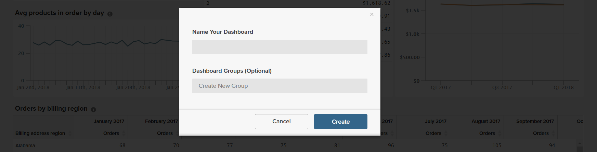

# ダッシュボード

[!DNL Adobe Commerce Intelligence] ダッシュボードを使用すると、ストアのパフォーマンスと販売アクティビティを一目で確認できます。 個々のダッシュボードは、他のユーザーと共有し、論理グループに整理できます。 他のユーザーに対して異なるレベルの権限を設定することもできます。

レポートを簡単に作成してダッシュボードに追加し、データを Excel にエクスポートできます。 グラフとレポートは、サイズを変更したり、ダッシュボード上の位置にドラッグしたりできます。

## ダッシュボードの作成 {#createdash}

ダッシュボードは、Report Builderで作成する分析に対して共有可能な、テーマを設定したバケットです。 これにより、チームに対して、組織全体で単一の情報源の共同作業と維持を促すことができます。

*管理者または Standard ユーザーの場合*&#x200B;をクリックし、 `Dashboard Options` ドロップダウンと選択 `Create New dashboard`.

作成するダッシュボードの外観は、完全にユーザー次第です。 ダッシュボード内の要素は、ニーズやワークフローに合わせて自由に配置およびサイズ変更できます。

### ダッシュボードの作成

1. メニューで、 **[!UICONTROL Dashboards]**.

1. デフォルトのダッシュボードの名前は、ダッシュボードヘッダーの左上隅に表示されます。 下矢印をクリックします（）を選択して、使用可能なオプションを表示します。

   

1. クリック **[!UICONTROL Create Dashboard]**. 次に、以下の手順を実行します。

   * を入力 `Name` （ダッシュボードの場合）

   * を作成するには `Group` ダッシュボードに、グループの名前を入力します。

     例えば、Commerceのインストール環境に複数のストア表示がある場合、ストア表示ごとにグループを作成できます。

   * クリック **[!UICONTROL Create]**.

   

   * 新しいダッシュボードの名前が左上隅に表示されます。 下矢印をクリックします（）を選択して、オプションを表示します。 グループを作成すると、新しいダッシュボードがリストのグループの下に表示されます。

### レポートを追加

1. レポートを追加するには、次のいずれかの操作を行います。

   * 「」をクリックします **[!UICONTROL Add a report]** ページでプロンプトを表示します。

   * ダッシュボードのヘッダーで、 **[!UICONTROL Add Report]**.

     

1. クリック **[!UICONTROL Create Report]** を表示する **[!UICONTROL Report Builder Options]**.

   

## ダッシュボード上のアイテムの配置

* グラフまたはレポートのサイズを変更するには、右下隅を新しいサイズにドラッグします。

* グラフやレポートを移動するには、カーソルが十字型に変わるまで、タイトルまたはヘッダーにカーソルを合わせます。 次に、適切な位置にドラッグします。

## ダッシュボードの管理 {#managedash}

対象： **[!DNL Manage Data** > **Dashboards]**&#x200B;を使用すると、所有するダッシュボードのユーザー権限を管理したり、不要になったダッシュボードを削除したり、デフォルトのダッシュボードを設定したりできます。

### ダッシュボードの共有 {#sharingdash}

真にスケーリングするには [!DNL Commerce Intelligence] Adobeでは、組織全体を通して貴重なインサイトを提供し、作成したダッシュボードを他のチームメンバーと共有することをお勧めします。 *所有しているダッシュボードを共有できます* をクリックする `Share Dashboard` ページ上部の「」オプション。

ダッシュボードを共有する際に、組織全体または個々に権限を割り当てることができます。つまり、誰がレポートを表示および編集できるかを決定できます。

>[!NOTE]
>
>`Read-Only` ユーザーは、直接共有されているダッシュボードにのみアクセスできます。自分でダッシュボードを検索して追加することはできません。 それらをループに保つことを忘れないでください！

### 共有ダッシュボードへのアクセス {#accessshared}

*管理者または Standard ユーザーの場合* 共有ダッシュボードをアカウントに追加するには、 **[!UICONTROL Dashboard Options]** をクリックし、 **[!UICONTROL Find]** ドロップダウンで選択します。

<!--{: width="1000" height="535"}-->

### ダッシュボード設定の管理

1. メニューで、 **[!DNL Manage Data** > **Dashboards]**.

1. 必要に応じて、新しい `Dashboard Name`.

1. ダッシュボードを特定のに割り当てるには `Dashboard Group`グループのリストから選択します。

   **`Permissions`**

   すべてのユーザーにダッシュボードに対する同じレベルのアクセス権を付与するには、次の操作を行います。

   1. 次の下 **`Shared with`**&#x200B;次のいずれかのオプションを選択します。

      * `View`
      * `Edit`
      * `None`

   1. 確認を求められたら、 **[!UICONTROL OK]** 各ユーザーの権限レベルを更新する

   1. 個人の権限レベルを変更するには、リストでユーザーを探して、権限レベルを変更します。 変更内容は自動的に保存されます。

   **`Default`**

   1. このダッシュボードをユーザーの既定にするには [!DNL Commerce Intelligence] アカウント、クリック **[!UICONTROL Make Default]**.

   **`Remove`**

   1. ダッシュボードを削除するには、 **[!UICONTROL Delete Dashboard]**.
