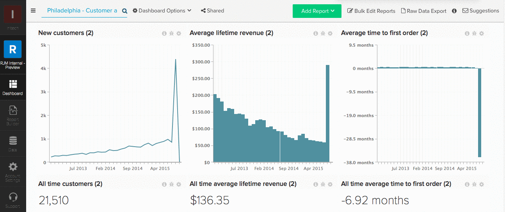

# ダッシュボードを残す（共有解除）

チームを変更しますか？ 春の真ん中にあなたの [!DNL Commerce Intelligence] のアカウントをクリーニング？ ダッシュボードから自分を離れたり、共有を解除したりするには、ダッシュボードから離れたい状態で、画面の上部にある「**[!UICONTROL Shared]**」をクリックします。 **[!UICONTROL Leave this Dashboard]** をクリックして自分を削除します。

例：

