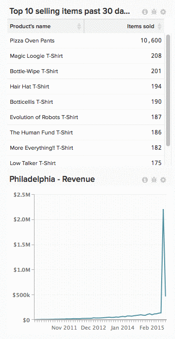

# ダッシュボードからグラフを削除する

ダッシュボードからグラフを削除するには、歯車アイコン () アイコンをクリックし、 **[!UICONTROL Remove from Dashboard]**.

>[!NOTE]
>
>グラフの削除は、 [削除](../../data-user/dashboards/delete-chart.md). また、 [グラフはダッシュボードに読み取ることができます](../../data-user/dashboards/add-charts-dashboard.md) いつでも

