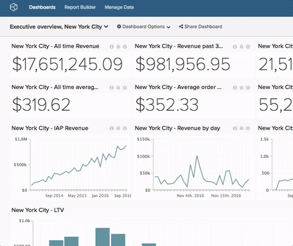

# ダッシュボードからのグラフの削除

>[!NOTE]
>
>が必要 [Admin](../../administrator/user-management/user-management.md) または `Standard` これらの機能を実行するための権限。 次の場合： `Standard` ユーザー（も必要） `Edit` ダッシュボードに対する権限。

名前が合わなくなる場合もあります。 ダッシュボードの名前の変更は、すばやく簡単に行えます。

1. ダッシュボードで、 **[!UICONTROL Dashboard Options]** の横にある画面上部のメニュー `Global Search` メニュー。

1. クリック **[!UICONTROL Rename]** ドロップダウンで選択します。

1. プロンプトが表示されたら、ダッシュボードの新しい名前を入力します。

1. クリック **[!UICONTROL Save Changes]**.

例：

