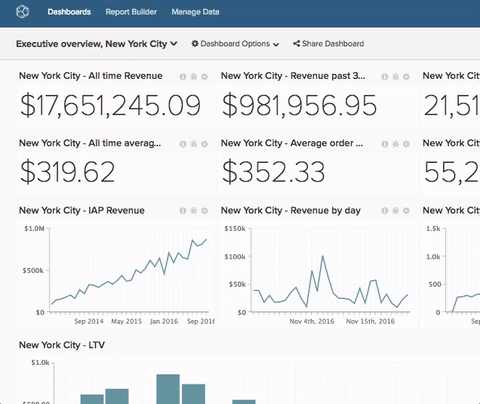

# ダッシュボードからのグラフの削除

>[!NOTE]
>
>これらの機能を実行するには、[&#x200B; 管理者 &#x200B;](../../administrator/user-management/user-management.md) 権限または `Standard` 権限が必要です。 `Standard` ユーザーの場合は、ダッシュボードに対する `Edit` 権限も必要です。

名前が合わなくなる場合もあります。 ダッシュボードの名前の変更は、すばやく簡単に行えます。

1. ダッシュボードで、画面の上部にある **[!UICONTROL Dashboard Options]** メニュー（`Global Search` メニューの横）をクリックします。

1. ドロップダウンで「**[!UICONTROL Rename]**」をクリックします。

1. プロンプトが表示されたら、ダッシュボードの新しい名前を入力します。

1. 「**[!UICONTROL Save Changes]**」をクリックします。

例：

