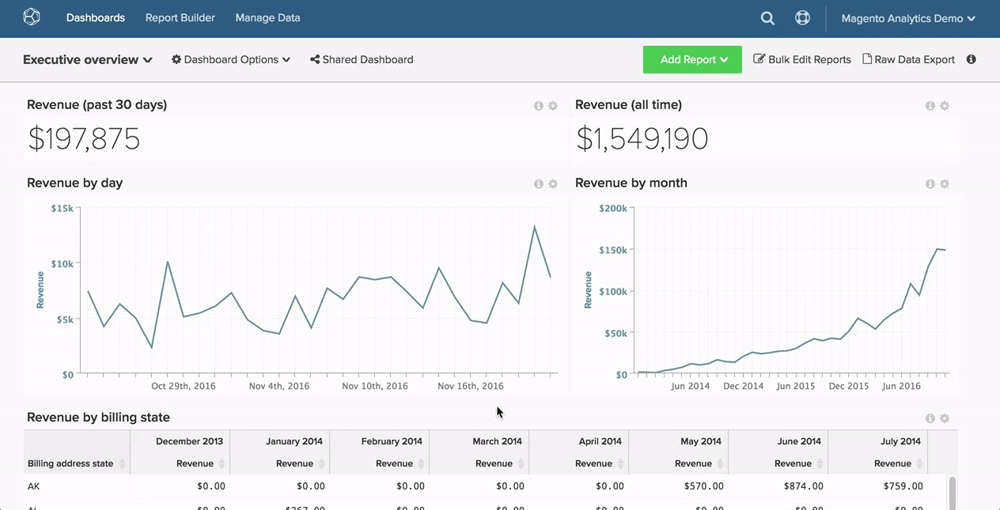

# ダッシュボードの検索

このトピックでは、[[!DNL Global Search] 機能](#global)を使用してダッシュボードを検索する方法と、他のユーザー[が所有する](#other) ダッシュボードを検索する方法について説明します。

## グローバル検索 {#global}

[!DNL Global Search] メニューでは、表示するダッシュボードを検索して選択できます。

* *既存のダッシュボードのリストを表示するには*、ダッシュボードをクリックします。

* *ダッシュボードを検索するには、ダッシュボードのドロップダウンをクリックした後、検索バーに検索条件を入力します。* 条件に一致するダッシュボードがある場合は、リストの最初に表示されます。

例：

## 他のユーザーが所有するダッシュボードを検索 {#other}

別のユーザーが所有するダッシュボードをお探しですか？ ダッシュボードを他のユーザーが表示できる場合は、**[!UICONTROL Find]** ドロップダウンの「`Dashboard Options`」をクリックして検索できます。

