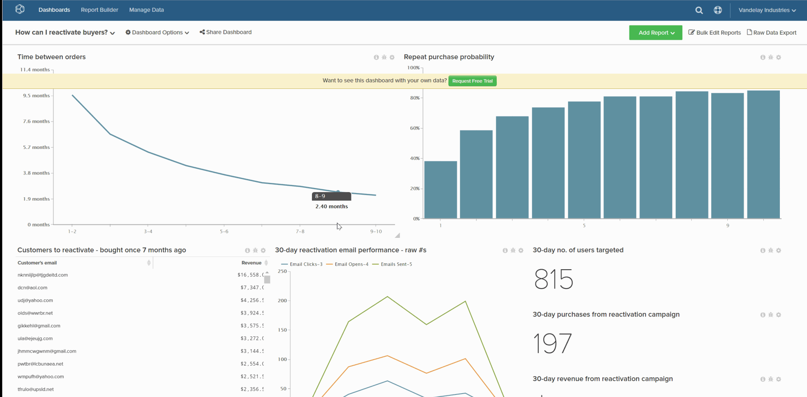

# デフォルトのダッシュボードを設定

デフォルトのダッシュボードは、[!DNL Commerce Intelligence] を開いたときに最初に表示されるダッシュボードです。

1. ダッシュボードで、画面 **[!UICONTROL Dashboard Options]** 上部にある「」をクリックします。

1. ドロップダウンで「**[!UICONTROL Make Default]**」をクリックします。

1. 確認プロンプトが表示されたら、「**[!UICONTROL Yes]**」をクリックしてデフォルトのダッシュボードを変更します。

これが新しいデフォルトダッシュボードになります。

例：

