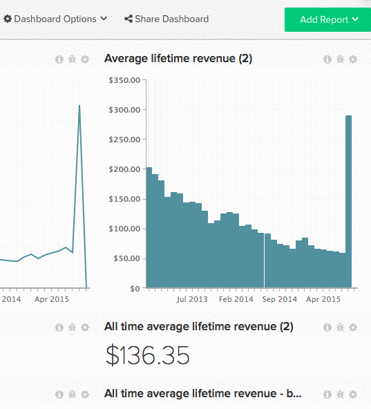

# ダッシュボードを他のユーザーと共有する

ダッシュボードの共有は、チームの動向を常に把握し、協力的な議論を促進する優れた方法です。 一元化されたダッシュボードを作成して共有することで、チームの統制を維持しながら、必要な情報を提供できます。 [[!DNL Adobe] は、誤った変更を最小限に抑えるために、](../../best-practices/share-dashboard-best-practice.md){: target="_blank"}の権限を一部のユーザーに付与することを`Edit`に推奨します。

>[!NOTE]
>
>共有しているダッシュボードに、特定のユーザーがアクセスできない指標で構築されたレポートが含まれている場合、レポートには`Error Loading Data` メッセージが表示されます。 特定のユーザーにデータを表示するには、[管理者ユーザー](../../administrator/user-management/user-management.md)が、これらのレポートで使用されるすべての指標にアクセス権を付与する必要があります。

## ダッシュボードの共有

1. 画面上部の「**[!UICONTROL Share Dashboard]**」をクリックします。

   [!DNL Commerce Intelligence] アカウントのすべてのユーザーのリストが表示されます。

1. ダッシュボードを共有するユーザーを選択するには、名前の左側にあるチェックボックスをオンにします。

   すべてのユーザーを選択または選択解除するには、**[!UICONTROL Select]**&#x200B;をクリックし、それぞれ`Everyone`または`None`を選択します。

1. 権限は、ユーザーごとに、または一括で設定できます。

   *個別の権限を設定するには、ユーザー名の右側にある*&#x200B;をクリックします。 **[!UICONTROL None]**&#x200B;このドロップダウンから、ユーザーが持つ権限のタイプを選択します。

   *権限を一括設定するには、*&#x200B;をクリックします。**[!UICONTROL Set Permissions]** このドロップダウンから、選択したユーザーに付与する権限のタイプを選択します。

   >[!NOTE]
   >
   >この機能を使用して、以前に設定した権限を更新することもできます。 例えば、ダッシュボードの共有を停止する場合、そのユーザーの権限を`None`に設定します。

1. ダッシュボードを共有するには、**[!UICONTROL Save Changes]**&#x200B;をクリックします。 選択したユーザーには、ダッシュボードの表示を促す電子メールが送信されます。

例：

