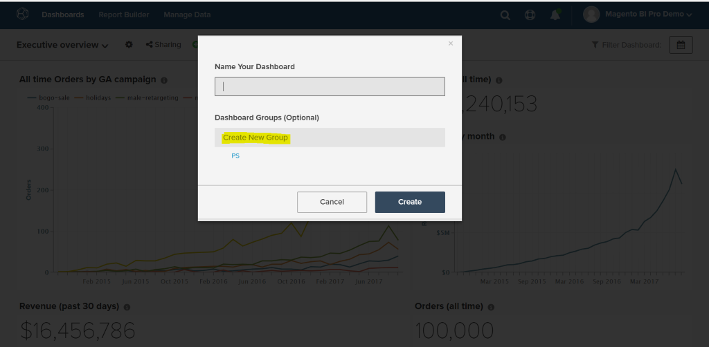
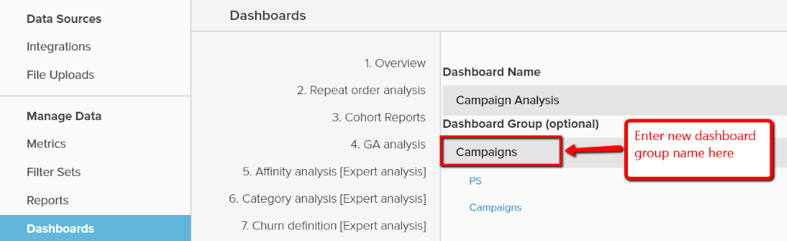
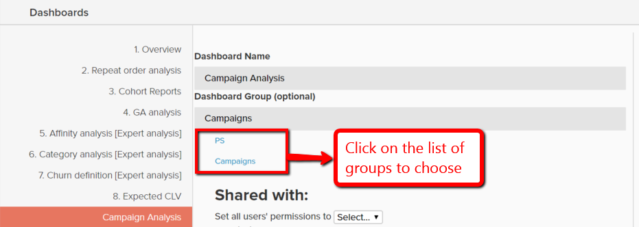

# ダッシュボードグループの使用

ダッシュボードグループを利用すると、ダッシュボードをより適切に整理できます。 最も一般的な使用例は、同じ「グループ」の下に類似のダッシュボードをグループ化することです。 例えば、マーケティングに関連するすべてのダッシュボードを、ダッシュボードグループ「マーケティング」の下にグループ化することができます。

ダッシュボード選択ドロップダウンでは、ダッシュボードグループがアルファベット順で表示され、「グループなし」の下のすべてのダッシュボードが最後に表示されます。 同じグループの下にあるダッシュボードは、各グループ内でアルファベット順に表示されます。

## ダッシュボードグループの共有

ダッシュボードグループは、ユーザー間で直接共有することはできません。 ダッシュボードがユーザーと共有されている場合、そのダッシュボードの下にあるダッシュボードグループは、存在しない場合、それらのユーザーに対して自動的に作成されます。 ダッシュボードグループが存在する場合は、ダッシュボードがリストに追加されます。

ダッシュボードのグループが所有者によって変更されると、その変更は、ダッシュボードが共有されているすべてのユーザーに対して自動的に反映されます。 ユーザーは、所有していないダッシュボードのダッシュボードグループを変更できません。

## ダッシュボードグループの作成

ダッシュボードグループは、次のいずれかの方法で作成できます。

1. ダッシュボードの作成時：

   

1. 既存のダッシュボードのグループを`Manage Data > Dashboards` ページから変更する場合：

   1. グループを作成するダッシュボードをクリックします。

   1. `Dashboard Group (optional)`の下に、現在のダッシュボードグループが表示されます。

   1. グループを作成するには、新しいグループの名前を入力し、ボックスの外側をクリックします。

      

## 既存のダッシュボードを既存のグループに追加

1. `Manage Data > Dashboards` ページで、グループを変更するダッシュボードを選択します。

1. `Dashboard Group (optional)`の下のテキストには、ダッシュボードの現在のダッシュボードグループが表示されます。

1. ダッシュボードのグループを変更するには、リストから別のグループを選択します（この場合は`PS`、`Campaigns`）。

   

## ダッシュボードグループの削除

ダッシュボードグループの下にダッシュボードがない場合は、自動的に削除されます。
