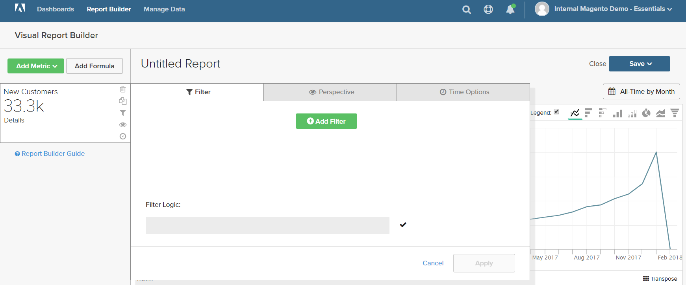
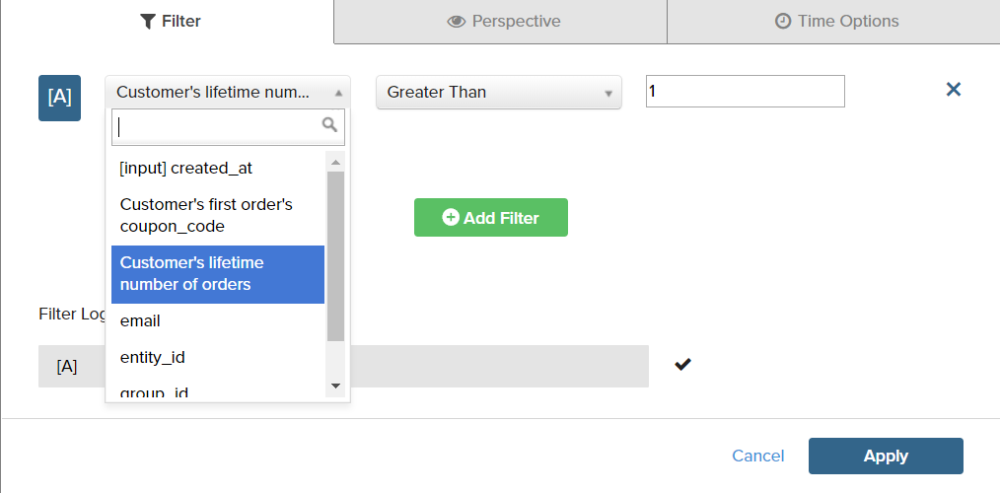
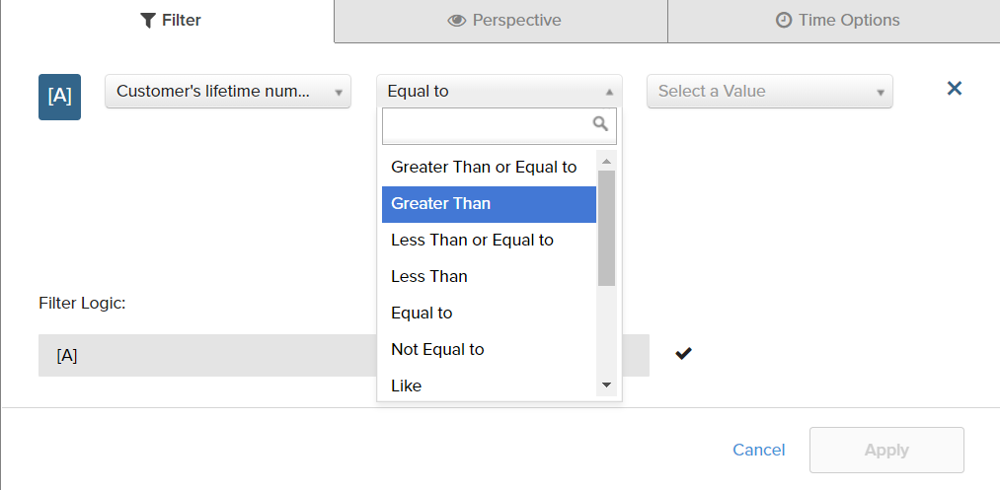
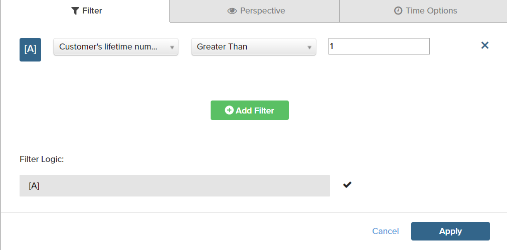
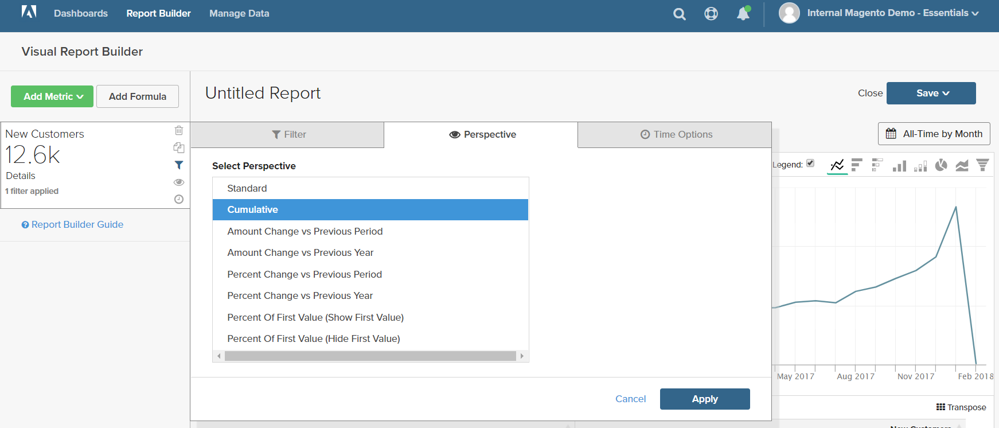
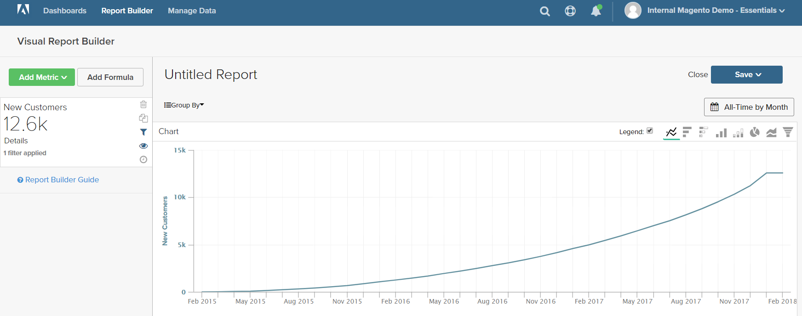
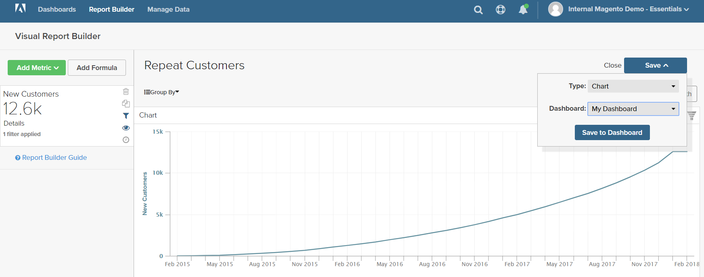

# フィルター

1つ以上のフィルターを追加して、レポートの作成に使用するデータを制限できます。 各フィルターは、関連付けられたテーブルの列、演算子、値を含む式です。 例えば、リピート顧客のみを含めるには、複数の注文を行った顧客のみを含むフィルターを作成します。 論理`AND/OR`演算子で複数のフィルターを使用して、レポートにロジックを追加できます。

>[!TIP]
>
>レポートには最大3,500個のデータポイントを含めることができます。 データポイントの数を減らすには、フィルターを使用して、レポートの生成に使用するデータの量を減らします。

[!DNL Adobe Commerce Intelligence]には、「すぐに使える（OOTB）」を使用するか、ニーズに合わせて変更できるフィルターの選択が含まれています。 作成できるフィルターの数に制限はありません。

## フィルターを追加するには：

1. グラフの各データ ポイントにカーソルを合わせます。

   このレポートでは、各データポイントは1か月の合計顧客数を示します。

1. 左側のパネルで、「フィルター（）」アイコンをクリックします。

   

1. **[!UICONTROL Add Filter]**&#x200B;をクリックします。

   フィルターにはアルファベット順に番号が付けられ、最初は`[A]`です。 フィルターの最初の2つの部分はドロップダウンオプションで、3番目の部分は値です。

   

   * フィルターの最初の部分をクリックし、式の被写体として使用する列を選択します。

     

   * フィルターの2番目の部分をクリックして、演算子を選択します。

     

   * フィルターの3番目の部分で、式を完了するために必要な値を入力します。

     

   * フィルターが完了したら、**[!UICONTROL Apply]**&#x200B;をクリックします。

     現在、レポートにはリピート顧客のみが含まれており、レポート用に取得された顧客記録の数は33,000件から12,600件に減少しました。

     <!--{: .zoom}-->

1. サイドバーで、遠近法（）アイコンをクリックします。

   <!--{: .zoom}-->

1. 設定のリストで、`Cumulative`を選択します。 次に、**[!UICONTROL Apply]**&#x200B;をクリックします。

   

   `Cumulative`の遠近法は、各月のギザギザの上下を示すのではなく、時間の経過に伴う変化を分布させます。

1. レポートの`Title`を入力し、**[!UICONTROL Save]**&#x200B;を`Chart`としてダッシュボードにクリックします。

   
