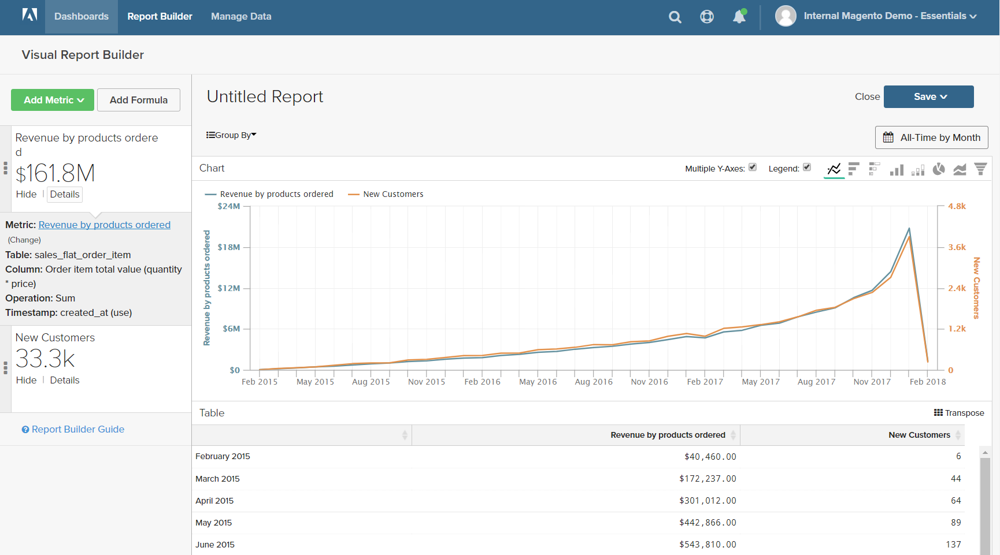
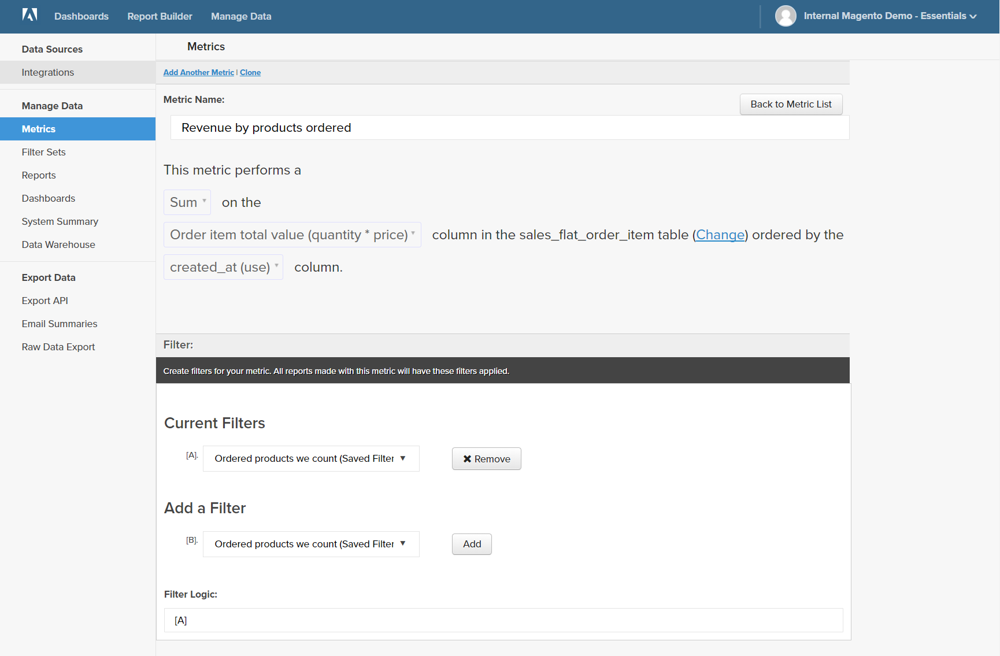
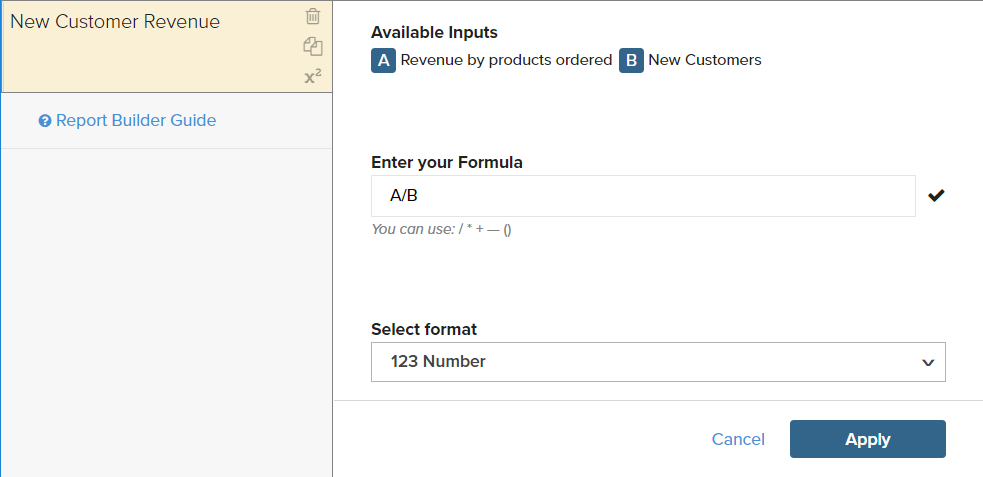
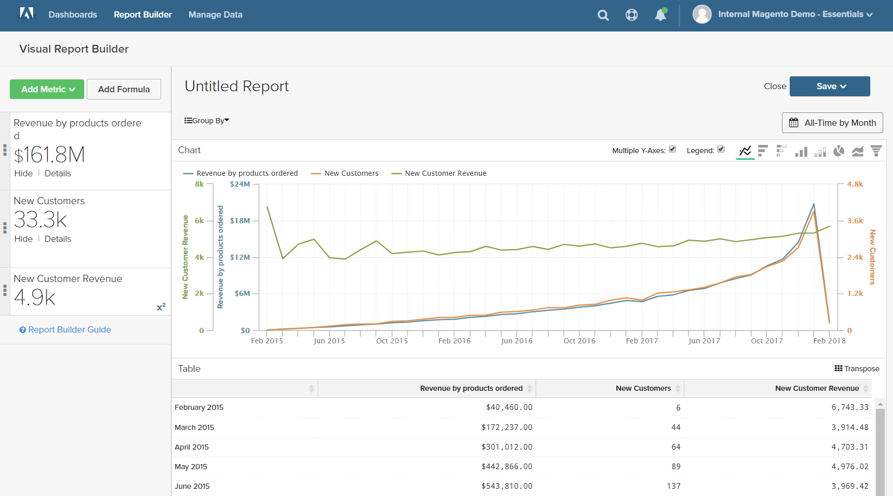
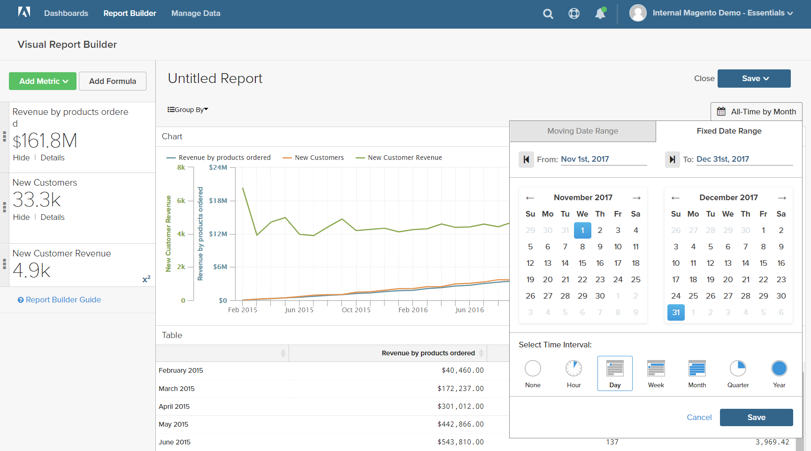
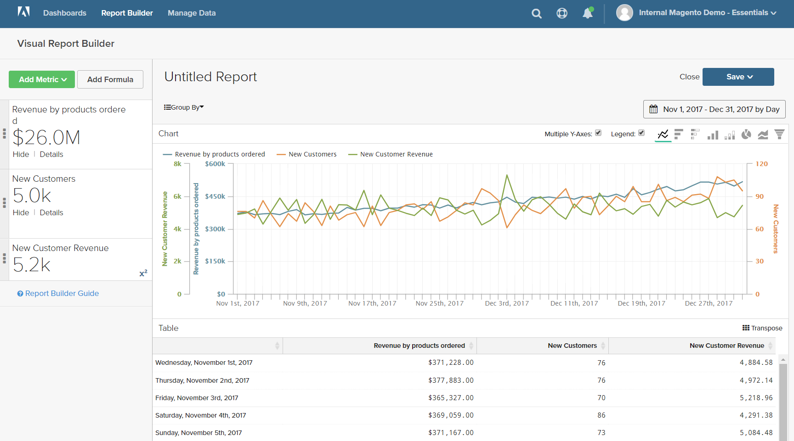

# 数式

数式は、複数の指標と数学的論理を組み合わせて質問に回答します。 例えば、ホリデーシーズン中に、新顧客によって生み出された商品1個当たりの売上は、どの程度でしょうか？

ダッシュボードでの

## 手順1：基本レポートの作成

1. メニューで、`Report Builder`を選択します。

1. **[!UICONTROL Add Metric]**&#x200B;をクリックし、レポートの最初の指標を選択します。

   この例では、`Revenue by products ordered`指標が使用されています。

1. もう一度&#x200B;**[!UICONTROL Add Metric]**&#x200B;をクリックし、レポートの2番目の指標を選択します。

   この例では、`New Customers`指標が使用されています。

1. サイドバーで、**[!UICONTROL Details]**&#x200B;をクリックして、各指標に関する情報を表示します。

   

1. サイドバーで各指標の名前をクリックし、新しいブラウザータブで設定ページを開きます。 下にスクロールして、指標クエリ、フィルター、ディメンションなど、指標の各コンポーネントを表示します。

   

1. レポートに戻るには、以前のブラウザータブをクリックします。

1. グラフで、各行のいくつかのデータポイントにカーソルを合わせると、各指標に関連付けられている金額が表示されます。

## 手順2：数式の追加

1. サイドバーの上部にある「**[!UICONTROL Add Formula]**」をクリックします。

   数式ボックスには、指標が使用可能な入力`A`および`B`として表示され、数式を入力できる入力ボックスが含まれています。

   次の操作を行います。

   * `Enter your Formula`入力ボックスに、`A/B`と入力します。

     これにより、売上を新規顧客数の多い商品で割ります。

   * `Select format`を`123Number`に設定します。

   * サイドバーで、`Untitled`を数式の名前に置き換えます。

   

1. 完了したら、**[!UICONTROL Apply]**&#x200B;をクリックします。

   レポートに数式`New Customer Revenue`の新しい行が追加され、サイドバーに新規顧客によって生成された収益の合計金額が表示されます。

   を使用したレポート

## 手順3：日付範囲の追加

1. 右上隅の&#x200B;**[!UICONTROL Date Range]**&#x200B;をクリックします。

1. 「`Fixed Date Range`」タブで、次の操作を行います。

   * カレンダーで、日付範囲を選択します。

     この例では、ホリデーシーズンは`November 1`から`December 31`までです。

   * `Select Time Interval`で、`Day`を選択します。

     

   * 完了したら、**[!UICONTROL Apply]**&#x200B;をクリックします。

   レポートは現在、ホリデーシーズンに限定され、毎日のデータポイントが表示されます。

   

## 手順4：レポートの保存

この手順では、レポートをグラフとしてもテーブルとしても保存します。

1. ページの上部にある「`Untitled Report`」をクリックし、わかりやすいタイトルを入力します。 この例では、レポートタイトルは`2017 Holiday Sales`です。

   次に、次の操作を行います。

   * 右上隅の「**[!UICONTROL Save]**」をクリックします。

   * `Type`の場合は、デフォルトの`Chart`設定を受け入れます。

   * レポートを利用できる`Dashboard`を選択します。

   * **[!UICONTROL Save to Dashboard]**&#x200B;をクリックします。

1. レポートタイトルをクリックし、名前を変更します。 この例では、レポートタイトルが`2017 Holiday Sales Data`に変更されています。

   次に、次の操作を行います。

   * 右上隅の「**[!UICONTROL Save a Copy]**」をクリックします。

   * `Type`を`Table`に設定します。

   * レポートを利用できる`Dashboard`を選択します。

   * **[!UICONTROL Save a Copy to Dashboard]**&#x200B;をクリックします。

1. ダッシュボードにレポートを表示するには、次のいずれかの操作を行います。

   * ページ上部のメッセージで「**[!UICONTROL Go to Dashboard]**」をクリックします。

   * メニューで、**[!UICONTROL Dashboards]**&#x200B;を選択します。 現在のダッシュボードの名前をクリックして、リストを表示します。 次に、レポートが保存されたダッシュボードの名前をクリックします。
