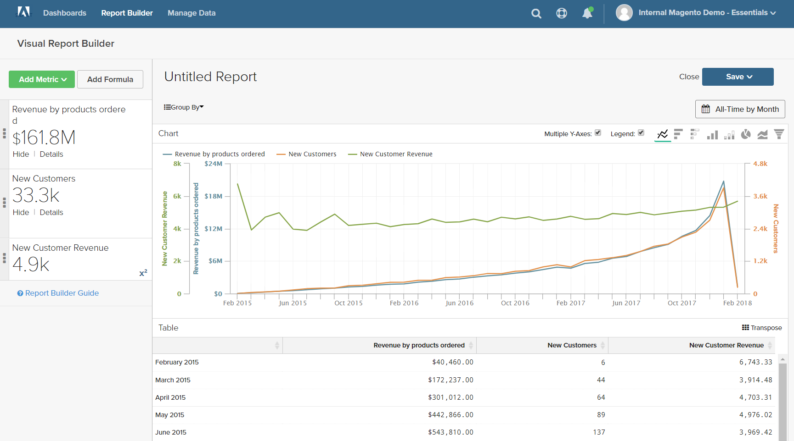

# 数式

数式は、複数の指標と数学的ロジックを組み合わせて、質問に回答します。 例えば、ホリデーシーズンの製品あたりの売上高のうち、新規顧客によって生み出されたものはどれくらいですか。

## 手順 1：基本レポートの作成

1. メニューで、「`Report Builder`」を選択します。

1. 「**[!UICONTROL Add Metric]**」をクリックして、レポートの最初の指標を選択します。

   この例では、`Revenue by products ordered` の指標を使用します。

1. もう一度「**[!UICONTROL Add Metric]**」をクリックして、レポートの 2 番目の指標を選択します。

   この例では、`New Customers` の指標を使用します。

1. サイドバーで「**[!UICONTROL Details]**」をクリックすると、各指標に関する情報が表示されます。

   

1. サイドバーで、各指標の名前をクリックして、設定ページを新しいブラウザータブで開きます。 下にスクロールして、指標クエリ、フィルター、ディメンションなど、指標の各コンポーネントを表示します。

   

1. レポートに戻るには、[ 前のブラウザ ] タブをクリックします。

1. グラフで、各線の上にいくつかのデータポイントを置くと、各指標に関連付けられている金額が表示されます。

## 手順 2：数式を追加

1. サイドバーの上部にある「**[!UICONTROL Add Formula]**」をクリックします。

   式ボックスには、指標が使用可能な入力 `A` および `B` として表示され、式を入力できる入力ボックスが含まれています。

   次の手順を実行します。

   * `Enter your Formula` 入力ボックスに `A/B` と入力します。

     これにより、売上高が製品の注文数で、新規顧客数で除算されます。

   * `Select format` を `123Number` に設定します。

   * サイドバーで、`Untitled` を式の名前に置き換えます。

   

1. 完了したら、「**[!UICONTROL Apply]**」をクリックします。

   レポートには、式、`New Customer Revenue` の新しい行が表示され、サイドバーには、新規顧客によって生み出された収益の合計金額が表示されます。

   

## 手順 3：日付範囲の追加

1. 右上隅の「**[!UICONTROL Date Range]**」をクリックします。

1. [`Fixed Date Range`] タブで次の操作を行います。

   * カレンダーで、日付範囲を選択します。

     この例では、ホリデーシーズンは `November 1`～`December 31` です。

   * 「`Select Time Interval`」で、「`Day`」を選択します。

     

   * 完了したら、「**[!UICONTROL Apply]**」をクリックします。

   レポートは現在、ホリデーシーズンに限定され、各日のデータポイントが含まれます。

   

## 手順 4：レポートを保存する

この手順では、レポートをグラフおよびテーブルとして保存します。

1. ページ上部の「`Untitled Report`」をクリックして、わかりやすいタイトルを入力します。 この例では、レポートタイトルは `2017 Holiday Sales` です。

   次に、以下の手順を実行します。

   * 右上隅にある「**[!UICONTROL Save]**」をクリックします。

   * `Type` の場合、デフォルトの `Chart` 設定を使用します。

   * レポートを使用できる `Dashboard` を選択します。

   * 「**[!UICONTROL Save to Dashboard]**」をクリックします。

1. レポートのタイトルをクリックし、名前を変更します。 この例では、レポートのタイトルを `2017 Holiday Sales Data` に変更します。

   次に、以下の手順を実行します。

   * 右上隅の「**[!UICONTROL Save a Copy]**」をクリックします。

   * `Type` を `Table` に設定します。

   * レポートを使用できる `Dashboard` を選択します。

   * 「**[!UICONTROL Save a Copy to Dashboard]**」をクリックします。

1. ダッシュボードでレポートを表示するには、次のいずれかの操作を行います。

   * ページ上部のメッセージで「**[!UICONTROL Go to Dashboard]**」をクリックします。

   * メニューで、「**[!UICONTROL Dashboards]**」を選択します。 現在のダッシュボードの名前をクリックしてリストを表示します。 次に、レポートが保存されたダッシュボードの名前をクリックします。
