# [!DNL Visual Report Builder]

[!DNL Visual Report Builder]を使用すると、事前に定義された指標に基づいて簡単にレポートを作成できます。 各指標には、レポートのデータセットを定義するクエリが含まれます。

次の例は、簡単なレポートを作成し、データを追加のディメンションでグループ化し、日付と時間間隔を設定し、グラフの種類を変更し、レポートをダッシュボードに保存する方法を示しています。

## シンプルなレポートを作成するには：

1. [!DNL Commerce Intelligence] メニューで、**[!UICONTROL Report Builder]**&#x200B;をクリックします。

1. [!UICONTROL Visual Report Builder]で「**[!UICONTROL Create Report]**」をクリックし、次の操作を行います。

   * **[!UICONTROL Add Metric]**&#x200B;をクリックします。

     使用可能な指標は、アルファベット順またはテーブル別に一覧表示できます。

     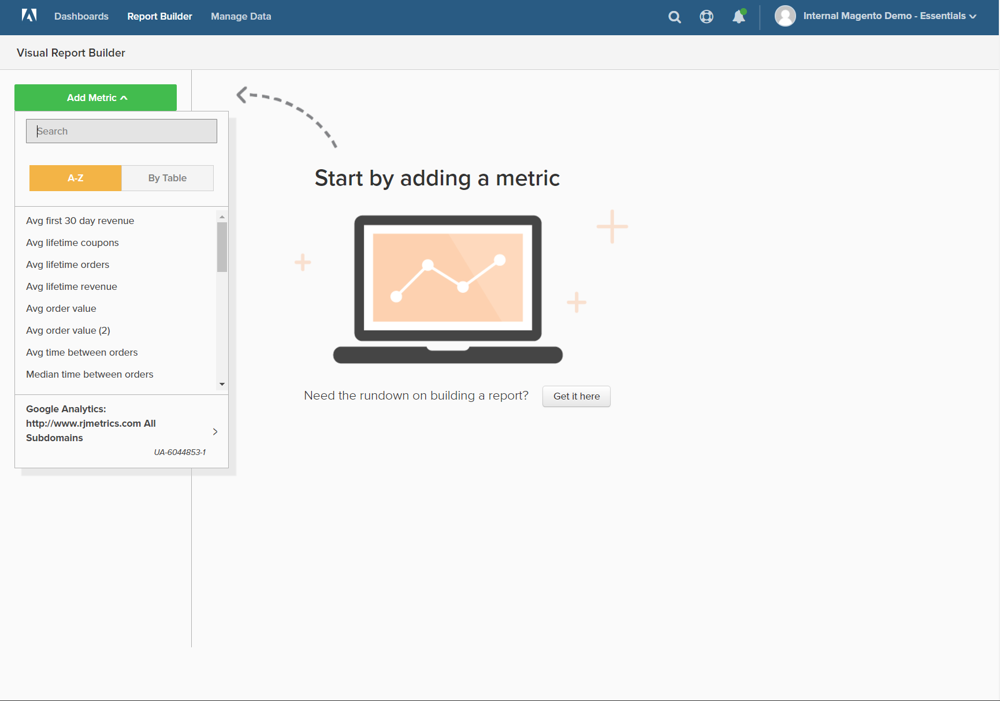

   * レポートに使用するデータ セットを表す[指標](../../data-user/reports/ess-manage-data-metrics.md)を選択します。

     この例で使用されている`New Customers`指標は、すべての顧客をカウントし、顧客がアカウントにサインアップした日付でリストを並べ替えます。 最初のレポートには、単純な折れ線グラフとデータのテーブルが含まれています。

     左側のサマリーには、現在の指標の名前が表示され、その後、指標で指定された列データの計算の結果が表示されます。 この例では、概要に合計顧客数が表示されます。

     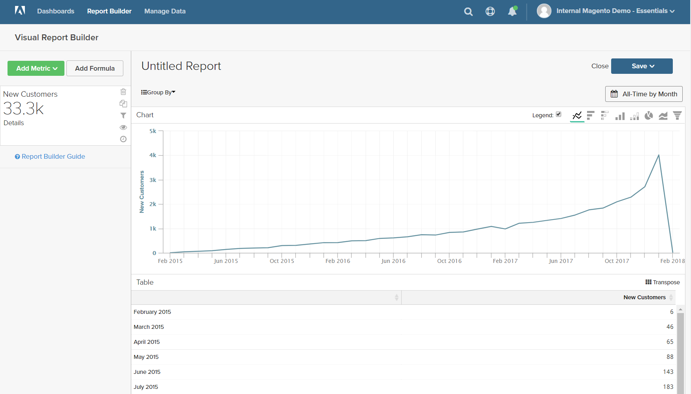

1. グラフで、行の各データポイントにカーソルを合わせます。 各データポイントは、その月にサインアップした新規顧客の合計数を示します。

1. データのグループ化、日付範囲の変更、グラフの種類については、次の手順に従ってください。

   **`Group By`**

   `Group By` コントロールを使用すると、グループまたはセグメントごとに複数のディメンションを追加できます。 ディメンションは、データのグループ化に使用できるテーブル内の列です。

   * `Group By` オプションのリストから、使用可能なディメンションのいずれかを選択します。

     この例では、顧客が最初の注文を行う際に使用した5つのクーポンコードが見つかりました。

     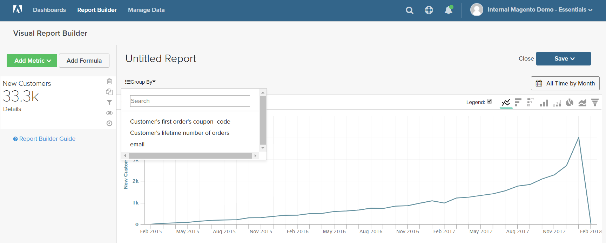

     `Group By`の詳細には、顧客が使用する各クーポンが一覧表示されます。 最初の注文に使用されたクーポンには、チェックボックスが付いています。 グラフには、最初の注文に使用された各クーポンを表す複数の色付きの線が追加されました。 凡例は、データの各行に対応するように色分けされています。

   * 「**[!UICONTROL Apply]**」をクリックして、グループ別の詳細を閉じます。

     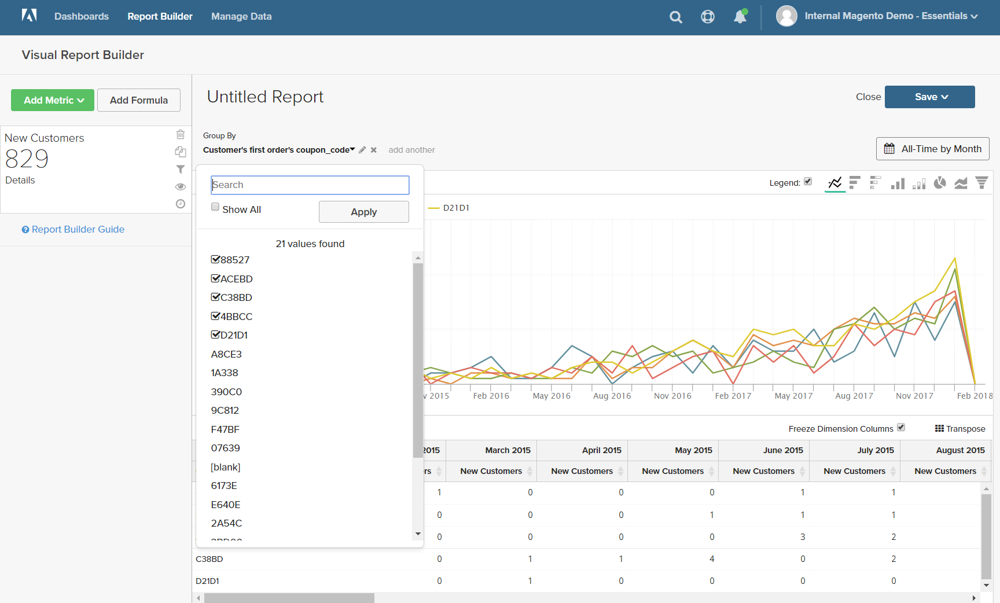

   * 各行のデータポイントにカーソルを合わせると、最初の注文を行う際にクーポンを使用した月の顧客数が表示されます。

   * データのテーブルには、毎月の列と各クーポンコードの行を含む追加ディメンションが追加されました。

     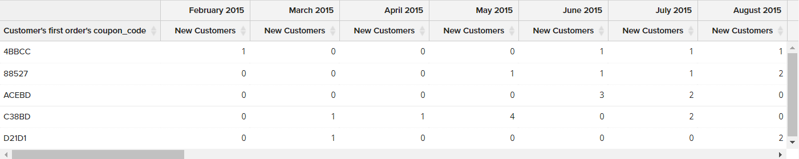

   * テーブルの右上隅にある転置（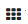）コントロールをクリックして、データの向きを変更します。

     データの軸は反転され、テーブルには各クーポンコードの列と各月の行があります。 この方向を読みやすくすることができます。

     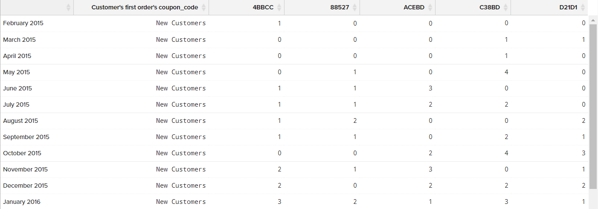

   **`Date Range`**

   `Date Range` コントロールには、現在の日付範囲と時間間隔の設定が表示され、右側のグラフのすぐ上にあります。

   * この例では`Date Range`に設定されている`All-Time by Month` コントロールをクリックします。

     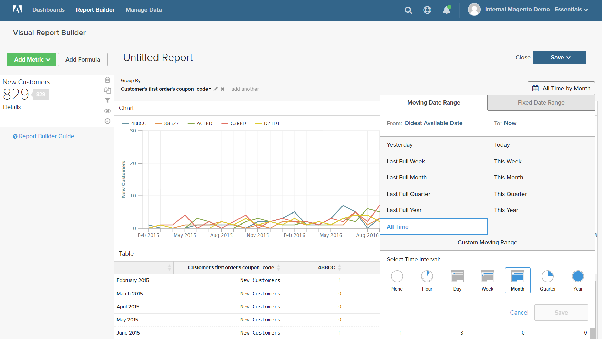

   * 次の変更を行います。

      * 拡大表示するには、日付範囲を`Last Full Quarter`に変更します。
      * `Select Time Interval`で、`Week`を選択します。
      * 完了したら、**[!UICONTROL Save]**&#x200B;をクリックします。

     現在、レポートには前四半期のデータのみが週別に含まれています。

     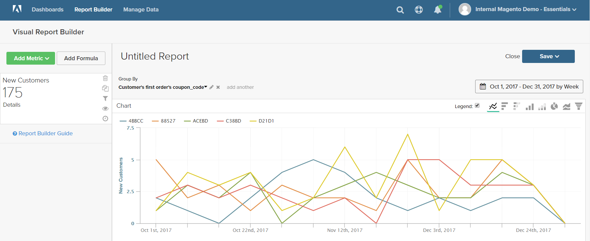

   **グラフの種類**

   * 右上隅にあるコントロールをクリックして、データに最適なチャートを見つけます。

     チャートの種類によっては、多次元データと互換性がないものもあります。

     | | |
     |-----|-----|
     |  | 折れ線グラフ |
     |  | 横棒グラフ |
     | 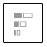 | 横向き積み上げ棒グラフ |
     |  | 縦棒グラフ |
     |  | 縦組み横向き積み上げ棒 |
     |  | 円 |
     |  | 面グラフ |
     |  | ファネル |

     {style="table-layout:auto"}

1. レポートに`title`を付けるには、ページ上部の`Untitled Report` テキストをわかりやすいタイトルに置き換えます。

1. 右上隅の「**[!UICONTROL Save]**」をクリックし、次の操作を行います。

   * `Type`の場合、デフォルト設定である`Chart`を受け入れます。

   * レポートを利用できる`Dashboard`を選択します。

   * **[!UICONTROL Save to Dashboard]**&#x200B;をクリックします。

     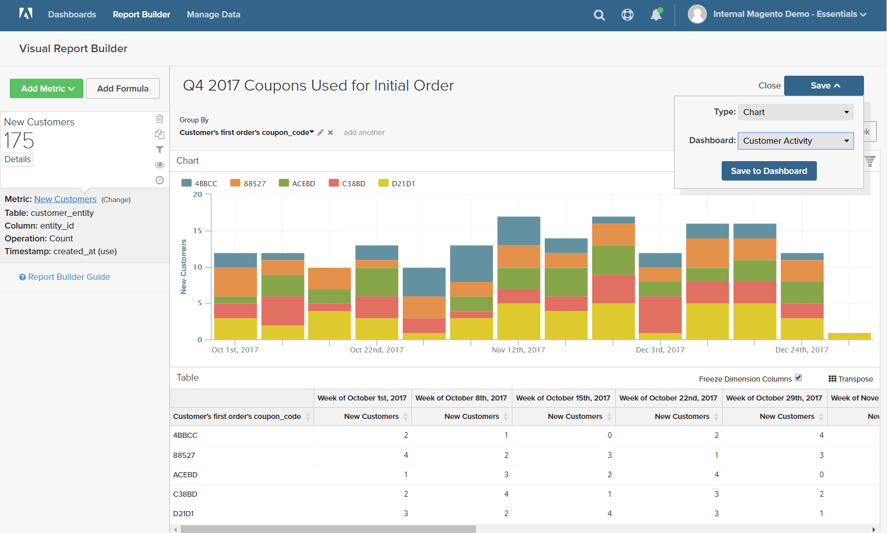

1. ダッシュボードでグラフを表示するには、次のいずれかの操作を行います。

   * ページ上部のメッセージで「**[!UICONTROL Go to Dashboard]**」をクリックします。

   * メニューで「`Dashboards`」を選択し、現在のダッシュボードの名前をクリックしてリストを表示します。 次に、レポートが保存されたダッシュボードの名前をクリックします。

     ダッシュボードの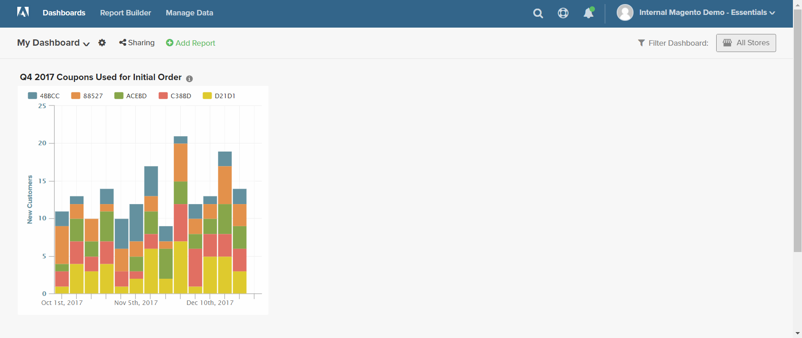
