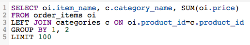

# レポートビルダーの選択

>[!NOTE]
>&#x200B;>[管理者権限](../../administrator/user-management/user-management.md)が必要です。

分析の作成方法が増えたことで、レポートビルダーのどの機能が自社のニーズに適しているのかを正確に把握することが難しい場合もあります。 このトピックでは、分析を構築するための最適な方法を選択する方法を説明します。

## [!DNL SQL Report Builder]を使用するタイミング {#whensql}

[!DNL SQL Report Builder]よりも[!DNL traditional Report Builder]を使用する一般的な理由をいくつか確認してください。

### [!DNL SQL]固有の関数を使用する場合…

[!DNL SQL Report Builder]の利点の1つは、現在Data Warehouse Managerで使用できない関数を使用できることです。 過去には、アナリストの支援を受けて、ビジョンを完全に実現する必要があったかもしれません。

[!DNL SQL Report Builder]は、以前は使用できなかった[`LISTAGG`](https://docs.aws.amazon.com/redshift/latest/dg/r_LISTAGG.html)や[`GETDATE`](https://docs.aws.amazon.com/redshift/latest/dg/r_GETDATE.html)などの関数をサポートしています。 [`full list`](https://docs.aws.amazon.com/redshift/latest/dg/c_SQL_functions.html)にアクセスできますが、その他のSQL固有の関数には次のものが含まれます。

* [`Bitwise aggregate`個の関数](https://docs.aws.amazon.com/redshift/latest/dg/c_bitwise_aggregate_functions.html)
* [`CASE expression`](https://docs.aws.amazon.com/redshift/latest/dg/r_CASE_function.html)
* [`JSON_EXTRACT_PATH_TEXT`](https://docs.aws.amazon.com/redshift/latest/dg/JSON_EXTRACT_PATH_TEXT.html)
* [`LOG`](https://docs.aws.amazon.com/redshift/latest/dg/r_LOG.html)
* [`MONTHS_BETWEEN`](https://docs.aws.amazon.com/redshift/latest/dg/r_MONTHS_BETWEEN_function.html)
* [`REPLACE`](https://docs.aws.amazon.com/redshift/latest/dg/r_REPLACE.html)
* [`SQRT`](https://docs.aws.amazon.com/redshift/latest/dg/r_SQRT.html)
* [`concatenation`演算子](https://docs.aws.amazon.com/redshift/latest/dg/r_concat_op.html)

### テストをしたい場合。

分析に最適な方法を見つけるためのさまざまな手法や戦略を試す場合は、[!DNL SQL Report Builder]を使用することをお勧めします。 Data Warehouse Managerで列を作成するには時間がかかり、DWMを使用して作成する列は更新サイクルによって異なります。

カラムを使用するには、1回の更新サイクルを待つ必要があります。 列の作成で間違いがあることに気づいたら、*2* サイクルを待つ必要があります。1つは最初に列に入力するサイクル、もう1つはリビジョンを反映するサイクルです。

### 新しい列を1回だけ使用する場合…

上記のセクションで説明したように、Data Warehouse Managerで列を作成するには時間がかかります。 1つのレポートで作成した列のみを使用する場合は、[!DNL SQL Report Builder]を使用することをAdobeが提案します。 これにより、更新サイクルが完了するのを待つ必要がなくなり、より迅速に作業に戻ることができます。

### 多対多の関係を持つデータを使用している場合。

データ構造によっては、[!DNL SQL Report Builder]をより効率的で論理的な選択で分析を構築できる場合があります。 1対1のリレーションシップ用の列の作成はData Warehouse Managerでは簡単ですが、1対多のリレーションシップを扱う場合は、少し混乱する可能性があります。

1つの製品が複数の製品カテゴリの一部と見なされ、各製品の各カテゴリに関連する収益を表示する場合を考えてみましょう。 DWMを使用してこの関係を作成しようとすると、面倒で困難になる可能性がありますが、[!DNL SQL] クエリを記述する方が少し簡単です。

1対多の関係を持つ製品カテゴリ別の収益を表示する

## 従来のReport Builderをいつ使用すればよいですか？ {#whentraditionalrb}

[!DNL SQL Report Builder]を使用すると、以前は利用できなかった機能をより詳細に制御してアクセスできるようになりますが、必ずしも適切な選択とは限りません。 Adobeでは、使用するレポートビルダーのフレーバーを決定する際に、次のことも検討することをお勧めします。

### 簡単なレポートを作成する場合。

作成する内容が簡単な場合は、従来のReport Builderを使用すると、完全な[!DNL SQL] クエリを記述するよりもはるかに高速になります。 分析を作成するために必要な列が既にData Warehouse Managerに存在する場合に役立ちます。

### 作品を他のユーザーと共有している場合…

組織全体のユーザーがこの分析を使用/表示していますか？ 誰と共有するかに応じて、ビジュアルReport Builderを使用し続けることが良い場合があります。 ユーザーは、潜在的に長い[!DNL Visual Report Builder] クエリを読み取るのではなく、[!DNL SQL]の定義をすばやく確認できます。

レポートが必要だが[!DNL SQL]についてよく知らない人がいる場合は、AdobeはReport Builderのオリジナルのフレーバーを使用することを提案します。 指標を向上できます。

## まとめ {#wrapup}

[!DNL SQL Report Builder]と[!DNL Visual Report Builder]の両方は、様々なユースケースに適しています。 通常、自社の分析ニーズと、分析の対象者に応じて異なります。
