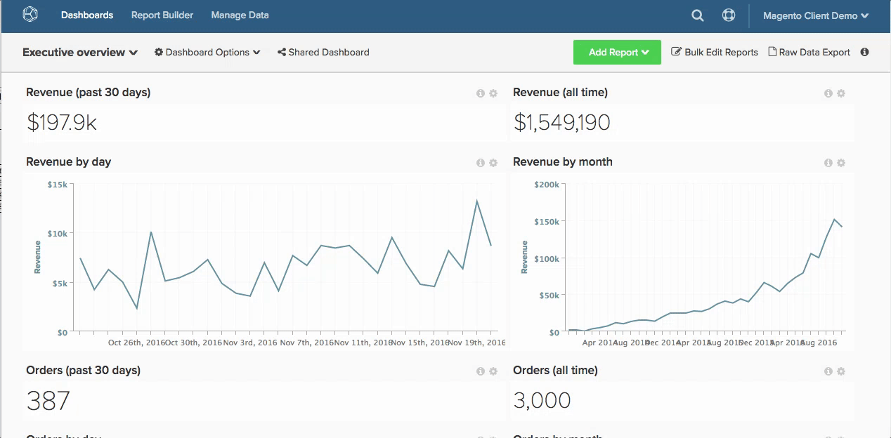
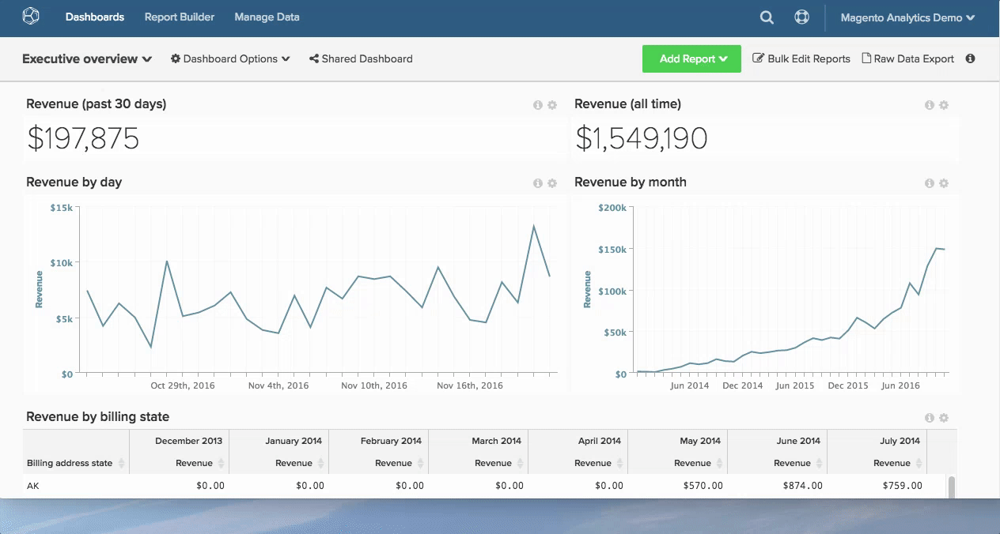

# レポートの使用

[!DNL Adobe Commerce Intelligence]のレポートを使用して、ビジネス上の疑問に答えましょう。今月の売上を昨年と比較して確認したい場合でも、最新の[!DNL Google AdWords] キャンペーンの獲得コストを把握したい場合でも、質問に答えることができます。

具体的に、質問から回答までの道のりは？

このプロセスを視覚化するために、そのルートは以下にマッピングされています。 このトピックでは、分析上の質問にどのようにアプローチするのか、必要なデータを取得するために必要なバックエンドのロジスティクスはどのようなものかについて解説します。

## 質問から始める

顧客満足度の向上やサプライコストの削減など、ビジネスを改善するために常に質問していることはご存知でしょう。 質問を分析に変換し、意思決定に役立てることに重点を置いています。

この例では、次の質問に答える必要があるとします。

* 新規登録者はどの程度のスピードでコンバージョンするか？

## 測定の特定

今こそ、質問に答えるための考えられる分析と測定値のリストを特定するときです。 この例では、次の指標に注目します。

* 登録から初回購入日までの平均時間（1回の使用あたりの時間）。

これにより、登録日からユーザーの最初の購入日までの平均経過時間が明らかになり、コンバージョンfunnelのこの最後のステップでユーザーがどのように行動するかを把握できます。

## データの発見

測定すべきことを理解しても、その方法の一部しか得られません。 登録からユーザーごとの初回購入日までの平均時間を評価するには、測定で構成されるすべてのデータポイントを特定する必要があります。

メジャーをコアコンポーネントに分割します。 登録した人数、購入した人数、2つのイベントの間に経過した時間を把握する必要があります。

より高度なレベルでは、データベース内のこのデータを見つける場所、特に次のことを把握する必要があります。

* 誰かが登録するたびにデータの行を記録するテーブル
* 誰かが購入するたびに行われるデータ行を記録するテーブル
* `purchase` テーブルを`customer` テーブルに結合または参照するために使用できる列。これにより、購入者を把握できます

より詳細なレベルでは、この分析に使用されるデータフィールドを正確に特定する必要があります。

* 顧客の登録日を含むデータテーブルと列。例：`user.created\_at`
* 購入日を含むデータテーブルと列。例：`order.created\_at`

## 分析用のデータ列の作成

上記で説明したネイティブデータ列に加えて、この分析を有効にするには、次のような計算データフィールドも必要です。

* `Customer's first purchase date`は、特定のユーザーの`MIN(order.created_at`を返します）

このフィールドは、次の作成に使用されます。

* `Time between a customer's registration date and first purchase date`：登録から最初の購入日までの特定のユーザーの休眠時間を返します。 これが後で指標の基礎になります。

これらのフィールドは、両方ともユーザーレベルで作成する必要があります（例えば、`user` テーブルで）。 これにより、ユーザーが平均分析を正規化できます（つまり、この平均計算の分母はユーザー数です）。

ここで、[!DNL Commerce Intelligence]の手順を実行します。 [!DNL Commerce Intelligence] Data Warehouseを使用して、上記の列を作成できます。 新しい列の具体的な定義については、Adobeのアナリストチームにお問い合わせください。 [列エディター](../../data-analyst/data-warehouse-mgr/creating-calculated-columns.md)を使用することもできます。

本番サーバーに不要な負荷がかかるため、これらの計算データフィールドをデータベースに直接作成することを避けることがベストプラクティスです。

## 指標の作成

分析に必要なデータフィールドが揃ったところで、分析を構築するための関連指標を見つけるか、作成します。

ここでは、次の計算を実行します。

_[合計/ `Time between a customer's registration date and first purchase date`] / [登録および購入した顧客の合計数]_

顧客の登録日に応じて、この計算を時間の経過とともにプロットするか、トレンドとして表示します。 次に、[でこの指標](../../data-user/reports/ess-manage-data-metrics.md)を[!DNL Commerce Intelligence]作成する方法を示します。

1. **[!UICONTROL Data]**&#x200B;に移動し、「`Metrics`」タブを選択します。
1. **[!UICONTROL Add New Metric]**&#x200B;をクリックし、`user` テーブル （上記のディメンションを作成した場所）を選択します。
1. ドロップダウンから、`Average`列が順序付けした`Time between a customer's registration date and first purchase date` テーブルの`user`列の`Customer's registration date`を選択します。
1. 関連するフィルターまたはフィルターセットを追加します。

これで、この指標の準備ができました。

## レポートの作成

新しい指標を設定すると、登録から最初の購入日までの平均時間を登録日ごとにレポートできます。

任意のダッシュボードに移動し、上記で作成した指標を使用して[ レポートを作成](../../data-user/reports/ess-manage-data-metrics.md)します。

### `Visual Report Builder` {#visualrb}

[`Visual Report Builder`](../../data-user/reports/ess-rpt-build-visual.md)は、データを視覚化する最も簡単な方法です。 SQLの使い方に詳しくない方や、レポートをすばやく作成する場合は、Visual Report Builderが最適です。 数回クリックするだけで、指標の追加、データのセグメント化、組織全体でのレポートの作成などが可能です。 このオプションは、技術的な専門知識を必要としないため、初心者にも専門家にも最適です。

|  |  |
|--- |--- |
| **これは…**&#x200B;に最適です | **これは…**&#x200B;にとってあまり良くありません |
|  – 分析/技術体験のすべてのレベル  - レポートの迅速な作成  – 他のユーザーと共有するための分析の作成 | - SQL固有の関数を必要とする分析  – 新しい列のテスト – 計算列は、最初のデータ母集団の更新サイクルに依存しますが、SQLを使用して作成された列はそうではありません。 |

{style="table-layout:auto"}

### レポートの説明と画像

#### レポートへの説明の追加

チームの他のメンバーと共有するレポートを作成する場合、Adobeでは、他のユーザーが分析をより深く理解できるように、説明を加えることをお勧めします。

1. レポートの上部にある「**[!UICONTROL i]**」をクリックします。
1. 単語ボックスに説明を入力します。
1. **[!UICONTROL Save Description]**&#x200B;をクリックします。

以下を参照してください。

#### レポートの画像としてのエクスポート

プレゼンテーションまたはドキュメントにレポートを含める必要がありますか？ すべてのレポートは、すべてのレポートの右上隅にある`Report Options` メニューを使用して、画像（PNG、PDFまたはSVG形式）として保存できます。

1. レポートの右上隅にある歯車アイコンをクリックします。
1. ドロップダウンから、`Enlarge`を選択します。
1. レポートが拡大したら、レポートの右上隅にある「**[!UICONTROL Download]**」をクリックします。
1. ドロップダウンから目的の画像形式を選択します。 ダウンロードはすぐに始まります。

以下を参照してください。

