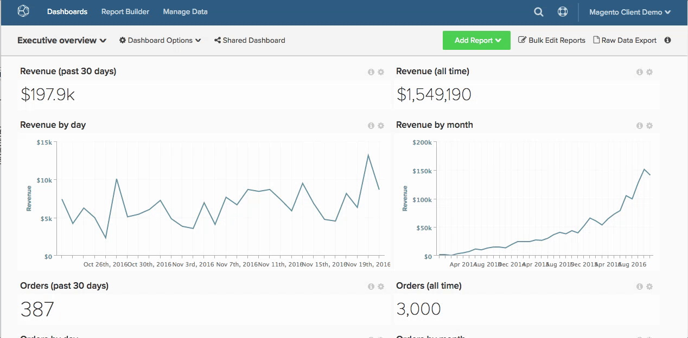

# レポートの使用

[!DNL Adobe Commerce Intelligence] のレポートを使用すると、ビジネスに関する質問に答えることができます。昨年と比較して今月の売上高を確認したいだけなのか、最新の [!DNL Google AdWords] キャンペーンの獲得コストを把握したいだけなのかを考慮します。

質問から回答へのパスは、正確にはどのようなものですか？

このプロセスを視覚化するために、そのルートは以下でマッピングされます。 このトピックでは、分析的な質問に対するアプローチ方法と、必要なデータを取得するために必要なバックエンドロジスティクスの両方に光を当てます。

## 質問から始める

顧客満足度の向上から供給コストの削減まで、ビジネスを改善するための質問を常に行っています。 質問を分析に変換し、意思決定を促進する方法に重点を置いています。

この例では、次の質問に答えるとします。

* 新しい登録者はどのくらいのペースでコンバージョンを行いますか？

## 測定の識別

質問に答えるのに役立つ、可能な分析と測定のリストを特定する時が来ました。 この例では、次の指標に焦点を当てます。

* 登録から初回購入日までの、1 回の使用あたりの平均時間。

これにより、登録日からユーザーの最初の購入日までの平均時間が表示され、コンバージョンファネルのこの最後のステップでユーザーがどのように行動するかがわかります。

## データの検索

何を測定するかを理解することは、私たちをそこに導く一部にすぎません。 ユーザーごとの登録から初回購入日までの平均時間を評価するには、測定が構成されるすべてのデータポイントを特定する必要があります。

測定をコアコンポーネントに分類します。 登録したユーザーの数（数）、購入を行ったユーザーの数、これら 2 つのイベント間の経過時間を知る必要があります。

より高いレベルでは、データベース内でこのデータを見つける場所を把握する必要があります。具体的には、次の場所です。

* 登録するたびにデータ行を記録するテーブル
* ユーザーが購入を行うたびにデータ行を記録するテーブル
* `purchase` テーブルを `customer` テーブルに結合または参照するために使用できる列。これにより、誰が購入したかを把握できます

より詳細なレベルで、この分析に使用される正確なデータフィールドを識別する必要があります。

* 顧客の登録日を含むデータテーブルと列：例 `user.created\_at`
* 購入日を含むデータテーブルと列：例 `order.created\_at`

## 分析用のデータ列の作成

上記のネイティブデータ列に加えて、この分析を有効にするには、次のような一連の計算データフィールドも必要です。

* 特定のユーザーの `MIN(order.created_at` を返す `Customer's first purchase date`）

これは、次の項目の作成に使用されます。

* `Time between a customer's registration date and first purchase date`。登録から最初の購入日までの経過時間を特定のユーザーに返します。 これは、後で指標の基礎となります。

これらのフィールドは両方とも、ユーザーレベル（例えば `user` テーブル）で作成する必要があります。 これにより、平均分析をユーザーで正規化できます（つまり、この平均計算の分母はユーザーの数です）。

ここで [!DNL Commerce Intelligence] の手順を実行します。 [!DNL Commerce Intelligence] Data Warehouseを使用して、上記の列を作成できます。 Adobeアナリストチームに連絡して、作成する新しい列の具体的な定義を提供してください。 [ 列エディター ](../../data-analyst/data-warehouse-mgr/creating-calculated-columns.md) を使用することもできます。

ベストプラクティスとしては、実稼動サーバーに不要な負荷をかけるので、これらの計算データフィールドをデータベースに直接作成しないようにすることをお勧めします。

## 指標の作成

これで、分析に必要なデータフィールドが用意できたので、関連する指標を見つけて分析を作成します。

ここでは、次の計算を実行します。

_[`Time between a customer's registration date and first purchase date`]/[ 登録・購入したお客様の総数]_

また、この計算が、顧客の登録日に応じて、経時的にプロットされるかトレンドを確認する必要があります。 また、[!DNL Commerce Intelligence] で [ この指標を作成 ](../../data-user/reports/ess-manage-data-metrics.md) する方法を次に示します。

1. **[!UICONTROL Data]** に移動し、「`Metrics`」タブを選択します。
1. 「**[!UICONTROL Add New Metric]**」をクリックし、`user` のテーブル（上記でディメンションを作成した場所）を選択します。
1. ドロップダウンから、`user` テーブルの `Time between a customer's registration date and first purchase date` 列の `Average` を `Customer's registration date` 列で並べ替えて選択します。
1. 関連するフィルターまたはフィルターセットを追加します。

これで、この指標の準備が整いました。

## レポートの作成

新しい指標が設定されたので、それを使用して、登録から最初の購入日までの平均時間を登録日別にレポートできます。

任意のダッシュボードに移動し、上記で作成した指標を使用して [ レポートを作成 ](../../data-user/reports/ess-manage-data-metrics.md) するだけです。

### `Visual Report Builder` {#visualrb}

[`Visual Report Builder`](../../data-user/reports/ess-rpt-build-visual.md) は、データを視覚化する最も簡単な方法です。 SQL に詳しくない場合や、レポートをすばやく作成したい場合は、ビジュアルReport Builderが最適です。 数回クリックするだけで、組織全体で指標を追加し、データをセグメント化し、レポートを作成できます。 このオプションは、技術的な専門知識を必要としないので、初心者や専門家に最適です。

|  |  |
|--- |--- |
| **これは…に最適です** | **これは…にはあまり適していません** |
|  – あらゆるレベルの分析/技術エクスペリエンス  - レポートをすばやく作成   – 他のユーザーと共有するための分析の作成 | - SQL 固有の関数が必要な分析   – 新しい列のテスト – 計算列は初期データ母集団の更新サイクルに依存しますが、SQL を使用して作成された列は依存しません。 |

{style="table-layout:auto"}

### レポートの説明と画像

#### レポートへの説明の追加

Adobeでは、チームの他のメンバーと共有するレポートを作成する場合、他のユーザーが分析をより深く理解できるように説明を追加することをお勧めします。

1. レポートの上部にある「**[!UICONTROL i]**」をクリックします。
1. 単語ボックスに説明を入力します。
1. 「**[!UICONTROL Save Description]**」をクリックします。

以下を参照してください。

#### レポートを画像として書き出す

プレゼンテーションまたはドキュメントにレポートを含める必要がありますか。 すべてのレポートの右上隅にある `Report Options` メニューを使用して、レポートを画像（PNG、PDF、SVG形式）として保存できます。

1. レポートの右上隅にある歯車アイコンをクリックします。
1. ドロップダウンから「`Enlarge`」を選択します。
1. レポートが拡大したら、レポートの右上隅にある「**[!UICONTROL Download]**」をクリックします。
1. ドロップダウンから目的の画像形式を選択します。 ダウンロードは直ちに開始されます。

以下を参照してください。

