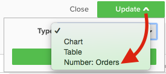

# ビジュアライゼーションオプション

特定のデータセットに対して適切なビジュアライゼーションを選択することは、分析プロセスの重要な要素です。 どのデータセットにも伝えるべきストーリーがありますが、そのストーリーの効果は視覚的な影響と読みやすさによって強調されます。

この [!DNL Commerce Intelligence] [!DNL Visual Report Builder] には、それぞれ独自の利点と使用例を持つ 12 の異なるビジュアライゼーションオプションが用意されています。 このトピックでは、 [!DNL Commerce Intelligence]（該当する場合は必要なレポート設定や使用例を含む） 以下のビジュアライゼーションを [!DNL Commerce Intelligence]:

* `Scalar`
* `Table`
* `Line`
* `Bar`
* `Stacked Bar`
* `Column`
* `Stacked Column`
* `Pie`
* `Area`
* `Funnel`
* `Scatter plot`
* `Bubble`
* `Heatmap`

## `Scalar`

`Scalar` レポートは、単一の数値として表示されます。 ほとんどの場合、売上高や注文件数などの主要指標の「全時間」値を表示したり、2 つの異なるスカラーレポートを使用して売上高と日付と予算を比較したりするために使用されます。 次の例では、指定されたレポート期間の注文の合計数を示しています。

レポートをスカラーとして保存するには、フィルターと時間の設定を構成し、 **[!UICONTROL Save]** または **[!UICONTROL Update]** をクリックします。 以下 `Type` ドロップダウンで、番号を選択します。レポートを左側のバーに表示される値として保存する指標名。

**要件**:

* `Time interval`: `None`
* `Group by`: `None`
* 1 つの指標のみ

## `Table`

名前が示すように `table` レポートは、表形式の詳細を表示するのに最適です。 1 つのレポートに、値や指標別の多数のグループを表示する必要がある場合は、多くの場合、テーブルを使用するのが最適な方法です。 例えば、以下に「顧客の詳細」のテーブルを示し、顧客の E メールでグループ化された注文と売上高を示します。

スカラーレポートと同様に、「 **[!UICONTROL Save]** または **[!UICONTROL Update]** を選択し、 `Type` ドロップダウン。

**要件：**

* レポート設定の要件はありませんが、テーブルの行数は 3500 行に制限されていることに注意する必要があります。 データセットに 3500 行を超える場合は、結果をフィルターして範囲を絞り込むか、結果をに書き出す必要があります。 `.csv` または `Excel` をクリックして、完全なデータセットを表示します。

## `Line`

`Line` グラフは、類似した指標コホートのパフォーマンスを比較する最適な選択肢です。 例えば、次に示すように、同じ期間の 2 つの地域の売上高を分析したり、履行注文件数の前年比の増加を比較したりします。

レポートに追加される各指標と数式は、それぞれ別の行で表されます。 指標を類似の単位およびスケールと比較する場合は、必ず `Multiple Y-Axes` をクリックすると、すべての指標が同じスケールで表示されます。

レポートを折れ線グラフとして保存するには、レポートを調整します `Type` から `Chart`をクリックし、次に示すように、Report Builder 内から適切なビジュアライゼーションを選択します。

**要件：**

* なし

## `Bar`

`Bar` グラフにはデータが一連の横棒グラフとして表示され、限られた数の指標またはグループを値で示すのに最適です。 例えば、棒グラフを使用して、店舗別の売上高を比較できます。

個別の指標、グループ化、時間間隔の組み合わせが、それぞれ独自のバーとして表示されます。 1 つの指標を持つ 2 つの指標がある場合 `group by`(3 つの異なる `group by` の値を指定すると、レポートには 6 つの異なるバーが表示されます。

レポートを棒グラフとして保存するには、レポートを調整します `Type` から `Chart` をクリックし、 `Bar` オプションを次に示します。

**要件：**

* なし

## `Stacked Bar`

`Stacked bar` グラフは棒グラフの逆数に似ており、さらに各棒の比例分類を表示できます。 多くの場合、積み重ね棒グラフは 2 つ以上の指標と 1 つのグループを使用して設定され、各棒は指標構成要素間で分割される値別の一意のグループを表します。

例えば、以下のレポートには、初回の注文をフィルターした 2 つの同一の売上高指標と、再注文をフィルターした他の注文を含む 2 つの同一の売上高指標があります。 ストアでグループ化すると、各ストアの合計売上高貢献度（バーの合計幅で表されます）と、各ストアの初回の売上高分類と繰り返し売上高の分類の両方を表示できます。

次を確認します。 `Multiple Y-Axes` ボックスは、上記のようなレポートを設定する場合にオフになります。

レポートを積み重ね棒グラフとして保存するには、レポートを調整します `Type` から `Chart` Report Builder で積み重ね棒グラフオプションを選択します。

**要件：**

* なし

## `Column`

`Column` グラフは、各データポイントを垂直列で表し、横棒グラフビジュアライゼーションよりも時間トレンドのデータを表示するのに適しています。 個別の指標とグループを組み合わせて表示すると、それぞれ独自の一連のバーが表示されます。 列レポートは、3 つ以下の指標を含むレポート、または 1 つのグループを含む 1 ～ 3 の値によるグループを含む 1 つの指標に最適です。

次の例では、2 つの売上高指標が表示されます。1 つは初回売上高用に、もう 1 つは繰り返し売上高用にフィルターされ、もう 1 つは月別のトレンドを示しています。

列レポートは、レポートを変更して保存できます `Type` から `Chart`列のビジュアライゼーションオプションを選択します。

**要件：**

* なし

## `Stacked Column`

`Stacked column` レポートは縦棒グラフとほとんど同じですが、同様の列が相互に積み重ねられ、合計の高さが値の合計を表す点が異なります。 積み重ね列は、限られた数の指標やグループビューで再び最適に視覚化されます。

同じレポート設定を使用する方法については、 `Column` 上の節では、2 つの売上高指標（初回と繰り返しでフィルタリング）を含むレポートは、次のようになります（積み重ね列ビジュアライゼーションは下に表示されます）。

繰り返しますが、 `Multiple Y-Axes` 積み重ね列のビジュアライゼーションで複数の指標を表示すると、チェックボックスがオフになっている。

レポートを積み重ね列として保存するには、レポートを設定します `Type` から `Chart` をクリックし、 `stacked column` オプション：

**要件：**

* なし

## `Pie`

`Pie` グラフは、1 つ以上のグループ by を持つ単一の指標、またはグループ by を持たない複数の指標のどちらかを表示するのに最適です。 いずれの場合も、円グラフにデータを表示するには、期間を none に設定する必要があります。 次の例では、1 つの注文指標がストア名でグループ化され、店舗別の注文の分類が表示されています。

レポートを円グラフとして保存するには、レポートを設定します `Type` から `Chart` をクリックし、 `pie` オプションを次に示します。

**要件：**

* `Time interval`: `None`
* 次のいずれかを実行します。
   * `Single metric with one or more group bys`
   * `Multiple metrics with no group bys`

## `Area`

`Area` グラフは、積み重ね縦棒グラフとほぼ同じですが、列が連続して表示される点が異なります。 積み重ね列と同様に、面グラフは限られた数のグループビーや指標で最適に視覚化されます。

同じ例を `stacked column` セクションの下のレポートは、面グラフビジュアライゼーションを使用した初回売上高とリピート売上高を示しています。

レポートを面グラフとして保存するには、 `Type` から `Chart` 領域オプションを選択します。

**要件：**

* なし

## `Funnel`

`Funnel` グラフは、予想される一連のイベントにわたるコンバージョンを視覚化するのに最適です。 例えば、リードからクローズ済み契約へのセールスファネルの潜在的な売上高の分析や、最初と 2 回目の注文、2 回目と 3 回目の注文の間の顧客の減少の測定などがあります。 後者の例を以下に示します。

ファネルレポートでは、ファネルの特定のステップの相対値がステップの高さに反映されます。 レポートの設定によって、ステップの表示順が決まります。 ファネルレポートを設定する方法は 2 つあります。

* `Single metric with one group by`: — グループの「上/下を表示」設定で決定されるステップの順序。 デフォルトでは、ファネルステップは最大値から最小値の順に表示されますが、グループ名でアルファベット順に並べ替えることもできます。

* `Multiple metrics with no group by`: — 指標をレポートに追加する順序によって決定される手順の順序。

レポートをファネルグラフとして保存するには、レポートを調整します `Type` から `Chart` をクリックし、report builder 内から適切なビジュアライゼーションを選択します。

**要件：**

* `Time interval`: `None`
* 次のいずれかを実行します。
   * `Single metric with one group by`
   * `Multiple metrics with no group by`

## `Scatter plot`

A `scatter plot` を使用すると、2 つの異なる変数との指標の関係を調べて、クロス集計と外れ値を簡単に識別できます。 このタイプのビジュアライゼーションは、数値ディメンションでのみ使用するのに最適です。注文指標と `Customer's lifetime number of coupons` および `Customer's lifetime revenue` ディメンションを使用して、クーポン使用量が売上高とどのように関連しているかを確認します。 近似曲線を含む散布グラフか、含まない散布グラフかを選択できます。

**要件：**

オプション 1:

* 2 `metrics`
* 1 `group by`
* `Time interval`: `None`

オプション 2:

* 2 `metrics`
* いいえ `group by`
* 設定 `time interval`

## `Bubble` チャート

A `bubble` グラフには、最大 4 次元のデータを表示できます。 `X` および `Y` 軸はバブルの位置を指定します。 この `Z` [ 軸 ] は吹き出しのサイズです。2 つのグループを含めると、吹き出しに色を追加できます。 このタイプのビジュアライゼーションは、複数のデータのディメンションを 1 つのグラフにプロットする場合に最も適しています。

例えば、次のグラフは、特定の獲得ソース（バブルの色）と州（特定の色の様々なバブル）でグループ化された顧客数（バブルのサイズ）を、合計売上高および平均全期間注文件数に対して示しています。

次のグラフは、獲得ソース（バブルの色）と州（特定の色の様々なバブル）別にグループ化された顧客数（バブルのサイズ）を、平均ライフタイム値と合計売上高に対して示したものです。

**単一系列バブルチャートの要件：**

オプション 1

* 3 `metrics`
* 1 `group by`
* `Time interval`: `None`

オプション 2

* 3 `metrics`
* いいえ `group by`
* 設定 `time interval`

**複数系列バブルチャートの要件：**

* 3 `metrics`
* 2 `group by`
* `Time interval`: `None`

## `Heatmap`

用途 `heatmaps` を使用して、データ内のホットスポットを視覚化します。 例えば、ヒートマップは、日常的に高いボリュームを得る場所を示すことができます。 このデータを可視化すると、在庫レベルを調整して、ピーク時の需要を確実に満たすことができます。

次のヒートマップは、数週間にわたる、曜日別、時間別の注文の集計を示しています。

<!--{: width="650"}-->

**要件：**

オプション 1

* 1 `metric`
* 2 `group by`
* `Time interval`: `None`

オプション 2

* 1 `metric`
* 1 `group by`
* 設定 `time interval`
