# 視覚化オプション

特定のデータセットに対して適切なビジュアライゼーションを選択することは、分析プロセスの重要な要素です。 あらゆるデータセットには語るべきストーリーがありますが、そのストーリーの効果は、視覚的なインパクトと読みやすさによって強調されています。

[!DNL Commerce Intelligence] [!DNL Visual Report Builder]には12の異なる視覚化オプションがあり、それぞれ独自の利点とユースケースがあります。 このトピックでは、必要なレポート設定やユースケースの例など、[!DNL Commerce Intelligence]の様々なビジュアライゼーションオプションについて説明します。 次のビジュアライゼーションは[!DNL Commerce Intelligence]で利用できます。

* `Scalar`
* `Table`
* `Line`
* `Bar`
* `Stacked Bar`
* `Column`
* `Stacked Column`
* `Pie`
* `Area`
* `Funnel`
* `Scatter plot`
* `Bubble`
* `Heatmap`

## `Scalar`

`Scalar`件のレポートが、単一の数値として表示されます。 多くの場合、売上や注文などの主要指標の「すべての時間」の値を表示したり、2つの別々のスカラー報告書を使用して売上高と日付と予算を比較したりするために使用されます。 次の例では、指定されたレポート期間の合計注文数を表示するだけです。

レポートをスカラーとして保存するには、フィルターと時間の設定を行い、レポートの右上の「**[!UICONTROL Save]**」または「**[!UICONTROL Update]**」をクリックします。 `Type` ドロップダウンで、数値：指標の名前を選択して、レポートを左側のサイドバーに表示されている値として保存します。

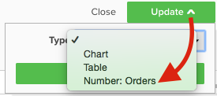

**要件**:

* `Time interval`: `None`
* `Group by`: `None`
* 1つの指標のみ

## `Table`

名前が示すように、`table`件のレポートは表形式の詳細を表示するのに最適です。 単一のレポートで多くのグループを値や指標で表示する必要がある場合、多くの場合、テーブルが最適な方法となります。 例えば、以下は「顧客の詳細」の表で、顧客メール別に注文と収益がグループ化されています。

スクラルレポートと同様に、レポートビルダー内の&#x200B;**[!UICONTROL Save]**&#x200B;または&#x200B;**[!UICONTROL Update]**&#x200B;をクリックし、`Type` ドロップダウンの「テーブル」オプションを選択すると、レポートをテーブルとして保存できます。

「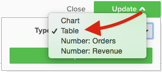

**要件：**

* レポート設定の要件はありませんが、テーブルは3500行に制限されていることに注意することが重要です。 データセットに3500行を超える行が含まれる場合は、結果をフィルタリングして範囲を絞り込むか、結果を`.csv`または`Excel`に書き出して完全なデータセットを表示する必要があります。

## `Line`

`Line` グラフは、類似の指標コホートのパフォーマンスを比較するのに最適な選択肢です。 たとえば、次に示すように、同じ期間に2つの地域の売上を分析したり、フルフィルメント注文の前年比の増加を比較したりします。

レポートに追加された各指標と数式は、それぞれ独自の行で表されます。 同じ単位とスケールの指標を比較する場合は、`Multiple Y-Axes`のチェックボックスをオフにして、すべての指標を同じスケールで表示することを忘れないでください。

レポートを折れ線グラフとして保存するには、次に示すように、レポート `Type`を`Chart`に調整し、レポートビルダー内から適切なビジュアライゼーションを選択します。

**要件：**

* なし

## `Bar`

`Bar`個のグラフは、データを一連の水平棒として表示します。これは、限られた数の指標または値でグループ化した指標の全体的なパフォーマンスを表示するのに最適です。 例えば、棒グラフは店舗ごとの売上の比較に使用できます。

すべての個別の指標、グループ化、時間間隔の組み合わせは、独自のバーとして表示されます。 1つの`group by`を持つ2つの指標があり、3つの異なる`group by`値が含まれている場合、レポートには6つの別々のバーが表示されます。

レポートを棒グラフとして保存するには、レポート `Type`を`Chart`に調整し、次に示すように`Bar` オプションを選択します。

**要件：**

* なし

## `Stacked Bar`

`Stacked bar`のグラフは棒グラフの兄弟に似ており、各棒グラフの比例的な分類を表示する機能が追加されています。 多くの場合、積み上げ棒グラフは2つ以上の指標と1つのグループで設定され、各棒は、その指標の構成要素の間で分割される値による一意のグループを表します。

例えば、次のレポートには、2つの同じ収益指標があり、1つは初回注文でフィルタリングされ、もう1つはリピート注文でフィルタリングされます。 ストア別にグループ化すると、各ストアの合計収益貢献度（バーの合計幅で表されます）と、各ストアの初回収益vs繰り返し収益の内訳の両方を確認できます。

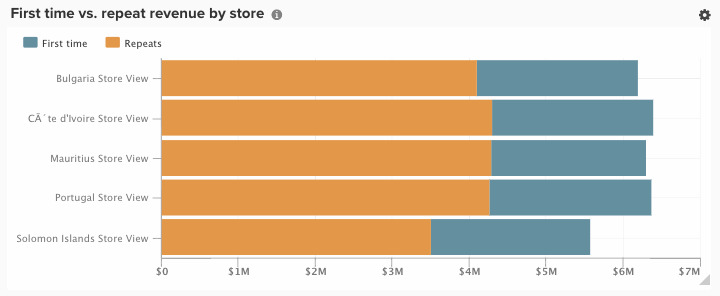

上記のようなレポートを設定する場合は、`Multiple Y-Axes` ボックスがオフになっていることを確認してください。

レポートを積み上げ棒グラフとして保存するには、レポート `Type`を`Chart`に調整し、レポートビルダーから積み上げ棒オプションを選択します。

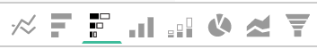

**要件：**

* なし

## `Column`

`Column`のグラフは、各データ ポイントを縦棒グラフとして表します。横棒グラフのビジュアライゼーションよりも、時系列データを表示するのに適しています。 一意の指標と組み合わせでグループ化された各指標は、独自の一連の棒グラフで表されます。 列レポートは、3つ以下の指標を持つレポート、または1～3個のグループ別の値を含む1つの指標を持つレポートに最適です。

次の例では、2つの収益指標が表示されています。1つは初回収益でフィルタリングされ、もう1つはリピート収益でフィルタリングされ、もう1つは月ごとにトレンドになります。

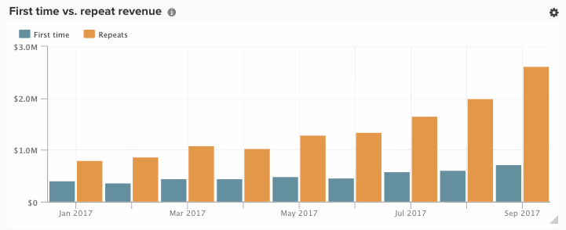

列レポートは、レポート `Type`を`Chart`に変更し、列ビジュアライゼーションオプションを選択することで保存できます。

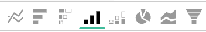

**要件：**

* なし

## `Stacked Column`

`Stacked column`件のレポートは列グラフとほぼ同じですが、類似する列が重なり合い、合計の高さが値の合計を表すようになっていることを除きます。 積み重ね列は、限られた数の指標またはグループの購入で再び最も効果的に視覚化されます。

上記の`Column` セクションで説明したのと同じレポート設定を使用すると、2つの収益指標（初めてフィルタリングおよび繰り返しフィルタリング）を持つレポートは、積み重ね列のビジュアライゼーションで次のようになります。

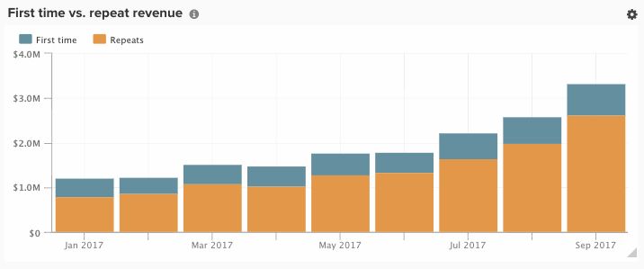

繰り返しますが、積み重ね列のビジュアライゼーションで複数の指標を表示する場合、`Multiple Y-Axes` チェックボックスをオフにすることが重要です。

レポートを積み重ね列として保存するには、レポート `Type`を`Chart`に設定し、`stacked column` オプションを選択します。

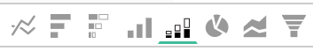

**要件：**

* なし

## `Pie`

`Pie`のグラフは、1つ以上のグループ bysを持つ単一の指標、またはグループ bysを持たない複数の指標のいずれかを表示するのに最適です。 いずれの場合も、データを円グラフで表示するには、時間間隔を「なし」に設定する必要があります。 次の例では、単一の注文指標がストア名でグループ化され、ストアごとの注文の内訳が表示されます。

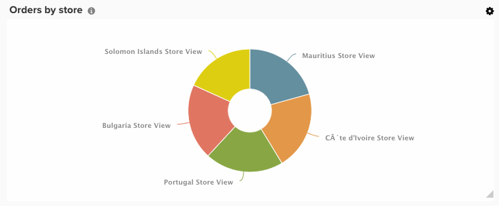

レポートを円グラフとして保存するには、レポート `Type`を`Chart`に設定し、次に示すように`pie` オプションを選択します。

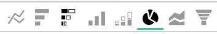

**要件：**

* `Time interval`: `None`
* 次のいずれかです。
   * `Single metric with one or more group bys`
   * `Multiple metrics with no group bys`

## `Area`

`Area` グラフは、積み上げ棒グラフとほぼ同じですが、列は連続して表示されます。 積み上げ棒グラフと同様に、エリアチャートもグループの棒グラフや指標の数が限られていることを視覚化するのに最適です。

`stacked column` セクションの同じ例を次に示します。下のレポートは、階層グラフのビジュアライゼーションを使用した初回収益とリピート収益の比較を示しています。

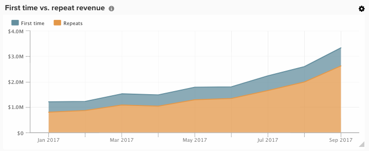

レポートをエリア チャートとして保存するには、`Type`を`Chart`に調整し、エリア オプションを選択します。

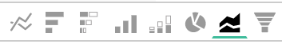

**要件：**

* なし

## `Funnel`

`Funnel` グラフは、予想されるイベントのシーケンス全体でコンバージョンを視覚化するのに最適です。 たとえば、リードから成約件数までのセールスfunnelの潜在的な売上を分析したり、1回目と2回目の注文、2回目と3回目の注文の顧客の減少を測定したりすることができます。 後者の例を以下に示します。

Funnel レポートでは、funnelの特定のステップの相対的な値が、ステップの高さによって反映されます。 レポート設定によって、手順を表示する順序が決まります。 Funnel レポートを設定するには、次の2つの方法があります。

* `Single metric with one group by`: - グループの「上/下を表示」設定で決定される手順の順序。 デフォルトでは、funnel ステップは最大値から最小値までの順に表示されますが、名前でグループ化してアルファベット順に並べ替えることもできます。

* `Multiple metrics with no group by`: – 指標がレポートに追加される順序によって決定される手順の順序。

レポートをfunnel グラフとして保存するには、レポート `Type`を`Chart`に調整し、レポートビルダー内から適切なビジュアライゼーションを選択します。

**要件：**

* `Time interval`: `None`
* 次のいずれかです。
   * `Single metric with one group by`
   * `Multiple metrics with no group by`

## `Scatter plot`

`scatter plot`は、2つの異なる変数との指標の関係を調べるために使用され、相関関係と異常値を簡単に特定できます。 このタイプのビジュアライゼーションは、数値ディメンションでのみ使用するのが最適です。注文指標と`Customer's lifetime number of coupons`および`Customer's lifetime revenue` ディメンションで試して、クーポンの使用が収益にどのように関連しているかを確認してください。 トレンドラインの有無にかかわらず、散布図を選択できます。

顧客指標の間の相関関係を示す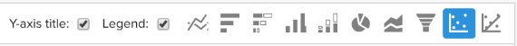

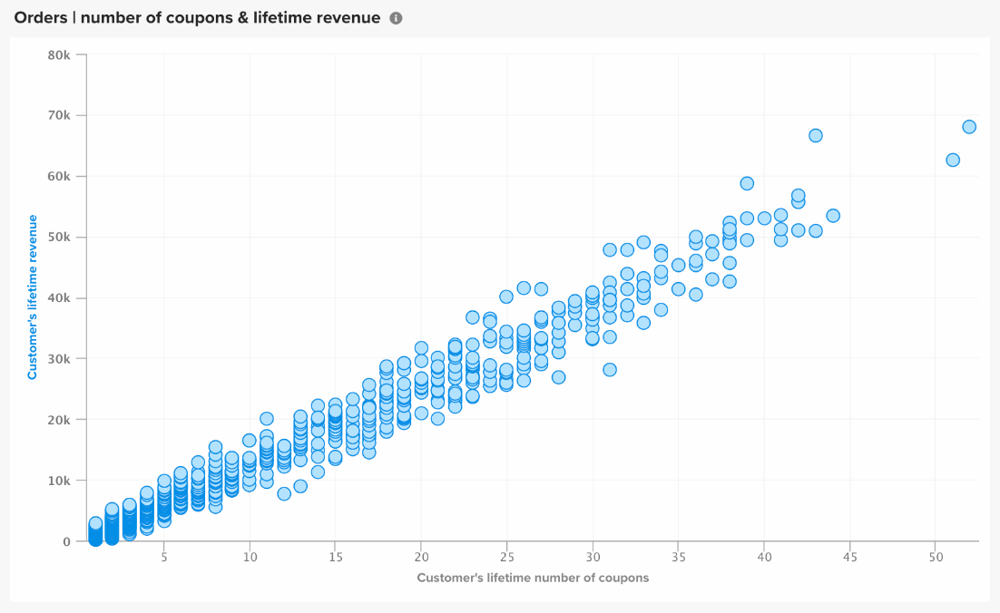

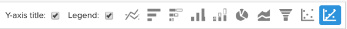

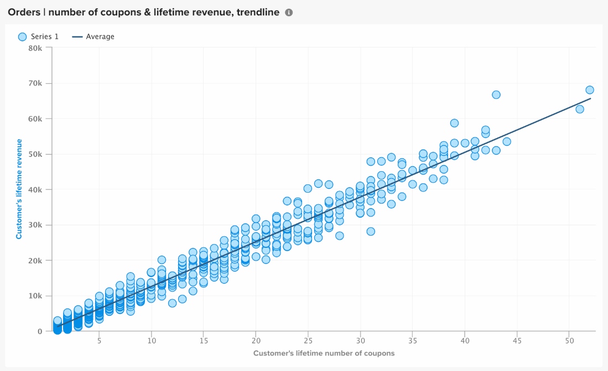

**要件：**

オプション 1:

* 2個の`metrics`
* 1個の`group by`
* `Time interval`: `None`

オプション 2:

* 2個の`metrics`
* いいえ`group by`
* `time interval`を設定

## `Bubble` グラフ

`bubble` グラフには、データの最大4つのディメンションを表示できます。`X`軸と`Y`軸でバブルの場所を指定します。 `Z`軸はバブルのサイズです。2つのグループを含めることで、バブルに色を追加できます。 このタイプのビジュアライゼーションは、単一のグラフで複数のディメンションのデータをプロットする場合に最適です。

例えば、次のグラフは、総売上と平均生涯注文に対してプロットされた、特定の取得元（バブルの色）と状態（特定の色の様々なバブル）でグループ化された顧客数（バブルサイズ）を示しています。

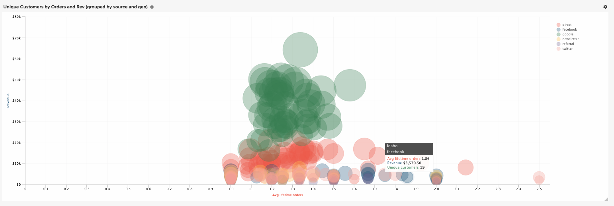

次のグラフは、顧客数（バブルサイズ）を獲得ソース（バブルカラー）と状態（特定の色の様々なバブル）でグループ化し、平均生涯価値と総収益に対してプロットしたものです。

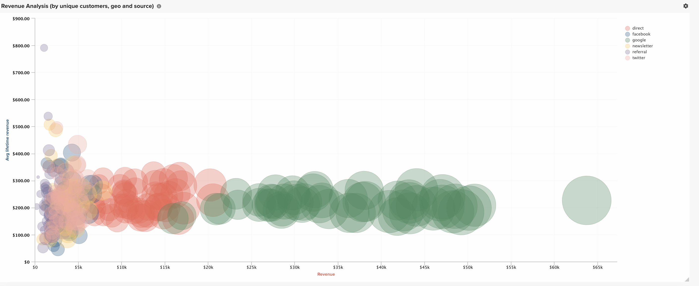

**単一シリーズ バブル チャートの要件：**

オプション 1

* 3 `metrics`
* 1個の`group by`
* `Time interval`: `None`

オプション 2

* 3 `metrics`
* いいえ`group by`
* `time interval`を設定

**複数系列バブル チャートの要件：**

* 3 `metrics`
* 2個の`group by`
* `Time interval`: `None`

## `Heatmap`

`heatmaps`を使用して、データ内のホットスポットを視覚化します。 例えば、ヒートマップは、定期的に配信数が増えている場所を示すことができます。 このデータを視覚化することで、在庫レベルを調整し、繁忙期の需要に対応することができます。

次のヒートマップは、注文を曜日ごとに時間ごとに集計し、数週間にわたって表示します。

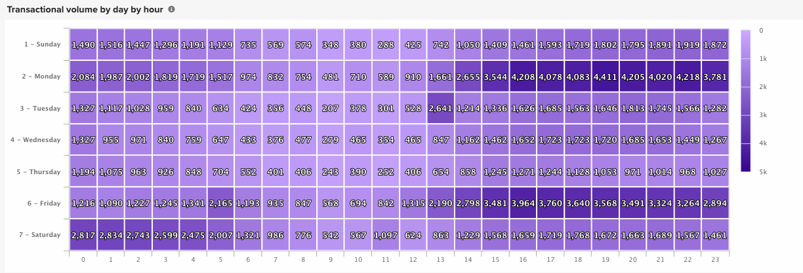<!--{: width="650"}-->

**要件：**

オプション 1

* 1個の`metric`
* 2個の`group by`
* `Time interval`: `None`

オプション 2

* 1個の`metric`
* 1個の`group by`
* `time interval`を設定
