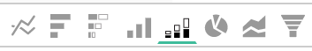

# 表示オプション

特定のデータセットに対して適切なビジュアライゼーションを選択することは、分析プロセスの重要な部分です。 どのデータセットにもストーリーがありますが、そのストーリーの効果は、視覚的な影響と読みやすさによって強調されています。

この [!DNL Commerce Intelligence] [!DNL Visual Report Builder] は、12 の異なるビジュアライゼーションオプションを提供し、それぞれに独自の利点とユースケースがあります。 このトピックでは、必要なレポート設定（該当する場合）やユースケースの例など、[!DNL Commerce Intelligence] の様々なビジュアライゼーションオプションについて説明します。 [!DNL Commerce Intelligence] では、次のビジュアライゼーションを使用できます。

* `Scalar`
* `Table`
* `Line`
* `Bar`
* `Stacked Bar`
* `Column`
* `Stacked Column`
* `Pie`
* `Area`
* `Funnel`
* `Scatter plot`
* `Bubble`
* `Heatmap`

## `Scalar`

レポ `Scalar` トは、1 つの数値として表示されます。 ほとんどの場合、これは、売上高や注文などの主要指標の「全期間」値を表示したり、2 つの個別のスカラーレポートを使用して売上高を日付と予算の比較を行うために使用されます。 次の例では、特定のレポート間隔における注文の合計数を単純に示しています。

レポートをスカラーとして保存するには、フィルターと時間設定を設定し、レポートの右上セクションにある「**[!UICONTROL Save]**」または「**[!UICONTROL Update]**」をクリックします。 「`Type`」ドロップダウンで「数値：指標名」を選択し、左側のバーに表示される値としてレポートを保存します。

**要件**:

* `Time interval`: `None`
* `Group by`: `None`
* 1 つの指標のみ

## `Table`

名前が示すように、`table` レポートは表形式の詳細を表示するのに最適です。 1 つのレポートに値または指標で多数のグループを表示する必要がある場合、多くの場合、テーブルが最適な方法です。 例えば、以下は「顧客の詳細」のテーブルで、顧客のメールごとにグループ化された注文と売上高が表示されています。

スカラーレポートと同様に、Report Builder 内で **[!UICONTROL Save]** または **[!UICONTROL Update]** をクリックし、`Type` ドロップダウンの下の「テーブル」オプションを選択することで、レポートをテーブルとして保存できます。

**要件：**

* レポート設定の要件はありませんが、テーブルは 3500 行に制限されることに注意してください。 データセットに 3500 行を超える行が含まれる場合、結果をフィルターして範囲を絞り込むか、結果を `.csv` または `Excel` に書き出して完全なデータセットを表示する必要があります。

## `Line`

`Line` グラフは、類似の指標コホートのパフォーマンスを比較するのに最適です。 例えば、次に示すように、同じ期間の 2 つの地域の売上高を分析したり、フルフィルメント済み注文の前年比の成長を比較したりします。

レポートに追加される各指標および数式は、それぞれ別の行で表されます。 単位とスケールが類似している指標を比較する場合は、すべての指標を同じスケールで表示す `Multiple Y-Axes` ためのチェックボックスをオフにすることを忘れないでください。

レポートを折れ線グラフとして保存するには、次に示すように、Report Builder でレポートの `Type` を `Chart` に調整して、適切なビジュアライゼーションを選択します。

**要件：**

* なし

## `Bar`

`Bar` グラフは、データを一連の横棒として表示し、限られた数の指標または値によるグループ化の全体的なパフォーマンスを示すのに最適です。 例えば、棒グラフを使用して、店舗別の売上高を比較できます。

個別の指標、グループ化および時間間隔の組み合わせはすべて、独自のバーとして表示されます。 1 つの `group by` を持つ 2 つの指標があり、3 つの異なる `group by` 値が含まれている場合、レポートには 6 つの異なるバーが表示されます。

レポートを棒グラフとして保存するには、レポート `Type` を `Chart` に調整し、次に示すように `Bar` オプションを選択します。

**要件：**

* なし

## `Stacked Bar`

`Stacked bar` グラフは棒グラフの兄弟に似ており、各棒の割合の分類を表示する機能が追加されています。 ほとんどの場合、積み重ね棒グラフは、2 つ以上の指標と 1 つのグループ化で設定されているので、各棒は、指標の構成要素で分割された一意のグループ化を値で表します。

例えば、以下のレポートには、2 つの同じ売上高指標があり、1 つは初回注文でフィルタリングされ、もう 1 つはリピート注文でフィルタリングされています。 ストア別にグループ化すると、各ストアの合計売上高の貢献度（棒の合計幅で表される）と、各ストアの初回売上高と繰り返し売上高の両方の分類を確認できます。

上記のようなレポートを設定する場合は、`Multiple Y-Axes` のチェックボックスがオフになっていることを確認します。

レポートを積み重ね棒グラフとして保存するには、レポート `Type` を `Chart` に調整し、Report Builder から「積み重ね棒グラフ」オプションを選択します。

**要件：**

* なし

## `Column`

`Column` グラフは、各データポイントを縦棒で表し、横棒グラフのビジュアライゼーションよりも時間トレンドのデータを表示するのに適しています。 各一意の指標とグループ化の組み合わせは、それぞれ独自の一連のバーで表されます。 列レポートは、指標が 3 つ以下のレポートや、値によって 1～3 のグループを含む単一グループの 1 つの指標に最適です。

次の例では、2 つの売上高指標が表示されます。1 つは初回売上高でフィルタリングされ、もう 1 つはリピート売上高でフィルタリングされています。月別の経時的なトレンドです。

列レポートを保存するには、レポート `Type` を `Chart` に変更し、列ビジュアライゼーションオプションを選択します。

**要件：**

* なし

## `Stacked Column`

`Stacked column` レポートは、縦棒グラフとほとんど同じですが、類似の列が積み重ねられ、高さの合計が値の合計を表す点が異なります。 積み重ね列は、指標やグループバイトの数が限られている場合に、再び最適に視覚化されます。

上記の `Column` の節で説明したのと同じレポート設定を使用すると、（初めてフィルタリングして繰り返す） 2 つの売上高指標を含んだレポートは、積み重ね列ビジュアライゼーションを含んだ次のようになります。

この場合も、積み重ね列のビジュアライゼーションで複数の指標を表示する際は、「`Multiple Y-Axes`」チェックボックスをオフにすることが重要です。

レポートを積み重ね列として保存するには、レポート `Type` を `Chart` に設定し、`stacked column` のオプションを選択します。

**要件：**

* なし

## `Pie`

`Pie` グラフは、1 つ以上のグループベイを持つ単一の指標、またはグループベイを持たない複数の指標を表示するのに最適です。 どちらの場合も、データを円グラフで表示するには、時間間隔をなしに設定する必要があります。 次の例では、単一の注文指標がストア名でグループ化され、ストア別の注文の分類が表示されます。

レポートを円グラフとして保存するには、レポート `Type` を `Chart` に設定し、次に示すように `pie` オプションを選択します。

**要件：**

* `Time interval`: `None`
* 次のいずれかの操作をおこないます。
   * `Single metric with one or more group bys`
   * `Multiple metrics with no group bys`

## `Area`

`Area` グラフは、列が連続して表示される点を除いて、積み重ね縦棒グラフとほとんど同じです。 積み重ね列と同様に、面グラフは、限られた数のグループバイトまたは指標で最も適切に視覚化されます。

`stacked column` の節の同じ例を取り上げると、以下のレポートでは、面グラフのビジュアライゼーションで初回売上高と繰り返し売上高を示しています。

レポートを面グラフとして保存するには、`Type` を `Chart` に調整して面グラフのオプションを選択します。

**要件：**

* なし

## `Funnel`

`Funnel` グラフは、予想される一連のイベントにわたるコンバージョンを視覚化するのに最適です。 例としては、リードから成約済みの取引に至るまでのfunnelにおける潜在的な売上高の分析、1 番目と 2 番目の注文、2 番目と 3 番目の注文の間の顧客の減少の測定などがあります。 後者の例を次に示します。

funnel レポートでは、funnelの特定のステップの相対値がステップの高さによって反映されます。 レポートの設定によって、ステップの表示順序が決まります。 funnel レポートを設定する方法は 2 つあります。

* `Single metric with one group by`: - グループ化の [ 上位/下位を表示 ] 設定によって決定されたステップの順序。 デフォルトでは、funnelのステップは最大値から最小値の順に表示されますが、名前でグループ化してアルファベット順に並べ替えることもできます。

* `Multiple metrics with no group by`: – 指標がレポートに追加された順序によって決定されるステップの順序。

レポートをfunnel グラフとして保存するには、レポート `Type` を `Chart` に変更し、Report Builder 内から適切なビジュアライゼーションを選択します。

**要件：**

* `Time interval`: `None`
* 次のいずれかの操作をおこないます。
   * `Single metric with one group by`
   * `Multiple metrics with no group by`

## `Scatter plot`

`scatter plot` を使用して、2 つの異なる変数との指標の関係を調べ、相関関係と異常値を簡単に識別できるようにします。 このタイプのビジュアライゼーションは、数値ディメンションでのみ最適です。注文指標、`Customer's lifetime number of coupons` および `Customer's lifetime revenue` ディメンションを使用して試し、クーポンの使用状況が売上高にどのように関連するかを確認します。 近似曲線のある散布図と近似曲線のない散布図のどちらかを選択できます。

**要件：**

オプション 1:

* 2`metrics`
* 1`group by`
* `Time interval`: `None`

オプション 2:

* 2`metrics`
* No `group by`
* `time interval` を設定

## `Bubble` グラフ

`bubble` グラフには、`X` 軸と `Y` 軸がバブルの位置を指定するデータの次元を最大 4 つ表示できます。 `Z` 軸は泡の大きさであり、2 つのグループのビーを含めることで、泡に色を追加できます。 このタイプのビジュアライゼーションは、複数のディメンションのデータを 1 つのグラフにプロットする場合に最適です。

例えば、次のグラフは、特定の取得ソース（バブルの色）と状態（様々なバブル）でグループ化された顧客数（バブルのサイズ）を、合計売上高と平均ライフタイム注文に対してプロットして示しています。

次のグラフは、顧客の数（バブルサイズ）を、獲得ソース（バブルカラー）と状態（特定の色の様々なバブル）別にグループ化し、平均ライフタイム値と合計売上高に対してプロットしたものです。

**単一系列のバブル チャートの要件：**

オプション 1

* 3`metrics`
* 1`group by`
* `Time interval`: `None`

オプション 2

* 3`metrics`
* No `group by`
* `time interval` を設定

**多系列バブルチャートの要件：**

* 3`metrics`
* 2`group by`
* `Time interval`: `None`

## `Heatmap`

`heatmaps` を使用して、データ内のホットスポットを視覚化します。 例えば、ヒートマップは、通常より多くの量を得る場所を示すことができます。 このデータを視覚化することで、在庫水準を調整し、ピーク時の需要を確実に満たすことができます。

次のヒートマップは、数週間にわたる、曜日および時間の集計でオーダーを示しています。

<!--{: width="650"}-->

**要件：**

オプション 1

* 1`metric`
* 2`group by`
* `Time interval`: `None`

オプション 2

* 1`metric`
* 1`group by`
* `time interval` を設定
