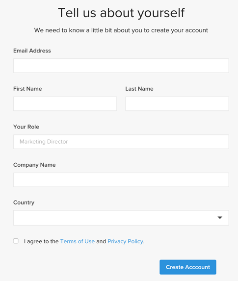

# のアクティブ化 [!DNL MBI] アカウント `Cloud Starter` 購読

有効化するには [!DNL MBI] 対象 `Cloud Starter` プロジェクト、最初に [!DNL MBI] アカウントを作成し、 `SSH` キーを押し、最後にコマースデータベースに接続します。 詳しくは、 [オンプレミスサブスクリプションのアクティブ化](../getting-started/onpremise-activation.md).

>[!NOTE]
>
>有効化に関するヘルプ [!DNL MBI] 対象 `Cloud Pro` プロジェクトに関しては、カスタマーサクセスマネージャーまたはカスタマーテクニカルアドバイザーにお問い合わせください。

1. を [!DNL MBI] アカウント。

   - に移動します。 [Adobe Commerceアカウントログイン](https://account.magento.com/customer/account/login)

   - に移動します。 **[!UICONTROL My Account** > **My [!DNL MBI] Instances]**.

   - クリック **[!UICONTROL Create Instance]**. このボタンが表示されない場合は、カスタマーサクセスマネージャーまたはカスタマーテクニカルアドバイザーにお問い合わせください。

   - を選択します。 `Cloud Starter` 購読。 次の条件を満たす `cloud starter` 配信登録が自動的に選択されます。

   - クリック **[!UICONTROL Continue]**.

   - アカウントを作成するには、情報を入力します。

   

   - インボックスに移動し、メールアドレスを確認します。

   

   - パスワードを作成します。

   

   - アカウントを作成したら、新しいアカウントにユーザーを追加するオプションが表示されます。 技術管理者を追加して、次の手順を実行できるようになりました。

   

1. 環境設定を指定するストアに関する情報を入力します。

   

   オンボーディングフローの 3 番目の手順でデータベースに接続する前に、収集する必要がある情報がいくつかあります。 次の項目を記入します。 `Connect your database` 手順 9 のページ

1. 専用を作成 [!DNL MBI] ユーザー。

   - 新しいユーザーを [Adobe Commerceアカウント](https://accounts.magento.com).

   - _新しいユーザーがいる理由_ [!DNL MBI] アカウントのに転送する新しいデータを継続的に取得するには、プロジェクトに追加されたユーザーが必要です [!DNL MBI] data warehouse を使用します。 このユーザーがその接続の役割を果たします。 このユーザーをプロジェクトに追加するには、手順 4 を実行します。

   - 専用の [!DNL MBI] ユーザーは、追加したユーザーが誤って無効化または削除されて停止するのを防ぐことができます [!DNL MBI] 接続。

1. 新しく作成したユーザーを、 `Contributor`.

   

1. ダウンロード [!DNL MBI] `SSH` キー。

   - 次に移動： `Connect your database` ページ [!DNL MBI] ユーザーインターフェイスを設定し、下にスクロールして `Encryption settings`.

   - の `Encryption Type` フィールド、選択 `SSH Tunnel`.

   - ドロップダウンから、提供されたをコピーして貼り付けることができます [!DNL MBI] `Public Key`.

   

1. 新しい [!DNL MBI] `Public key` から [!DNL MBI] ユーザーが手順 5 で作成されました。

   - に移動します。 [お使いの cloud Adobe Commerceアカウント](https://accounts.magento.cloud/). 新しい [!DNL MBI] ユーザーが作成されました。 その後、 `Account Settings` タブをクリックします。

   - ページを下にスクロールし、のドロップダウンを展開します。 `SSH` キー。 次に、 **[!UICONTROL Add a public key]**.

   

   - を [!DNL MBI] `SSH Public Key` 上から。

   

1. 提供 [!DNL MBI] MySQL の資格情報。

   - の更新 `.magento/services.yaml`

   ```sql
   mysql:
       type: mysql:10.0
       disk: 2048
       configuration:
           schemas:
               - main
           endpoints:
               mysql:
                   default_schema: main
                   privileges:
                       main: admin
               mbi:
                   default_schema: main
                   privileges:
                       main: ro
   ```

   - の更新 `.magento.app.yaml`

   ```sql
           relationships:
               database: "mysql:mysql"
               mbi: "mysql:mbi"
               redis: "redis:redis"
   ```

1. データベースの接続先の情報を取得します [!DNL MBI].

   実行
   `echo $MAGENTO_CLOUD_RELATIONSHIPS | base64 --decode | json_pp`

   をクリックして、データベースへの接続に関する情報を取得します。

   次の出力のような情報を受け取る必要があります。

   ```json
           "mbi" : [
                 {
                    "scheme" : "mysql",
                    "rel" : "mbi",
                    "cluster" : "vfbfui4vmfez6-master-7rqtwti",
                    "query" : {
                       "is_master" : true
                    },
                    "ip" : "169.254.169.143",
                    "path" : "main",
                    "host" : "[!DNL MBI].internal",
                    "hostname" : "3m7xizydbomhnulyglx2ku4wpq.mysql.service._.magentosite.cloud",
                    "username" : "mbi",
                    "service" : "mysql",
                    "port" : 3306,
                    "password" : "[password]"
                 }
              ],
   ```

1. コマースデータベースを接続

   

   - `Integration Name`: [統合の名前を選択します。]

   - `Host`: `[!DNL MBI].internal`

   - `Port`: `3306`

   - `Username`: `mbi`

   - `Password`: [手順 8 の出力で入力したパスワード。]

   - `Database Name`: `main`

   - `Table Prefixes`: [テーブルのプレフィックスがない場合は空白のままにします]

1. タイムゾーン設定を指定します。

   

   - `Database`: `Timezone: UTC`

   - `Desired Timezone`: [データを表示するタイムゾーンを選択します。]

1. 暗号化設定の情報を取得します。

   - プロジェクト UI には、 `SSH` アクセス文字列。 この文字列は、 `Remote Address` および `Username` を `Encryption` 設定。 以下を使用： `SSH Access` 文字列を検索するには、プロジェクト UI のマスターブランチで「サイトにアクセス」ボタンをクリックし、 `User Name` および `Remote Address` 以下に示すように。

   

   

1. 次の情報を入力： `Encryption` 設定

   

   **入力**

   - `Encryption Type`: `SSH Tunnel`

   - `Remote Address`: `ssh.us-3.magento.cloud`

   - `Username`: `vfbfui4vmfez6-master-7rqtwti--mymagento`

   - `Port`: `22`

1. クリック **[!UICONTROL Save Integration]**.

1. これで、 [!DNL MBI] アカウント

1. 接続が完了したら、 [!DNL MBI] コマースデータベースに問い合わせて、カスタマーサクセスマネージャーに連絡し、統合の設定や他の設定手順など、次の手順を調整してもらいます。

1. 設定が完了したら、次の操作を実行できます。 [サインイン](../getting-started/sign-in.md) を [!DNL MBI] アカウント
