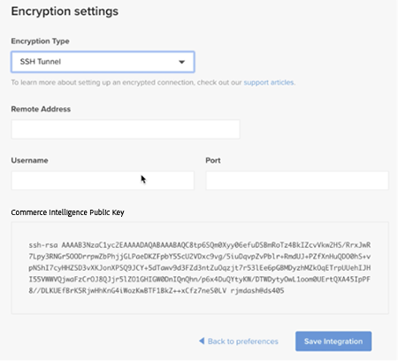

# オンプレミスおよびスターターのサブスクリプション用に [!DNL Commerce Intelligence] アカウントを有効化する

オンプレミスのサブスクリプションで [!DNL Commerce Intelligence] をアクティブにするには、まず [!DNL Commerce Intelligence] アカウントを作成し、設定情報を入力してから、[!DNL Commerce Intelligence] データベースに接続 [!DNL Commerce] ます。<!-- For information about activation in `Cloud Starter` projects, see [Activating your [!DNL Commerce Intelligence] Account for `Cloud Starter` Subscriptions](../getting-started/cloud-activation.md).-->

## [!DNL Commerce Intelligence] アカウントの作成

アカウントを作成するには、Adobe アカウントチームまたはカスタマーテクニカルアドバイザーにお問い合わせください。

## パスワードを作成

アカウントが作成されたら、メールで [!DNL The Magento BI Team@rjmetrics.com] からのアカウント通知メールを確認します。 メールに記載されているリンクを使用して [!DNL Commerce Intelligence] アカウントにアクセスし、パスワードを作成します。 インボックスに移動し、メールアドレスを確認します。

メールを受け取っていない場合は、[ サポートにお問い合わせください ](https://experienceleague.adobe.com/docs/commerce-knowledge-base/kb/troubleshooting/miscellaneous/mbi-service-policies.html?lang=ja)。

## ストアの環境設定

データベース接続を設定する前に、ストア情報フォームに入力します。 この情報は、**[!UICONTROL Connect your Database]** の設定を完了するために必要です。

## [!DNL Commerce Intelligence] 名のユーザーを追加

パスワードを設定して [!DNL Commerce Intelligence] にログインすると、[!DNL Commerce Intelligence] アカウントに他のユーザーを追加できます。 ユーザーを追加する場合は、適切な権限を持つ管理者ユーザーを追加してアクティベーションプロセスを完了します。

## [!DNL Commerce Intelligence] admin で専用の [!DNL Commerce] ユーザーを作成します

[!DNL Commerce Intelligence] を使用するには、[!DNL Commerce] プロジェクトに永続的な専用ユーザーを追加する必要があります。 この専用ユーザーは、[!DNL Commerce] への永続的な接続として機能し、新しいデータを取得してアカウントの [!DNL Commerce Intelligence] Data Warehouseに転送できます。

専用の [!DNL Commerce Intelligence] ユーザーを設定すると、アカウントがディアクティベートされたり削除されたりすることがないので、[!DNL Commerce Intelligence] 接続が停止します。

>[!NOTE]
>
>Adobeでは、永続的なステータスを示すアカウント名（ACI-dedicated、ACI-database-connector など）の使用を推奨しています。

管理者で [!DNL Commerce Intelligence] 専用ユーザーを作成したら、同じユーザーを [!DNL Commerce] の **[!UICONTROL Master]** 設定で `Contributor` プロジェクトのプライマリ環境に追加します。

## Commerce Intelligenceの SSH キーの取得

1. 設定の [!UICONTROL Connect your database] ページで、下 [!DNL Commerce Intelligence] スクロールして「**[!UICONTROL Encryption settings]**」を選択します。

1. **暗号化の種類** で、`SSH Tunnel` を選択します。

1. ドロップダウンから、指定された公開鍵をコピーします。

   

## 公開鍵を [!DNL Commerce Intelligence] に追加

1. [!DNL Commerce Admin] から、作成した [!DNL Commerce Intelligence] ユーザーのログイン情報を使用してログインします。

1. 「**アカウント設定**」タブを選択します。

1. 下にスクロールして、**[!UICONTROL SSH Keys]** ドロップダウンを展開します。 次に、「**[!UICONTROL Add a public key]**」を選択します。

   

1. 上記の [!DNL Encryption Type] の手順でコピーした公開鍵を貼り付けます。

   

## [!DNL Commerce Intelligence] Essentials `MySQL` 資格情報の指定

1. `.magento/services.yaml` を更新します。

   

1. `.magento.app.yaml` を更新します。

   

## データベース接続情報の取得

[!DNL Commerce] データベースへのデータベース接続情報を取得して [!DNL Commerce Intelligence] ます。

1. 次のコマンドを実行して、情報を取得します。

   `echo $MAGENTO_CLOUD_RELATIONSHIPS | base64 --decode | json_pp`

1. データベース情報を確認します。次の例のようになります。

   

## 暗号化された接続を使用して [!DNL Commerce Intelligence] データベースに [!DNL Commerce] を接続する

>[!NOTE]
>
>Adobeでは、[`SSH tunnel`](../data-analyst/importing-data/integrations/mysql-via-ssh-tunnel.md) トンネルを使用してデータベース接続を確立することを強くお勧めします。 ただし、この方法がオプションでない場合でも、[!DNL Commerce Intelligence] を使用して [`direct connection`](../data-analyst/importing-data/integrations/mysql-via-a-direct-connection.md) をデータベースにリンクできます。

[!DNL Commerce Intelligence] 画面に [!UICONTROL Connect your Magento Database] 情報を入力します。

**入力：**

[!UICONTROL Integration Name]: [[!DNL Commerce Intelligence] インスタンスの名前を選択 ]

[!UICONTROL Host]: `mbi.internal`

[!UICONTROL Port]: `3306`

[!UICONTROL ユーザー名]: `mbi`

[!UICONTROL Password]: [ 前の節で表示した入力パスワード ]

[!UICONTROL Database Name]: `main`

[!UICONTROL Table Prefixes]: [ テーブルのプレフィックスがない場合は空白のままにします ]

## [!UICONTROL **タイムゾーン**] 設定を行う

**入力：**

[!UICONTROL Database Timezone]: `UTC`

[!UICONTROL Desired Timezone]: [ データを表示するタイムゾーンを選択します ]

## 暗号化設定の情報の取得

プロジェクト UI には SSH アクセス文字列を指定します。 この文字列は、[!UICONTROL **Remote Address**] および [!UICONTROL **Username**] に必要な情報の収集に使用できます。 プロジェクト UI のマスターブランチにある「アクセス サイト」ボタンをクリックして、SSH アクセス文字列を使用します。 次に、[!UICONTROL User Name] を見つけ、以下に示すように [!UICONTROL Remote Address] します。

## [!DNL Encryption] 設定を入力

**入力：**

[!UICONTROL Encryption Type]: `SSH Tunnel`

[!UICONTROL Remote Address]: `ssh.us-3.magento.cloud` [ 前の手順から ]

[!UICONTROL Username]: `vfbfui4vmfez6-master-7rqtwti—mymagento` [ 前の手順から ]

[!UICONTROL Port]: `22`

## 統合を保存します。

設定手順が完了したら、「[!UICONTROL **統合を保存**]」を選択して変更を適用します。

これで、[!DNL Commerce] データベースが [!DNL Commerce Intelligence] アカウントに正常に接続されました。

>[!NOTE]
>
>[!DNL Adobe Commerce Intelligence Pro] のお客様は、カスタマーサクセスマネージャーまたはカスタマーテクニカルアドバイザーに連絡して、次の手順を調整してください。

設定を完了したら、[ アカウントに ](../getting-started/sign-in.md) ログイン [!DNL Commerce Intelligence] します。

<!---# Activate your [!DNL Commerce Intelligence] Account 

To activate [!DNL Commerce Intelligence] for on-premise or `Cloud Pro` subscriptions, [contact support](https://experienceleague.adobe.com/docs/commerce-knowledge-base/kb/troubleshooting/miscellaneous/mbi-service-policies.html?lang=ja).

>[!NOTE]
>
>Adobe no longer supports new `Cloud Starter` subscriptions.--->
