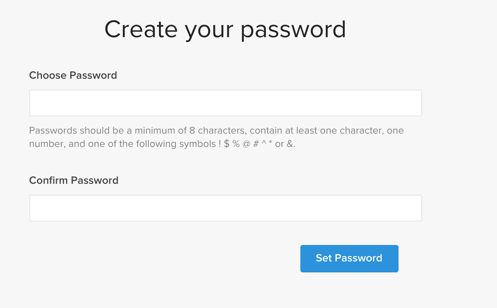

# のアクティブ化 [!DNL MBI] オンプレミスサブスクリプション用アカウント

有効化するには [!DNL MBI] オンプレミスサブスクリプションの場合、最初に [!DNL MBI] アカウント、接続 [!DNL MBI] を Commerce データベースに追加します。 でのアクティベーションについて詳しくは、 `Cloud Starter` プロジェクトについては、 [のアクティブ化 [!DNL MBI] アカウント `Cloud Starter` 購読](../getting-started/cloud-activation.md).

1. を [!DNL MBI] アカウント。

   - に移動します。 [https://account.magento.com/customer/account/login](https://account.magento.com/customer/account/login)

   - に移動します。 **[!UICONTROL My Account** > **My [!DNL MBI] Instances]**.

   - クリック **[!UICONTROL Create Instance]**. このボタンが表示されない場合は、カスタマーサクセスマネージャーまたはカスタマーテクニカルアドバイザーにお問い合わせください。

   - アカウントを作成するには、情報を入力します。

   

   - インボックスに移動し、メールアドレスを確認します。 電子メールを受信していない場合は、 [連絡先サポート](../guide-overview.md).

   - パスワードを作成します。

   

   - アカウントを作成したら、新しいアカウントにユーザーを追加することができます。 技術管理者を追加して、次の手順を実行できるようになりました。

   

1. ストアに関する情報を入力して、環境設定を設定します。

   

1. 接続 [!DNL MBI] 暗号化された接続を使用して Commerce データベースに接続します。

   Commerce では、 [`SSH tunnel`](../data-analyst/importing-data/integrations/mysql-via-ssh-tunnel.md). ただし、これがオプションでない場合、 [!DNL MBI] を使用してデータベースに追加する [`direct connection`](../data-analyst/importing-data/integrations/mysql-via-a-direct-connection.md).

1. 接続が完了したら、 [!DNL MBI] コマースデータベースに問い合わせて、カスタマーサクセスマネージャーに連絡し、統合の設定や他の設定手順など、次の手順を調整してもらいます。

1. 設定が完了したら、次の操作を実行できます。 [サインイン](../getting-started/sign-in.md) を [!DNL MBI] アカウント
