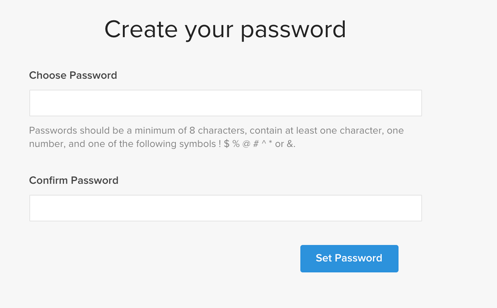
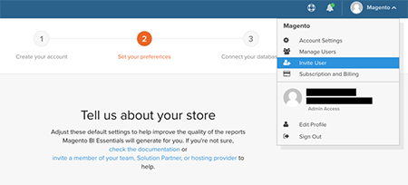
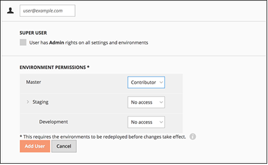
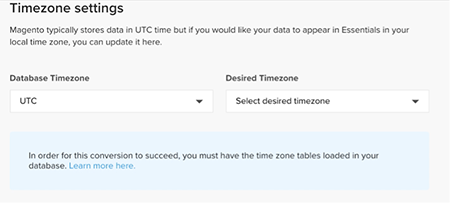
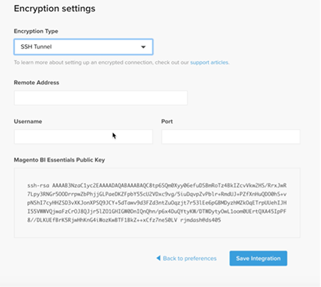

# オンプレミスおよびスターターサブスクリプション用に[!DNL Commerce Intelligence] アカウントをアクティブ化する

オンプレミス サブスクリプション用に[!DNL Commerce Intelligence]をアクティブ化するには、まず[!DNL Commerce Intelligence] アカウントを作成し、設定情報を入力してから、[!DNL Commerce Intelligence]を[!DNL Commerce] データベースに接続します。<!-- For information about activation in `Cloud Starter` projects, see [Activating your [!DNL Commerce Intelligence] Account for `Cloud Starter` Subscriptions](../getting-started/cloud-activation.md).-->

## [!DNL Commerce Intelligence] アカウントを作成

アカウントを作成するには、Adobeのアカウントチームまたはカスタマーテクニカルアドバイザーにお問い合わせください。

## パスワードの作成

アカウントが作成されたら、メールで[!DNL The Magento BI Team@rjmetrics.com]からのアカウント通知メールを確認します。 電子メールに記載されているリンクを使用して、[!DNL Commerce Intelligence] アカウントにアクセスし、パスワードを作成してください。 受信トレイに移動し、電子メールアドレスを確認します。

電子メールが届かない場合は、[&#x200B; サポートにお問い合わせください](https://experienceleague.adobe.com/docs/commerce-knowledge-base/kb/troubleshooting/miscellaneous/mbi-service-policies.html)。

## ストアの環境設定

データベース接続を設定する前に、ストア情報フォームに入力します。 この情報は、**[!UICONTROL Connect your Database]**&#x200B;の設定を完了するために必要です。

## [!DNL Commerce Intelligence] ユーザーを追加

パスワードを設定して[!DNL Commerce Intelligence]にログインしたら、他のユーザーを[!DNL Commerce Intelligence] アカウントに追加できます。 ユーザーを追加する場合は、適切な権限を持つ管理者ユーザーを追加して、アクティベーションプロセスを完了します。

## [!DNL Commerce]管理者に専用の[!DNL Commerce Intelligence] ユーザーを作成します

[!DNL Commerce Intelligence]を使用するには、[!DNL Commerce] プロジェクトに永続的かつ専用のユーザーを追加する必要があります。 この専用ユーザーは、アカウントの[!DNL Commerce Intelligence] Data Warehouseへの新しいデータの取得と転送を可能にする[!DNL Commerce]への永続的な接続として機能します。

専用の[!DNL Commerce Intelligence] ユーザーを設定すると、アカウントが非アクティブ化または削除されないことが保証されるので、[!DNL Commerce Intelligence]接続が停止されます。

>[!NOTE]
>
>Adobeでは、永続ステータス（ACI-dedicated、ACI-database-connectorなど）を示すアカウント名を使用することをお勧めします。

管理者で[!DNL Commerce Intelligence]の専用ユーザーを作成した後、**[!UICONTROL Master]**&#x200B;設定が`Contributor`の[!DNL Commerce] プロジェクトのプライマリ環境に同じユーザーを追加します。

に設定されたユーザーインターフェイスを追加します

## Commerce IntelligenceのSSH キーを取得する

1. [!DNL Commerce Intelligence]設定の[!UICONTROL Connect your database] ページで、下にスクロールして「**[!UICONTROL Encryption settings]**」を選択します。

1. **暗号化タイプ**&#x200B;で、`SSH Tunnel`を選択します。

1. ドロップダウンから、指定された公開鍵をコピーします。

   

## 公開鍵を[!DNL Commerce Intelligence]に追加

1. [!DNL Commerce Admin]から、作成したばかりの[!DNL Commerce Intelligence] ユーザーのログイン情報を使用してログインします。

1. 「**アカウント設定**」タブを選択します。

1. 下にスクロールして、**[!UICONTROL SSH Keys]** ドロップダウンを展開します。 次に、**[!UICONTROL Add a public key]**&#x200B;を選択します。

   

1. 上記の[!DNL Encryption Type] ステップでコピーした公開鍵を貼り付けます。

   

## [!DNL Commerce Intelligence] Essentials `MySQL`資格情報を指定してください

1. `.magento/services.yaml`を更新します。

   

1. `.magento.app.yaml`を更新します。

   

## データベース接続情報の取得

[!DNL Commerce] データベースから[!DNL Commerce Intelligence]へのデータベース接続情報を取得します

1. 次のコマンドを実行して、情報を取得します。

   `echo $MAGENTO_CLOUD_RELATIONSHIPS | base64 --decode | json_pp`

1. データベース情報を確認します。これは、次の例のようになります。

   ホスト、ポート、ユーザー名を含むデータベース接続資格情報を示す

## 暗号化された接続を使用して[!DNL Commerce Intelligence]を[!DNL Commerce] データベースに接続します

>[!NOTE]
>
>Adobeでは、[`SSH tunnel`](../data-analyst/importing-data/integrations/mysql-via-ssh-tunnel.md) トンネルを使用してデータベース接続を行うことを強くお勧めします。 ただし、このメソッドがオプションでない場合でも、[`direct connection`](../data-analyst/importing-data/integrations/mysql-via-a-direct-connection.md)を使用して[!DNL Commerce Intelligence]をデータベースにリンクできます。

[!UICONTROL Connect your Magento Database]画面に[!DNL Commerce Intelligence]情報を入力します。

**入力：**

[!UICONTROL Integration Name]: [自分の[!DNL Commerce Intelligence] インスタンスの名前を選択]

[!UICONTROL Host]: `mbi.internal`

[!UICONTROL Port]: `3306`

[!UICONTROL ユーザー名]: `mbi`

[!UICONTROL Password]: [前のセクションに表示された入力パスワード ]

[!UICONTROL Database Name]: `main`

[!UICONTROL Table Prefixes]: [ テーブルの接頭辞がない場合は空白のままにします]

## [!UICONTROL **タイムゾーン**]&#x200B;の設定

**入力：**

[!UICONTROL Database Timezone]: `UTC`

[!UICONTROL Desired Timezone]: [ データを表示するタイムゾーンを選択]

## 暗号化設定情報を取得する

プロジェクト UIには、SSH アクセス文字列が表示されます。 この文字列は、[!UICONTROL **リモートアドレス**]&#x200B;および&#x200B;[!UICONTROL **ユーザー名**]&#x200B;に必要な情報を収集するために使用できます。 プロジェクト UIのマスターブランチにある「サイトにアクセス」ボタンを選択して、SSH アクセス文字列を使用します。 次に、次に示すように、[!UICONTROL User Name]と[!UICONTROL Remote Address]を見つけます。

ユーザー名とリモート アドレスを含むSSH アクセス情報を表示する

## [!DNL Encryption]の設定を入力

**入力：**

[!UICONTROL Encryption Type]: `SSH Tunnel`

[!UICONTROL Remote Address]: `ssh.us-3.magento.cloud` [前の手順]から

[!UICONTROL Username]: `vfbfui4vmfez6-master-7rqtwti—mymagento` [前の手順]から

[!UICONTROL Port]: `22`

## 統合を保存します。

設定手順を完了したら、[!UICONTROL **統合を保存**]&#x200B;を選択して変更を適用します。

これで、[!DNL Commerce] データベースを[!DNL Commerce Intelligence] アカウントに正常に接続しました。

>[!NOTE]
>
>[!DNL Adobe Commerce Intelligence Pro]のお客様の場合は、カスタマーサクセスマネージャーまたはカスタマーテクニカルアドバイザーに連絡して、次の手順を調整してください。

設定が完了したら、[あなたの[!DNL Commerce Intelligence] アカウントに](../getting-started/sign-in.md) ログインしてください。

<!--
# Activate your [!DNL Commerce Intelligence] Account

To activate [!DNL Commerce Intelligence] for on-premise or `Cloud Pro` subscriptions, [contact support](https://experienceleague.adobe.com/docs/commerce-knowledge-base/kb/troubleshooting/miscellaneous/mbi-service-policies.html).

>[!NOTE]
>
>Adobe no longer supports new `Cloud Starter` subscriptions.
-->
