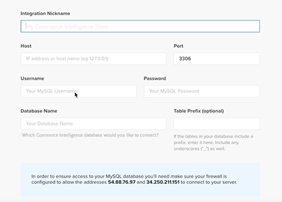

# のアクティブ化 [!DNL Commerce Intelligence] オンプレミスおよびスターターサブスクリプション用のアカウント

有効化するには [!DNL Commerce Intelligence] オンプレミスサブスクリプションの場合、最初に [!DNL Commerce Intelligence] アカウントに設定情報を入力し、接続します。 [!DNL Commerce Intelligence] を [!DNL Commerce] データベース。 <!-- For information about activation in `Cloud Starter` projects, see [Activating your [!DNL Commerce Intelligence] Account for `Cloud Starter` Subscriptions](../getting-started/cloud-activation.md).-->

## を作成します。 [!DNL Commerce Intelligence] アカウント

アカウントを作成するには、担当のAdobeアカウントチームまたはカスタマーテクニカルアドバイザーにお問い合わせください。

## パスワードを作成

アカウントを作成したら、電子メールで、次のアカウント通知電子メールを確認します： [!DNL The Magento BI Team@rjmetrics.com]. 電子メールに記載されているリンクを使用して、 [!DNL Commerce Intelligence] アカウントを作成し、パスワードを作成します。 インボックスに移動し、メールアドレスを確認します。

電子メールを受信していない場合は、 [連絡先サポート](https://experienceleague.adobe.com/docs/commerce-knowledge-base/kb/troubleshooting/miscellaneous/mbi-service-policies.html?lang=en).

## ストアの環境設定を指定

データベース接続を設定する前に、ストア情報フォームに入力します。 この情報は、 **[!UICONTROL Connect your Database]** 設定。

## 追加 [!DNL Commerce Intelligence] ユーザー

パスワードを設定し、 [!DNL Commerce Intelligence]を使用する場合、他のユーザーを [!DNL Commerce Intelligence] アカウント。 ユーザーを追加する際に、アクティベーションプロセスを完了するための適切な権限を持つ管理者ユーザーを追加します。

## 専用のを作成する [!DNL Commerce Intelligence] ユーザーが [!DNL Commerce] admin

次を使用するには： [!DNL Commerce Intelligence]に設定する場合は、永続的な専用ユーザーを [!DNL Commerce] プロジェクト。 この専用ユーザーは、 [!DNL Commerce] これにより、新しいデータをアカウントの [!DNL Commerce Intelligence] Data Warehouse。

専用のの設定 [!DNL Commerce Intelligence] ユーザーが、アカウントを非アクティブ化または削除しないようにするので、 [!DNL Commerce Intelligence] 接続。

>[!NOTE]
>
>Adobeでは、永続的なステータスを示すアカウント名（ACI 専用、ACI-database-connector など）を使用することを推奨します。

専用ユーザーを作成した後 [!DNL Commerce Intelligence] 管理で、同じユーザーを [!DNL Commerce] ～と共にプロジェクトを行う **[!UICONTROL Master]** の設定 `Contributor`.

## Commerce Intelligence SSH キーの取得

1. 次の日： [!UICONTROL Connect your database] ～のページ [!DNL Commerce Intelligence] 設定、下にスクロールして「 」を選択します。 **[!UICONTROL Encryption settings]**.

1. の場合 **暗号化タイプ**&#x200B;を選択します。 `SSH Tunnel`.

1. ドロップダウンから、提供された公開鍵をコピーします。

   

## 公開鍵を [!DNL Commerce Intelligence]

1. 次から： [!DNL Commerce Admin]にログインし、 [!DNL Commerce Intelligence] 作成したユーザー。

1. を選択します。 **アカウント設定** タブをクリックします。

1. 下にスクロールして、 **[!UICONTROL SSH Keys]** 」ドロップダウンリストから選択できます。 次に、 **[!UICONTROL Add a public key]**.

   

1. コピーした公開鍵をに貼り付けます。 [!DNL Encryption Type] 上記の手順を実行します。

   

## 提供 [!DNL Commerce Intelligence] 初期設定 `MySQL` 資格情報

1. を更新します。 `.magento/services.yaml`.

   

1. を更新します。 `.magento.app.yaml`.

   

## データベース接続情報の取得

データベース接続情報をに取得する [!DNL Commerce] データベースへ [!DNL Commerce Intelligence]

1. 次の手順を実行して、情報を取得します。

   `echo $MAGENTO_CLOUD_RELATIONSHIPS | base64 --decode | json_pp`

1. データベース情報を確認します。次の例のようになります。

   

## 接続 [!DNL Commerce Intelligence] を [!DNL Commerce] 暗号化された接続を使用するデータベース

>[!NOTE]
>
>Adobeでは、 [`SSH tunnel`](../data-analyst/importing-data/integrations/mysql-via-ssh-tunnel.md) データベース接続を確立するためのトンネル。 ただし、このメソッドがオプションでない場合でも、 [!DNL Commerce Intelligence] を使用してデータベースに追加する [`direct connection`](../data-analyst/importing-data/integrations/mysql-via-a-direct-connection.md).

を入力します。 [!DNL Commerce Intelligence] 情報 [!UICONTROL Connect your Magento Database] 画面。

**入力：**

[!UICONTROL Integration Name]:[ 名前を選択 [!DNL Commerce Intelligence] インスタンス ]

[!UICONTROL Host]: `mbi.internal`

[!UICONTROL Port]: `3306`

[!UICONTROL ユーザー名]: `mbi`

[!UICONTROL Password]: [前のセクションに表示された入力パスワード]

[!UICONTROL Database Name]: `main`

[!UICONTROL Table Prefixes]: [テーブルのプレフィックスがない場合は空白のままにします]

## を [!UICONTROL **タイムゾーン**] 設定

**入力：**

[!UICONTROL Database Timezone]: `UTC`

[!UICONTROL Desired Timezone]: [データを表示するタイムゾーンを選択します]

## 暗号化設定情報を取得する

プロジェクトの UI には SSH アクセス文字列が表示されます。 この文字列は、 [!UICONTROL **リモートアドレス**] および [!UICONTROL **ユーザー名**]. プロジェクト UI のアクセスブランチのアクセスサイトボタンをマスターし、SSH アクセス文字列を使用します。 次に、 [!UICONTROL User Name] および [!UICONTROL Remote Address] 以下に示すように。

## 次の項目を入力： [!DNL Encryption] 設定

**入力：**

[!UICONTROL Encryption Type]: `SSH Tunnel`

[!UICONTROL Remote Address]: `ssh.us-3.magento.cloud`  [前の手順から]

[!UICONTROL Username]: `vfbfui4vmfez6-master-7rqtwti—mymagento`  [前の手順から]

[!UICONTROL Port]: `22`

## 統合を保存します。

設定手順を完了したら、「 」を選択して変更を適用します。 [!UICONTROL **統合の保存**].

これで、 [!DNL Commerce] データベースを [!DNL Commerce Intelligence] アカウント。

>[!NOTE]
>
>次の場合、 [!DNL Adobe Commerce Intelligence Pro] お客様は、カスタマーサクセスマネージャーまたはカスタマーテクニカルアドバイザーに連絡して、次の手順を調整してください。

設定が完了したら、 [サインイン](../getting-started/sign-in.md) を [!DNL Commerce Intelligence] アカウント。

<!---# Activate your [!DNL Commerce Intelligence] Account 

To activate [!DNL Commerce Intelligence] for on-premise or `Cloud Pro` subscriptions, [contact support](https://experienceleague.adobe.com/docs/commerce-knowledge-base/kb/troubleshooting/miscellaneous/mbi-service-policies.html).

>[!NOTE]
>
>Adobe no longer supports new `Cloud Starter` subscriptions.--->
