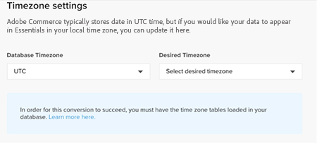

# のアクティベート [!DNL Commerce Intelligence] オンプレミスおよびスターター配信登録用のアカウント

アクティベートするには [!DNL Commerce Intelligence] オンプレミスのサブスクリプションの場合は、まず [!DNL Commerce Intelligence] アカウントを選択し、設定情報を入力してから、接続します [!DNL Commerce Intelligence] 宛先： [!DNL Commerce] データベース。 <!-- For information about activation in `Cloud Starter` projects, see [Activating your [!DNL Commerce Intelligence] Account for `Cloud Starter` Subscriptions](../getting-started/cloud-activation.md).-->

## を作成 [!DNL Commerce Intelligence] アカウント

アカウントを作成するには、Adobeアカウントチームまたはカスタマーテクニカルアドバイザーにお問い合わせください。

## パスワードを作成

アカウントが作成されたら、メールで次のアカウント通知メールを確認します： [!DNL The Magento BI Team@rjmetrics.com]. メールに記載されているリンクを使用して、 [!DNL Commerce Intelligence] アカウントを作成し、パスワードを作成します。 インボックスに移動し、メールアドレスを確認します。

メールを受信していない場合、 [サポートに連絡する](https://experienceleague.adobe.com/docs/commerce-knowledge-base/kb/troubleshooting/miscellaneous/mbi-service-policies.html?lang=en).

## ストアの環境設定

データベース接続を設定する前に、ストア情報フォームに入力します。 この情報は、 **[!UICONTROL Connect your Database]** 設定。

## 追加 [!DNL Commerce Intelligence] ユーザー

パスワードを設定し、にログインしたら、 [!DNL Commerce Intelligence]を開きます。他のユーザーをに追加できます [!DNL Commerce Intelligence] アカウント。 ユーザーを追加する場合は、適切な権限を持つ管理者ユーザーを追加してアクティベーションプロセスを完了します。

## 専用のを作成 [!DNL Commerce Intelligence] のユーザー [!DNL Commerce] admin

使用目的 [!DNL Commerce Intelligence]に、永続的な専用ユーザーを追加する必要があります [!DNL Commerce] プロジェクト。 この専用ユーザーは、に恒久的に接続します [!DNL Commerce] これにより、新しいデータを取得してアカウントのに転送できます [!DNL Commerce Intelligence] Data Warehouse。

専用のの設定 [!DNL Commerce Intelligence] ユーザーは、アカウントがディアクティベートされたり削除されたりしていないことを確認します。これにより、が停止します [!DNL Commerce Intelligence] 接続。

>[!NOTE]
>
>Adobeは、永続的なステータスを示すアカウント名（ACI-dedicated、ACI-database-connector など）を使用することをお勧めします。

用の専用ユーザーの作成後 [!DNL Commerce Intelligence] admin で、同じユーザーをプライマリ環境のに追加します。 [!DNL Commerce] を使用したプロジェクト **[!UICONTROL Master]** の設定 `Contributor`.

## Commerce Intelligence の SSH キーの取得

1. 日 [!UICONTROL Connect your database] のページ [!DNL Commerce Intelligence] 設定、下にスクロールして選択 **[!UICONTROL Encryption settings]**.

1. の場合 **暗号化タイプ**&#x200B;を選択 `SSH Tunnel`.

1. ドロップダウンから、指定された公開鍵をコピーします。

   

## 公開鍵をに追加します [!DNL Commerce Intelligence]

1. から [!DNL Commerce Admin]、のログイン情報を使用してログイン [!DNL Commerce Intelligence] 作成したユーザー。

1. 「」を選択します **アカウント設定** タブ。

1. 下にスクロールして、 **[!UICONTROL SSH Keys]** ドロップダウン。 次に、を選択します **[!UICONTROL Add a public key]**.

   

1. コピーした公開鍵をに貼り付けます [!DNL Encryption Type] 上記の手順です。

   

## 提供する [!DNL Commerce Intelligence] 初期設定 `MySQL` 資格情報

1. を更新 `.magento/services.yaml`.

   

1. を更新 `.magento.app.yaml`.

   

## データベース接続情報の取得

へのデータベース接続情報の取得 [!DNL Commerce] データベース先 [!DNL Commerce Intelligence]

1. 次のコマンドを実行して、情報を取得します。

   `echo $MAGENTO_CLOUD_RELATIONSHIPS | base64 --decode | json_pp`

1. データベース情報を確認します。次の例のようになります。

   

## 接続 [!DNL Commerce Intelligence] 宛先： [!DNL Commerce] 暗号化された接続を使用したデータベース

>[!NOTE]
>
>Adobeでは、 [`SSH tunnel`](../data-analyst/importing-data/integrations/mysql-via-ssh-tunnel.md) データベース接続を確立するためにトンネルを作成します。 ただし、この方法がオプションでない場合は、リンクを設定できます [!DNL Commerce Intelligence] を使用してデータベースに [`direct connection`](../data-analyst/importing-data/integrations/mysql-via-a-direct-connection.md).

を入力 [!DNL Commerce Intelligence] の情報 [!UICONTROL Connect your Magento Database] 画面。

**入力：**

[!UICONTROL Integration Name]: [ 名前を選択してください [!DNL Commerce Intelligence] instance]

[!UICONTROL Host]: `mbi.internal`

[!UICONTROL Port]: `3306`

[!UICONTROL ユーザー名]: `mbi`

[!UICONTROL Password]: [前の節で表示した入力パスワード]

[!UICONTROL Database Name]: `main`

[!UICONTROL Table Prefixes]: [テーブルのプレフィックスがない場合は空白のままにします]

## を設定 [!UICONTROL **タイムゾーン**] 設定

**入力：**

[!UICONTROL Database Timezone]: `UTC`

[!UICONTROL Desired Timezone]: [データを表示するタイムゾーンを選択します]

## 暗号化設定の情報の取得

プロジェクト UI には SSH アクセス文字列を指定します。 この文字列は、に必要な情報の収集に使用できます [!UICONTROL **リモートアドレス**] および [!UICONTROL **ユーザー名**]. プロジェクト UI のマスターブランチにある「アクセス サイト」ボタンをクリックして、SSH アクセス文字列を使用します。 次に、を見つけます [!UICONTROL User Name] および [!UICONTROL Remote Address] 下図を参照してください。

## 入力： [!DNL Encryption] 設定

**入力：**

[!UICONTROL Encryption Type]: `SSH Tunnel`

[!UICONTROL Remote Address]: `ssh.us-3.magento.cloud`  [前の手順から]

[!UICONTROL Username]: `vfbfui4vmfez6-master-7rqtwti—mymagento`  [前の手順から]

[!UICONTROL Port]: `22`

## 統合を保存します。

設定手順を完了したら、次を選択して変更を適用します。 [!UICONTROL **統合を保存**].

接続に成功しました [!DNL Commerce] データベースから [!DNL Commerce Intelligence] アカウント。

>[!NOTE]
>
>次の場合： [!DNL Adobe Commerce Intelligence Pro] お客様は、カスタマーサクセスマネージャーまたはカスタマーテクニカルアドバイザーに連絡して、次の手順を調整します。

設定が完了したら、 [ログイン](../getting-started/sign-in.md) 宛先： [!DNL Commerce Intelligence] アカウント。

<!---# Activate your [!DNL Commerce Intelligence] Account 

To activate [!DNL Commerce Intelligence] for on-premise or `Cloud Pro` subscriptions, [contact support](https://experienceleague.adobe.com/docs/commerce-knowledge-base/kb/troubleshooting/miscellaneous/mbi-service-policies.html).

>[!NOTE]
>
>Adobe no longer supports new `Cloud Starter` subscriptions.--->
