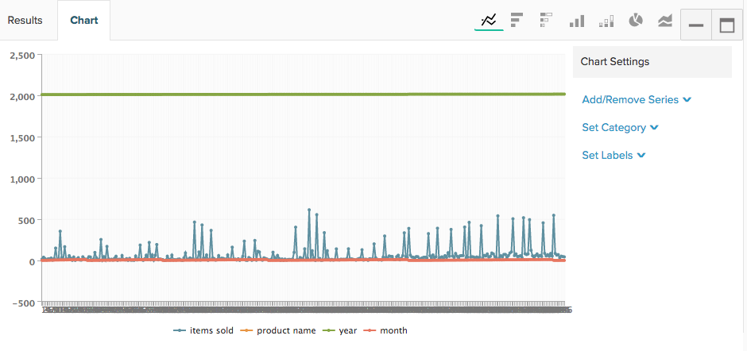
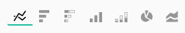

# SQL クエリからのビジュアライゼーションの作成

このチュートリアルの目的は、[!DNL SQL Report Builder]で使用されている用語を理解し、`SQL visualizations`を作成するための堅牢な基盤を提供することです。

[[!DNL SQL Report Builder]](../data-analyst/dev-reports/sql-rpt-bldr.md)はオプション付きのレポートビルダーです。データのテーブルを取得する目的だけでクエリを実行するか、それらの結果をレポートに変換できます。 このチュートリアルでは、SQL クエリからビジュアライゼーションを作成する方法を説明します。

## 用語

このチュートリアルを開始する前に、`SQL Report Builder`で使用されている次の用語を参照してください。

- `Series`：測定する列は、SQL Report Builderではシリーズと呼ばれます。 一般的な例は、`revenue`、`items sold`、`marketing spend`です。 ビジュアライゼーションを作成するには、少なくとも1つの列を`Series`として設定する必要があります。

- `Category`: データのセグメント化に使用する列は`Category`と呼ばれます。これは、`Group By`の[`Visual Report Builder`](../data-user/reports/ess-rpt-build-visual.md)機能と同じです。 例えば、顧客の生涯売上を獲得ソース別にセグメント化する場合、獲得ソースを含む列は`Category`として指定されます。 複数の列を`Category`として設定できます。

>[!NOTE]
>
>日付とタイムスタンプは`Categories`としても使用できます。 クエリ内のデータの単なる列であり、クエリ自体で必要に応じてフォーマットおよび順序を設定する必要があります。

- `Labels`：これらはX軸ラベルとして適用されます。 データのトレンドを時系列で分析する場合、年と月の列はラベルとして指定されます。 複数の列をラベルに設定できます。

## 手順1：クエリの記述

次の点に留意してください。

- [!DNL SQL Report Builder]は[`Redshift SQL`](https://docs.aws.amazon.com/redshift/latest/dg/c_redshift-and-postgres-sql.html)を使用しています。

- 時系列を含むレポートを作成する場合は、必ずタイムスタンプ列を`ORDER BY`してください。 これにより、タイムスタンプがレポート上で正しい順序でプロットされます。

- `EXTRACT`関数は、タイムスタンプの日、週、月、年を解析するのに最適です。 これは、レポートで使用する`time interval`が`daily`、`weekly`、`monthly`、または`yearly`の場合に便利です。

開始するには、[!DNL SQL Report Builder]をクリックして&#x200B;**[!UICONTROL Report Builder** > **SQL Report Builder]**&#x200B;を開きます。

例えば、各製品の月間販売総数を返すこのクエリを考えてみましょう。

```sql
    SELECT SUM("qty") AS "Items Sold", "products's name" AS "product name",
    EXTRACT(year from "Order date") AS "year",
    EXTRACT(month from "Order date") AS "month"
    FROM "items"
    WHERE "products's name" LIKE '%Jeans'
    GROUP BY  "products's name", "year","month"
    ORDER BY "year" ASC,"month" ASC
    LIMIT 3500
```

このクエリは、次の結果のテーブルを返します。


## 手順2：ビジュアライゼーションの作成

これらの結果を使用して、*どのようにビジュアライゼーションを作成しますか？*&#x200B;開始するには、**[!UICONTROL Chart]** ペインの「`Results`」タブをクリックします。 `Chart settings` タブが表示されます。

クエリが最初に実行されると、クエリ内のすべての列が系列としてプロットされるため、レポートが不可解に見える場合があります。



この例では、時間の経過に伴って変化する折れ線グラフにする必要があります。 作成するには、次の設定を使用します。

- `Series`: `Items sold`列を`Series`として選択します。この列を測定するためです。 `Series`列を定義すると、レポートに1行のプロットが表示されます。

- `Category`：この例では、各製品をレポートの異なる行として表示します。 これを行うには、`Product name`を`Category`として設定します。

- `Labels`：列`year`と`month`をx軸のラベルとして使用すると、`Items Sold`を経時的なトレンドとして表示できます。

>[!NOTE]
>
>クエリに`ORDER BY`/`date`列の場合、ラベルに`time`句を含める必要があります。

次に、クエリの実行からレポートの設定まで、このビジュアライゼーションをどのように作成したかを簡単に説明します。


## 手順3: `Chart Type`を選択

この例では、`Line` グラフの種類を使用しています。 別の`chart type`を使用するには、「グラフのオプション」セクションの上にあるアイコンをクリックして変更します。



## 手順4：ビジュアライゼーションの保存

このレポートをもう一度使用する場合は、レポートに名前を付けて、右上隅の「**[!UICONTROL Save]**」をクリックします。

ドロップダウンで、`Chart`として`Type`を選択し、レポートを保存するダッシュボードを選択します。

## まとめ

さらに一歩進めたいですか？ [&#x200B; クエリ最適化のベストプラクティス &#x200B;](../best-practices/optimizing-your-sql-queries.md)をご覧ください。
