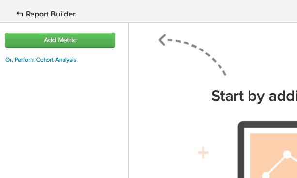
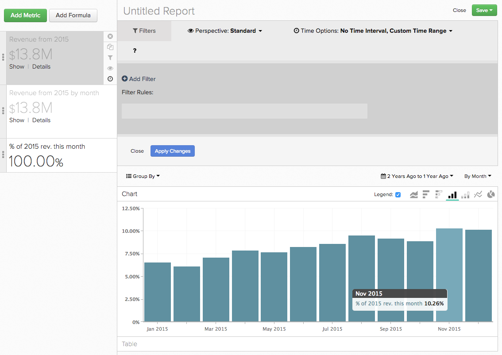
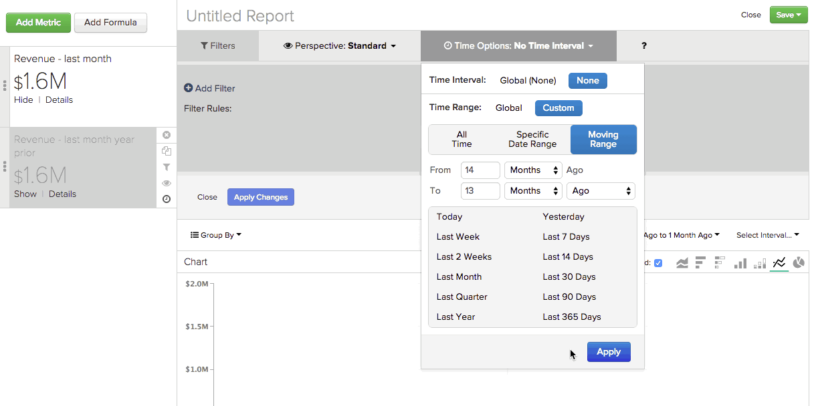
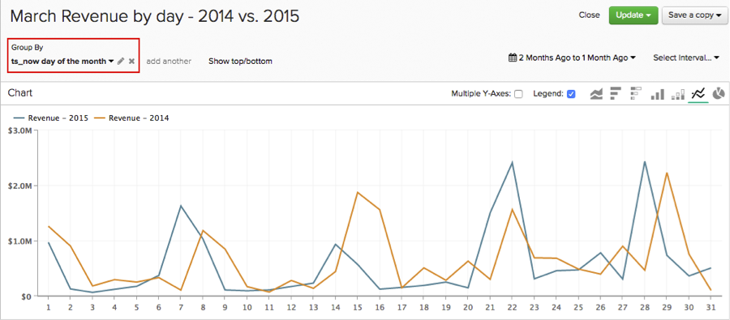
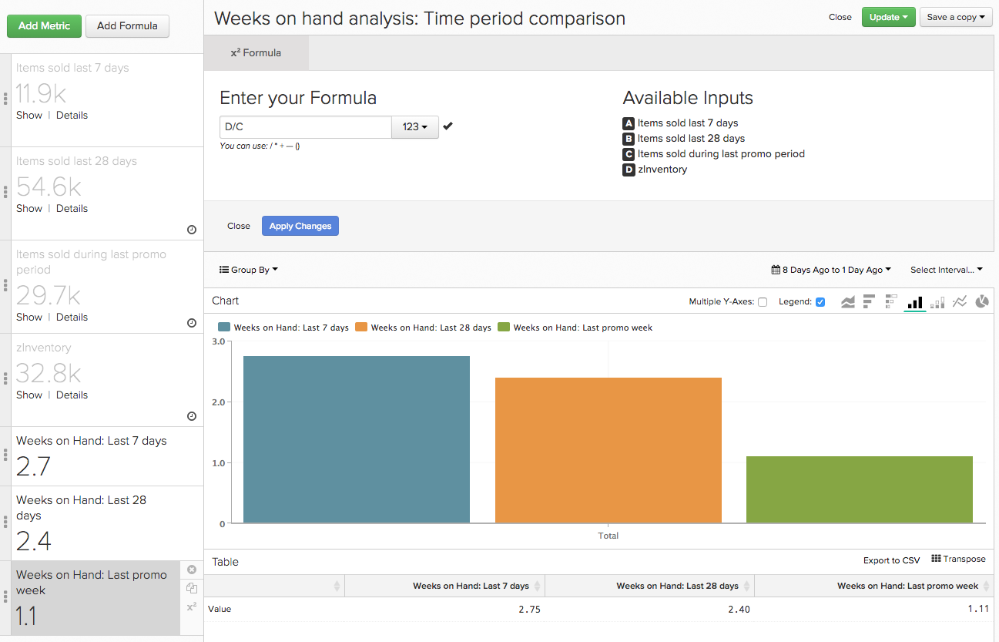

# [!DNL Time]で[!DNL Visual Report Builder] オプションを使用

[!DNL Visual Report Builder]の機能の1つは、グローバル設定`Time Range`と`Interval`です。 これらの設定を使用すると、特定の期間のレポート内のデータを分析できます。

ただし、一部の分析では、同じレポートで異なる時間範囲または時間間隔を考慮する必要がある場合があります。 そこで、`Time` オプションを使用します。 レポートで`Time` オプションを使用する方法をより詳しく説明するために、このチュートリアルでは、次の使用例について説明します。

* [タイムスタンプのない指標の分析](#notimestamp)
* [1つの指標に独立した時間間隔を与える](#independenttimeinterval)
* [異なる時間範囲での同じ指標の比較](#difftimerange)

このトピックで取り上げたサンプルレポートの一部に従う場合は、続行する前に[[!DNL Visual Report Builder]](../data-user/reports/ess-rpt-build-visual.md)を開きます。

## タイムスタンプのない指標の分析 {#notimestamp}

一部の指標では、データが収集されたり、関連するタイムスタンプで保存されたりしないため、時間の経過とともにトレンドを把握できません。 たとえば、在庫テーブルには、多くの場合、SKUごとに1行しか含まれていません。 その場合、タイムスタンプを指定せずに[指標](../data-user/reports/ess-manage-data-metrics.md)を作成する必要があります。

レポートで指標を使用する場合、この指標をレポートに追加すると、独立した`Time Interval`/`None`、`Time Range`/`Global`が自動的に設定されます。

## 1つの指標に独立した時間間隔を与える {#independenttimeinterval}

`Time` オプションを使用すると、時間ベースの100% チャートを作成して、特定の期間に最も価値を提供した日、週、月、年を特定できます。 このセクションでは、年の各暦月に生成された収益の割合を示すグラフを作成します。

このタイプのレポートは、生成された売上を前年比で比較したい場合に役立ちます。 例えば、2015年のグラフでは、1月が年間の売上の18%に貢献し、2016年のグラフではわずか8%であることが示されています。 何が起こったのかを調査することができます。

1. レポートに`Revenue`指標を追加します。
1. **[!UICONTROL Duplicate]**&#x200B;をクリックして、指標のコピーを作成します。
1. 「**[!UICONTROL Time Range]**」オプションをクリックし、「**[!UICONTROL Moving Time Range]**」をクリックします。 これを`Last Year`に設定します。
1. グローバル **[!UICONTROL Time Interval]** オプションをクリックして、`Monthly`に設定します。
1. Report Builderは、2番目の指標に2番目のY軸を自動的に追加します。 `Multiple Y-Axes` ボックスの選択を解除します。
1. 次に、独立した`Time Interval`を最初の指標に適用します。 **[!UICONTROL Time Options]**&#x200B;の右側にある`first Revenue metric` （時計アイコン）をクリックします。
1. レポートの上に表示される拡張ウィンドウで「**[!UICONTROL Time Options]**」をクリックします。
1. ドロップダウンで、次の値を設定します。

   * `Time Interval`：これを`None`に設定します。

   * `Time Range`：最初に`Last Year`、次に&#x200B;**[!UICONTROL Custom]**&#x200B;をクリックし、最後に&#x200B;**[!UICONTROL Moving Range]** オプションを選択して、これを`Last Year`に設定します。

   * **[!UICONTROL Apply]**&#x200B;をクリックして、間隔と範囲の設定を保存します。 これにより、前年の総売上を計算する指標が作成されます。 次に、この指標を数式の分母として使用します。

   * 各月の収益の割合を表示するには、レポートに数式を追加する必要があります。 **[!UICONTROL Add Formula]**&#x200B;をクリックします。

   * 数式フィールドに「`B/A`」と入力し、テキストフィールドの横にあるドロップダウンから「`% Percent`」を選択します。 この計算式は、前年の特定の月の売上額を前年の売上総額で割ったものです。

   * **[!UICONTROL Apply Changes]**&#x200B;をクリックします。

   * 両方の入力指標を非表示にして、数式の名前を変更します。

各月が昨年にどの程度インパクトがあったかがわかります。

## 異なる時間範囲での同じ指標の比較 {#difftimerange}

この例では、`Day number of the month`というカスタムディメンションを使用しています。 このレポートを作成する場合に、このディメンションがData Warehouseにまだ含まれていない場合は、[&#x200B; サポートにお問い合わせください](https://experienceleague.adobe.com/docs/commerce-knowledge-base/kb/troubleshooting/miscellaneous/mbi-service-policies.html)。

このカテゴリーで最も一般的な例は、（1）成長指標（前年比または前月比）の比較、（2）最近の在庫や品目の売上動向をより深く理解することです。

このユースケースを示すために、前月の日別売上高と前年の同月を比較します。 例えば、2016年1月の各日の売上を見て、それを2015年1月や2014年1月などと比較したい場合、このレポートにはそれが表示されます。

1. レポートに`Revenue`指標を追加します。
1. **[!UICONTROL Duplicate]**&#x200B;をクリックして、指標のコピーを作成します。
1. 最初の指標の名前を`Items sold last 7 days`に、2番目の指標の名前を`Items sold last 28 days`に変更します。
1. 「**[!UICONTROL Time Range]**」、「**[!UICONTROL Moving Time Range]**」の順にクリックします。 これを`Last Month`に設定します。
1. **[!UICONTROL Time Interval]**&#x200B;をクリックして`None`に設定します。
1. 2番目の&#x200B;**[!UICONTROL Time Options]**&#x200B;指標の横にある`Revenue` （時計アイコン）をクリックします。
1. レポートの上に表示される拡張ウィンドウで「**[!UICONTROL Time Options]**」をクリックします。
1. ドロップダウンで、次の値を設定します。

   * `Time Interval`：これを`None`に設定します。

   * `Time Range`：最初に`From 14 Months Ago To 13 Months Ago`、**[!UICONTROL Custom]**&#x200B;をクリックして、これを&#x200B;**[!UICONTROL Moving Range]**&#x200B;に設定します。 メニューの上部にあるフィールドとドロップダウンを使用して、範囲を設定します。 この設定を使用すると、前月と前年の売上を確認できます。

   指標がレポートから消える場合は心配しないでください。独立した時間オプションを設定すると、指標がレポートから自動的に非表示になります。 再表示するには、指標の横にある「**[!UICONTROL Show]**」をクリックします。

   

   * **[!UICONTROL Apply]**&#x200B;をクリックして、間隔と範囲の設定を保存します。

   * 次に、`Day number of the month`をクリックしてディメンションを選択し、カスタム **[!UICONTROL Group By]** ディメンションを追加します。 これにより、注文の月の日番号が返されます。例えば、3月2日に行われた注文は`2`を返します。

   * `Group By` ドロップダウンで、`Show All`を選択し、**[!UICONTROL Apply]**&#x200B;をクリックします。 これにより、レポートのX軸の値が作成されます。

   

   * 指標の名前を変更します。 例では、最初の指標は`Revenue - 2015`、2番目の指標は`Revenue - 2014`です。

カスタム `Time Options`のもうひとつの一般的な使用法は、数週間の供給を決定することです。 特にホリデーシーズンや特別なプロモーション期間中は、先週、月、過去のプロモーション期間に販売された商品を考慮して、十分な情報にもとづいた購入決定を下すことができます。

このレポートを自分で作成する際に、必要な時間範囲を忘れずに設定してください。

1. レポートに`Items Sold`指標を追加します。
1. **[!UICONTROL Duplicate]**&#x200B;をクリックして、指標のコピーを作成します。
1. 指標の名前を変更します。 同じ名前を使用するか、類似したものを使用できます。
   1. 最初の指標の名前を`Items sold last 7 days`に変更します。
   1. 2つ目の指標の名前を`Items sold last 28 days`に変更します。
1. `Items sold last 7 days`指標で、「**[!UICONTROL Time Range]**」オプションをクリックし、「**[!UICONTROL Moving Time Range]**」をクリックします。 この例では、`Last 7 Days`に設定します。
1. **[!UICONTROL Time Interval]**&#x200B;をクリックして`None`に設定します。
1. 次に、`Time Options`指標の`Items sold last 28 days`を定義します。 **[!UICONTROL Time Options]**&#x200B;指標の右側にある`second Items sold` （時計アイコン）をクリックします。
1. レポートの上に表示される拡張ウィンドウで「**[!UICONTROL Time Options]**」をクリックします。
1. ドロップダウンで、次の値を設定します。

   * `Time Interval`：これを`None`に設定します。
   * `Time Range`：最初に`From 29 days to 1 day ago`、次に&#x200B;**[!UICONTROL Custom]**&#x200B;をクリックして、これを&#x200B;**[!UICONTROL Moving Range]**&#x200B;に設定します。 メニューの上部にあるフィールドとドロップダウンを使用して、範囲を設定します。
   * **[!UICONTROL Apply]**&#x200B;をクリックして、間隔と範囲の設定を保存します。
   * `Items sold last 28 days`指標を複製し、新しい指標の`Time Options`を開きます。 オプションを次のように設定します。

      * `Time Interval`：これを`None`のままにします。
      * `Time Range`: **[!UICONTROL Specific Date Range]**&#x200B;をクリックして適切な日付を入力し、興味のあるプロモーションに合った日付範囲に変更します。
      * 指標`Items sold during last promotion`などの名前を変更します。
      * `Units on hand`指標を追加します。
      * 次に、レポートに含める期間（`last 7 days`、`last 28 days`、および`last promo`）の売上動向を考慮して、手元にある週を表示する計算を追加する必要があります。 期間ごとに1回ずつ行う必要があります。

数式を作成するには、**[!UICONTROL Add Formula]**&#x200B;をクリックします。 以下の数式を入力し、終了したら「**[!UICONTROL Apply Changes]**」をクリックします。 これを3つの期間ごとに繰り返します。

* `last 7 days time period`に対して、`D / A` フィールドに`Formula`と入力します。
* `last 28 days time period`に対して、`D / (B/4)` フィールドに`Formula`と入力します。

  >[!NOTE]
  >
  >ここで選択した時間範囲を正規化することが重要です。 この例では、28日を4週間に分割します。 数式に別のロジックを適用する必要がある場合があります。

* `last promo period`に対して、`D / C` フィールドに`Formula`と入力します。

  

* 最後に、指標を非表示にし、`SKU`または同様のディメンションを`Group By`としてレポートに追加して、レポートをカスタマイズします。

この例では、現在の在庫量が、製品全体での14日間の販売に適していることを示しています。 しかし、同等のプロモーション期間を追加することで、より多くの在庫を発注し、十分な在庫を備えた商品のみを宣伝するなど、何らかの変更を加える必要があることを示唆しています。

顧客の行動は時間の経過とともに異なるため、分析を実行する際にはデータの違いを確認できます。 カスタム時間オプションを設定すると、複雑な分析をすばやく作成し、過去のトレンドを考慮したデータ主導の意思決定を可能にします。

