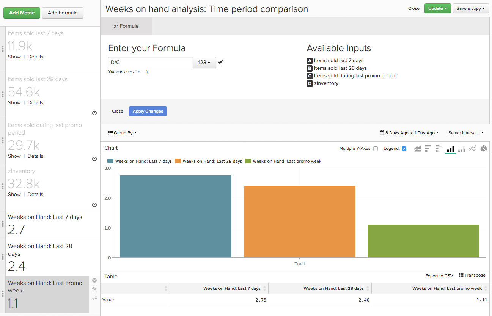

# 使用方法 [!DNL Time] のオプション [!DNL Visual Report Builder]

の機能の 1 つ [!DNL Visual Report Builder] グローバル `Time Range` および `Interval` 設定。 これらの設定を使用すると、特定の期間に関するレポートのデータを分析できます。

ただし、一部の分析では、同じレポート内で異なる時間範囲または時間間隔を考慮する必要が生じる場合があります。 そこがそこです `Time` オプションが用意されています。 の使用方法に関する理解を深めるために `Time` このチュートリアルでは、レポートのオプションで使用できるユースケースは次のとおりです。

* [タイムスタンプのない指標の分析](#notimestamp)
* [1 つの指標に独立した時間間隔を指定する](#independenttimeinterval)
* [異なる時間範囲での同じ指標の比較](#difftimerange)

このトピックで説明するサンプルレポートの一部について理解するには、 [[!DNL Visual Report Builder]](../data-user/reports/ess-rpt-build-visual.md) 続行する前に。

## タイムスタンプのない指標の分析 {#notimestamp}

一部の指標では、データが関連付けられたタイムスタンプで収集または保存されないので、時間の経過と共にトレンドを分析できないだけです。 例えば、多くの場合、在庫テーブルには各 SKU に対して 1 行のみが含まれます。 この場合、次の操作をおこないます [指標の作成](../data-user/reports/ess-manage-data-metrics.md) タイムスタンプを指定しません。

レポートでこのような指標を使用すると、この指標をレポートに追加すると、自動的に独立した指標が設定されます `Time Interval` 件中 `None` および `Time Range` 件中 `Global`:

## 1 つの指標に独立した時間間隔を指定する {#independenttimeinterval}

`Time` オプションを使用すると、時間ベースの 100% グラフを作成し、特定の時間範囲で、どの日、週、月、年が最も価値を生み出したかを特定できます。 このセクションでは、年の各暦月で生成された収益の割合を示すグラフを作成します。

このタイプのレポートは、前年比で生じた収益を比較する場合に役立ちます。 例えば、2015 年のグラフで、1 月がその年の売上高の 18% を占めていたことが明らかになり、2016 年のグラフでは 8% しか示されませんでした。 何が起きたのかを調べ始めることができます。

1. を追加 `Revenue` レポートに対する指標。
1. クリック **[!UICONTROL Duplicate]** 指標のコピーを作成します。
1. グローバルをクリックします。 **[!UICONTROL Time Range]** オプション、次に **[!UICONTROL Moving Time Range]**. これを次に設定 `Last Year`.
1. グローバルをクリックします。 **[!UICONTROL Time Interval]** オプションを選択して、に設定します。 `Monthly`.
1. Report Builderは、2 番目の指標の 2 番目の Y 軸を自動的に追加します。 の選択を解除 `Multiple Y-Axes` ボックス。
1. 次に、独立型を適用します `Time Interval` を最初の指標に追加します。 クリック **[!UICONTROL Time Options]** の右側にある（時計アイコン） `first Revenue metric`.
1. クリック **[!UICONTROL Time Options]** レポートの上に表示される展開ウィンドウで調整します。
1. ドロップダウンで、次の設定を行います。

   * `Time Interval`：これを次のように設定 `None`.

   * `Time Range`：これを次のように設定 `Last Year` 最初にクリックすることで **[!UICONTROL Custom]**、次に **[!UICONTROL Moving Range]**&#x200B;最後に、 `Last Year` オプション。

   * クリック **[!UICONTROL Apply]** 間隔と範囲の設定を保存します。 これにより、前年の合計売上高を計算する指標が作成されます。 次に、この指標を式の分母として使用します。

   * 各月の売上高の割合を表示するには、レポートに式を追加する必要があります。 クリック **[!UICONTROL Add Formula]**.

   * Enter `B/A` 「式」フィールドでを選択します。 `% Percent` テキストフィールドの横にあるドロップダウンから。 この数式は、特定の月の昨年の収益の金額を、昨年収益の合計金額で除算します。

   * クリック **[!UICONTROL Apply Changes]**.

   * 両方の入力指標を非表示にし、式の名前を変更します。

現在、各月が昨年にどの程度影響を与えたかを確認できます。

## 異なる時間範囲での同じ指標の比較 {#difftimerange}

この例では、というカスタムディメンションを使用します `Day number of the month`. このレポートを作成したいが、Data Warehouseにこのディメンションがまだない場合、 [サポートに連絡する](https://experienceleague.adobe.com/docs/commerce-knowledge-base/kb/troubleshooting/miscellaneous/mbi-service-policies.html) お手伝いさせていただきます。

このカテゴリの 2 つの最も一般的な例は、（1）成長指標（前年度の売上高または前月比の売上高）の比較、（2）最近の在庫または品目販売のトレンドをより深く理解することです。

この使用例を示すには、前年の同月と比較した前月の日次売上高を確認します。 2016 年 1 月の各日の売上高を見て、それを 2015 年 1 月、2014 年 1 月などと比較すると、このレポートにはそれが表示されます。

1. を追加 `Revenue` レポートに対する指標。
1. クリック **[!UICONTROL Duplicate]** 指標のコピーを作成します。
1. 最初の指標の名前をに変更します。 `Items sold last 7 days` 2 番目の指標はです `Items sold last 28 days`.
1. クリック **[!UICONTROL Time Range]**、次に **[!UICONTROL Moving Time Range]**. これを次に設定 `Last Month`.
1. クリック **[!UICONTROL Time Interval]** およびを設定します `None`.
1. クリック **[!UICONTROL Time Options]** （時計アイコン） 2 番目の隣 `Revenue` 指標。
1. クリック **[!UICONTROL Time Options]** レポートの上に表示される展開ウィンドウで調整します。
1. ドロップダウンで、次の設定を行います。

   * `Time Interval`：これを次のように設定 `None`.

   * `Time Range`：これを次のように設定 `From 14 Months Ago To 13 Months Ago` 最初にクリックすることで **[!UICONTROL Custom]** その後 **[!UICONTROL Moving Range]**. メニュー上部のフィールドとドロップダウンを使用して、範囲を設定します。 この設定を使用すると、前月の売上高を前年に表示できます。

   指標がレポートから消えても心配しないでください。独立した時間オプションを設定すると、レポートから指標が自動的に非表示になります。 再表示するには、をクリックします **[!UICONTROL Show]** 指標の横。

   

   * クリック **[!UICONTROL Apply]** 間隔と範囲の設定を保存します。

   * 次に、カスタムを追加します `Day number of the month` をクリックしてディメンションを作成 **[!UICONTROL Group By]** ディメンションを選択します。 これにより、注文の月の日数が返されます。例えば、3 月 2 日に注文した場合はが返されます `2`.

   * が含まれる `Group By` ドロップダウン、選択 `Show All` をクリックして、 **[!UICONTROL Apply]**. これにより、レポートの X 軸の値が作成されます。

   

   * 指標の名前を変更します。 この例では、最初の指標はです。 `Revenue - 2015` 2 つ目は `Revenue - 2014`.

カスタムのもう 1 つの一般的な使用方法 `Time Options` は、供給週を決定することです。 特に、ホリデーシーズンや特別なプロモーション期間の間に、情報に基づいた購入の決定を行うために、先週、月、前のプロモーション期間に販売されたアイテムを検討する必要がある場合があります。

このレポートを自分で作成する場合は、必要に応じて時間範囲を設定することを忘れないでください。

1. を追加 `Items Sold` レポートに対する指標。
1. クリック **[!UICONTROL Duplicate]** 指標のコピーを作成します。
1. 指標の名前を変更します。 同じ名前を使用することも、似たものを使用することもできます。
   1. 最初の指標の名前をに変更します。 `Items sold last 7 days`.
   1. 2 番目の指標の名前をに変更します。 `Items sold last 28 days`.
1. 日 `Items sold last 7 days` 指標で、「グローバル」をクリックします。 **[!UICONTROL Time Range]** オプション then **[!UICONTROL Moving Time Range]**. この例では、次のように設定します `Last 7 Days`.
1. クリック **[!UICONTROL Time Interval]** およびを設定します `None`.
1. 次に、 `Time Options` の場合 `Items sold last 28 days` 指標。 クリック **[!UICONTROL Time Options]** の右側にある（時計アイコン） `second Items sold` 指標。
1. クリック **[!UICONTROL Time Options]** レポートの上に表示される展開ウィンドウで調整します。
1. ドロップダウンで、次の設定を行います。

   * `Time Interval`：これを次のように設定 `None`.
   * `Time Range`：これを次のように設定 `From 29 days to 1 day ago` 最初にクリックすることで **[!UICONTROL Custom]**、次に **[!UICONTROL Moving Range]**. メニュー上部のフィールドとドロップダウンを使用して、範囲を設定します。
   * クリック **[!UICONTROL Apply]** 間隔と範囲の設定を保存します。
   * を複製 `Items sold last 28 days` 指標を選択し、新しい指標のを開きます。 `Time Options`. オプションを次のように設定します。

      * `Time Interval`：このをのままにします `None`.
      * `Time Range`：をクリックして、目的のプロモーションに合わせた日付範囲に変更します。 **[!UICONTROL Specific Date Range]** その後、適切な日付を入力します。
      * 指標の名前の変更 `Items sold during last promotion` または似たようなものです。
      * を追加 `Units on hand` 指標。
      * 次に、販売トレンドを考慮して、期間（`last 7 days`, `last 28 days`、および `last promo` 期間）が含まれています。 期間ごとに 1 回ずつ実行する必要があります。

式を作成するには、をクリックします **[!UICONTROL Add Formula]**. 以下に式を入力して、 **[!UICONTROL Apply Changes]** 終了したとき。 次の 3 つの期間のそれぞれについて、これを繰り返します。

* の場合 `last 7 days time period`、と入力します `D / A` が含まれる `Formula` フィールド。
* の場合 `last 28 days time period`、と入力します `D / (B/4)` が含まれる `Formula` フィールド。

  >[!NOTE]
  >
  >選択した時間範囲をここで正規化することが重要です。 この例では 28 日を 4 週間に分割します。 数式に異なるロジックを適用する必要が生じる場合があります。

* の場合 `last promo period`、と入力します `D / C` が含まれる `Formula` フィールド。

  

* 最後に、指標を非表示にしてを追加し、レポートをカスタマイズします。 `SKU` または、などのレポートに類似したディメンション `Group By`.

この例は、現在の在庫レベルが、製品全体で 14 日間の販売に適切に配置されていることを示しています。 ただし、同等のプロモーション期間を追加すると、より多くの在庫を注文し、十分な数の在庫がある商品をプロモーションするだけで、会社はいくつかの変更を加える必要があります。

顧客の動作は時間の経過と共に変化するので、分析を実行する際にデータに違いが生じることが予想されます。 カスタム時間オプションを設定すると、複雑な分析をすばやく作成し、過去のトレンドを考慮したデータ駆動型の決定が可能になります。

