# [!DNL Visual Report Builder]を使用

[[!DNL Visual Report Builder]](../data-user/reports/ess-rpt-build-visual.md)を使用すると、データを視覚的に分析してインサイトを引き出し、ビジネス上の意思決定に役立てることができます。 このチュートリアルでは、基本レポートを作成する手順について説明します。

>[!NOTE]
>
>ダッシュボードにレポートを追加するには、`Standard` [&#x200B; ユーザー権限](../administrator/user-management/user-management.md)と`Edit` ダッシュボードへのアクセス権が必要です。

## 手順1：レポートの作成

レポートの作成を開始するには、サイドバーの&#x200B;**[!UICONTROL Report Builder]**&#x200B;またはダッシュボードの上部にある&#x200B;**[!UICONTROL Add Report]**&#x200B;をクリックします。 `Report Builder` ページが表示されたら、「**[!UICONTROL Visual Report Builder]**」オプションをクリックします。

[!DNL Visual Report Builder]で作成されたレポートを編集するには、グラフの右上隅にある歯車（オプション）アイコンをクリックし、**[!UICONTROL Edit]**&#x200B;をクリックします。

## ステップ 2：指標の追加

分析を作成する最初の手順は、分析する[指標](../data-user/reports/ess-manage-data-metrics.md)を選択することです。 指標はデフォルトでアルファベット順にリストされますが、指標を実行するテーブルでグループ化することもできます。

最初の指標を選択した後に指標を追加し、単一のレポート上のすべての指標をオーバーレイするか、数式を追加して複数の指標の計算を実行できます。

## 手順3: `Formulas`の追加

レポート内の指標のリストのすぐ上にある`Formulas`をクリックすると、**[!UICONTROL Add Formula]**&#x200B;がレポートに追加されます。 [数式エディター](../data-analyst/dev-reports/formulas-in-rpt-bldr.md)では、レポートに含まれる指標のいずれかを入力として使用できます。 基本的な数学的演算子を使用して、様々な指標を操作します。

注文あたりの平均売上を示すレポートを作成するとします。 この場合、`Revenue`指標を`Number of orders`指標で割ります。

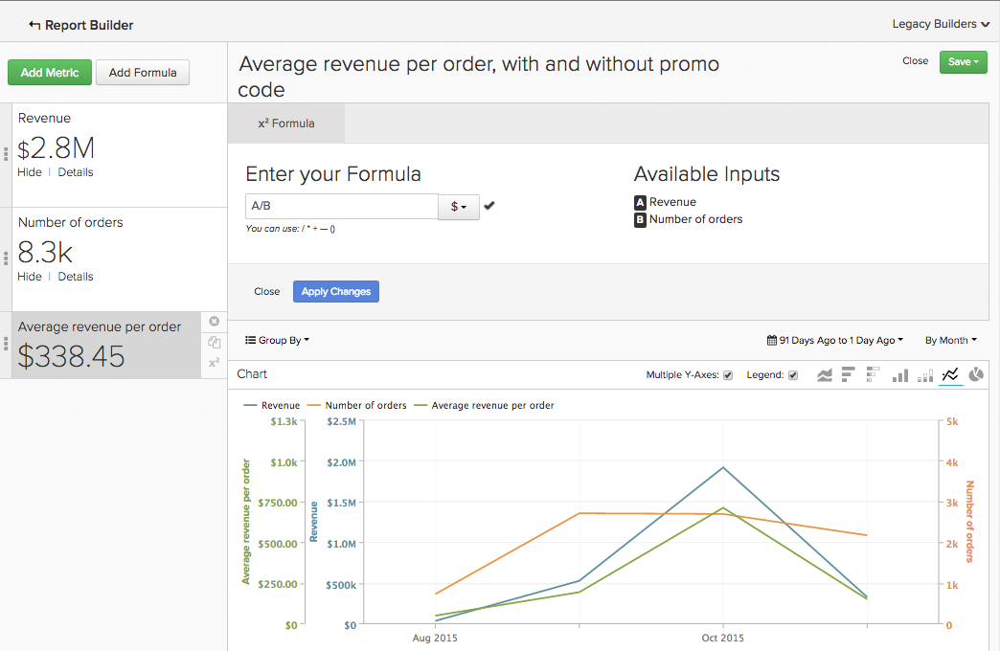

## 手順4: `Time Period`と`Interval of Analysis`の設定 {#time}

特定の期間に焦点を当てるには、分析の期間を設定します。 期間を選択して、データをセグメント化することもできます（例：年、四半期、月など）。 グラフの右上隅にあるメニューを使用して、期間と間隔を設定します。

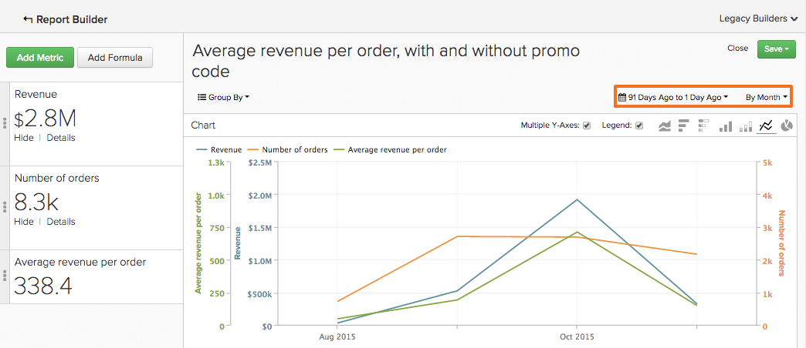

期間に特定の日付範囲を設定する場合は、開始日が間隔の先頭にあり、終了日が間隔の最後にあることを確認します。

例えば、`January 1st`から`March 1st`までの期間を設定し、`monthly`の間隔を選択すると、`March`がデータポイントとして表示されますが、`March`を除く`March 1`では毎日無視されます。 その場合、`Time Period`から`January 1 to March 31`を作成する必要があります。

## ステップ 5: `Group by` / `Segmenting the Analysis` {#groupby}

[指標をデータディメンション &#x200B;](../best-practices/segment-filter.md)でセグメント化するには、グラフの左上にある&#x200B;**[!UICONTROL Group by]** メニューをクリックします。 これにより、リストに含まれる最初の指標の利用可能なすべてのディメンションを含むドロップダウンが表示されます。

指標がセグメント化されないようにするには、`None`を選択できます。 例えば、セグメント化されずに総売上を返す指標と、別の収益指標を地域別にセグメント化する指標を組み合わせることができます。

注文あたりの平均売上の例に戻り、Group byをプロモーションコードに設定します。 これは、プロモーションコードの有無にかかわらず、注文あたりの平均売上を示しています。

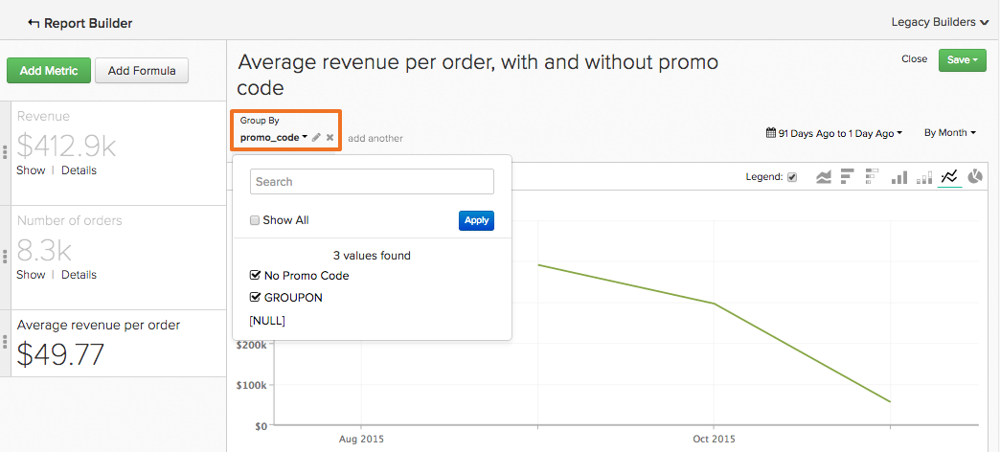

分析に含まれる指標が異なるデータテーブル上に構築されている場合、ポップアップを使用して、各テーブルで一致するデータディメンションを選択できます。 ここでの目的は、セグメント化の値タイプを共有するディメンションを見つけることです。

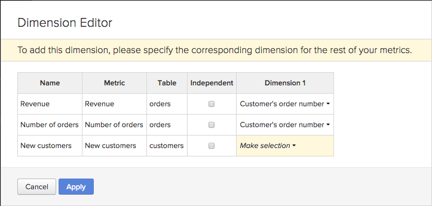

## 手順6: `Metric Filters`、`Perspective`、`Time Interval`の設定 {#metric-specific}

分析に追加された各指標について、フィルターを追加し、関連するデータの遠近法を選択して、`time interval` オプションを設定できます。 これらの機能にアクセスするには、レポートに含まれる指標の横にあるfunnel （`Filter`）、目（`Perspective`）、時計（`Time`）のアイコンをクリックします。

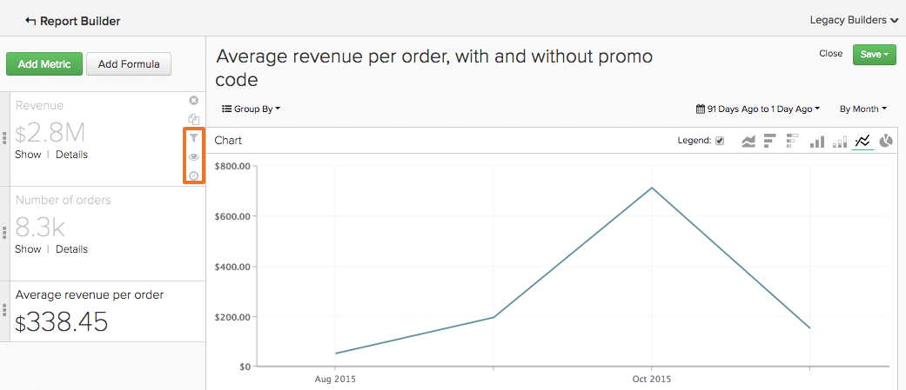

### `Filters`

`Filters`は、分析に含まれるデータセットを制限します。 フィルターは、例えば、個々の獲得チャネルを評価したり、外れ値を削除したりする場合に便利です。

ドロップダウンメニューとテキストボックスに加えて、`LIKE`や`IN`などの特殊なフィルター演算子を使用してフィルターを作成することもできます。

`%`文でワイルドカード（`_`または`LIKE`）を使用することはサポートされています。 `%` ワイルドカードは複数の文字に一致しますが、`_`は1つの文字のみに一致します。 例：

- `affiliate's name Like B%`は、名前が`B`で始まる顧客からのデータのみを許可します。

- `affiliate's name Like _ake`は、名前が`Jake`、`Rake`、`Bake`のようで、`Drake`や`Blake`のようではない顧客からのデータのみを許可します。

複数のフィルターを追加すると、チャートのデータを厳密に制御できます。 デフォルトでは、データを含めるすべてのフィルター条件はtrueである必要がありますが、「フィルタールール」テキストボックスを編集してOR関係を作成できます。

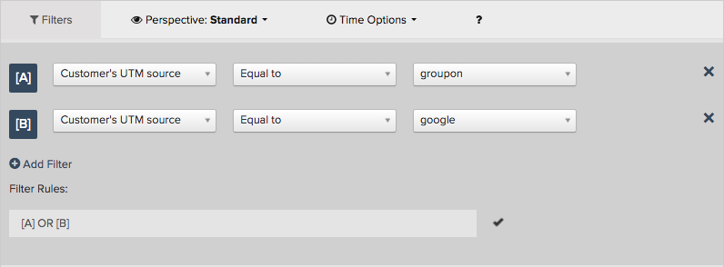

### `Perspectives`

`Perspectives` データの異なるビューを簡単に切り替えることができます。 次のような機能があります。

- `Standard perspective`：標準の遠近法では、X軸の一致する日付（1月の収益など）の結果が表示されます。 これは、注文あたりの平均売上の例で使用する視点です。

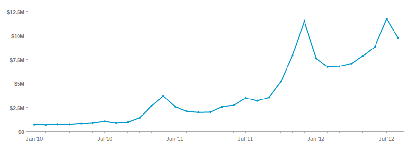

- `Amount`または`Percent Change`と`Previous Period`の視点の比較：この視点は、ある間隔から次の間隔への変化量または変化率を示し、急速に変化する指標の変化率を測定するのに役立ちます。 また、前年と同じ時期と比較して、前年比で成長を示す視点もあります。

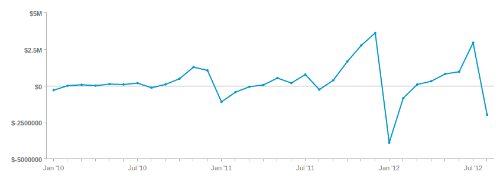

- `Cumulative perspective`: `cumulative perspective`には、期間中の指標の継続的または累積合計金額が表示されます。 これは、多くの場合、総顧客を分析し、将来のキャパシティを計画するために使用されます。

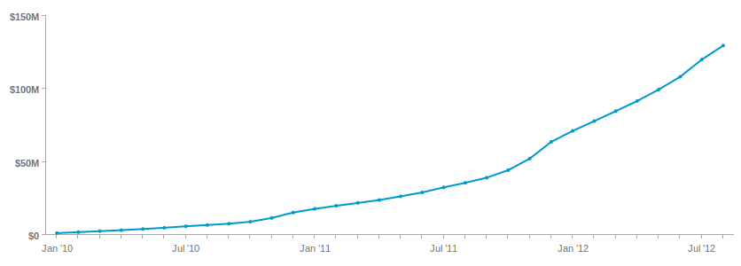

- `Percent of First Value perspective`：この遠近法では、分析に含まれる初回間隔に対する割合でデータが表示されます。 これは、最初の期間のパフォーマンスに対する特定のアクションの有効性を測定するのに役立ちます。

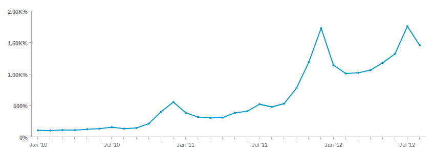

- `Rolling averages window perspective`：移動平均ウィンドウの遠近法は、指定された時間範囲における指標の移動平均値を示します。 間隔は、レポートレベルで設定された間隔と同じである必要があります。 例えば、レポートに収益の最後の四半期が週別に表示されている場合、ウィンドウのローリング平均期間の範囲を4週間に設定できます。 これにより、最初の3つの値がnullになり、4番目の値は収益の最初の4週間の平均を表します。 明確にするために、次の例のように、同じ指標をローリング平均で表示している場合は、`Multiple Y-Axes` チェックボックスをオフにしてください。

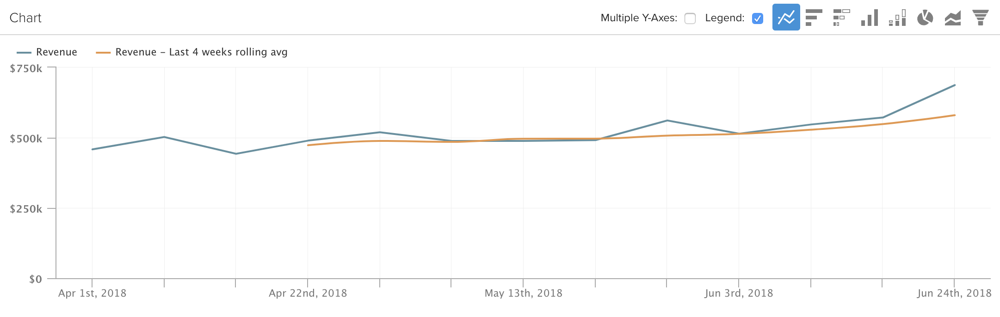

### 指標に特化した時間オプション

レポートで使用される指標には2つのオプションがあります。グローバル時間オプションに従って時間の経過に伴ってトレンドを示すことも、スカラー番号として表示することもできます。

指標の時間間隔を`None`に変更すると、`scalar`個の数値が返されます。これは、時間傾向の指標を`scalar`個の数値で割る数式を作成する場合に便利です。 また、`scalar`指標の時間範囲を、レポートの時間範囲とは独立した時間範囲に変更することもできます。

例えば、2019年の月間収益を2019年総収益に対する割合で示したとします。 2019年1月1日から2019年12月31日までのグローバルな時間範囲を持つレポートに、月間間隔でセグメント化された2つの`Revenue`指標を追加できます。

>[!NOTE]
>
>`group by` ディメンションを追加する場合は、新しいビジュアライゼーションを選択するか、時間間隔を調整してから、数値（`scalar`）だけを保存します。 これらの調整は、次回ダッシュボードからそのレポートを開いたときに保持されません。時間範囲のみが保持されます。

レポートでの時間オプションの使用について詳しくは、この[&#x200B; チュートリアル &#x200B;](../tutorials/time-options-visual-rpt-bldr.md)を参照してください。

## 手順7：レポートの保存

グラフを作成する場合は、**[!UICONTROL Save]**&#x200B;の右上隅にある`Visual Report Builder`をクリックして保存できます。

`scalar` ドロップダウンと、`Type` ドロップダウンを使用してレポートを保存するダッシュボードを使用して、グラフ、表、または数値（`Location`）を保存できます。

次に、**[!UICONTROL Save to Dashboard]**&#x200B;をクリックしてレポートを保存できます。

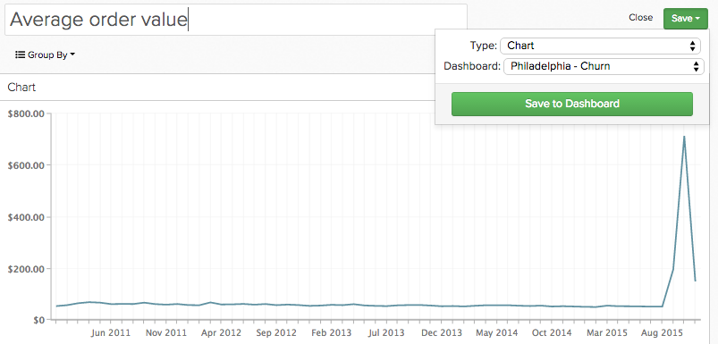

## レポート出力

選択するレポート出力を決定するには、次を参照してください。

### グラフ

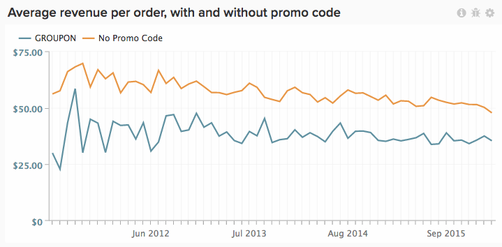

### テーブル

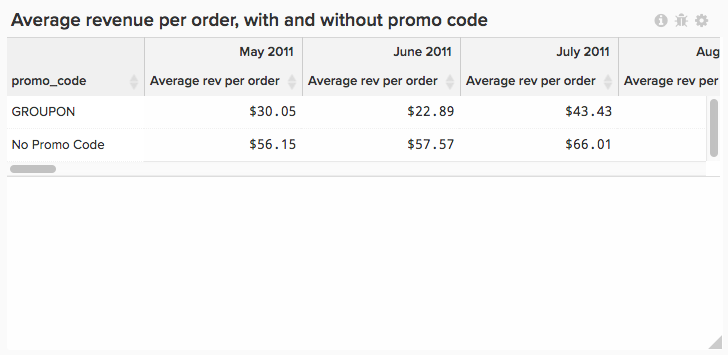

### 数値（`scalar`）

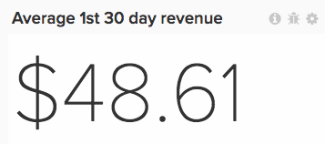

おめでとうございます。 君のおしまいです。
