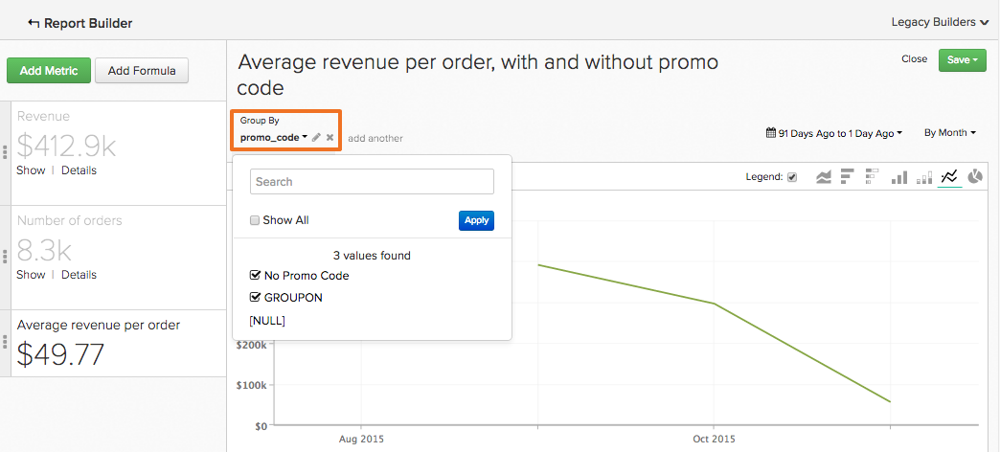
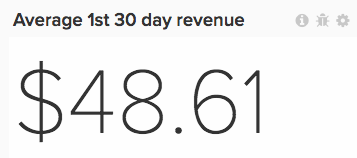

# 以下を使用します。 [!DNL Visual Report Builder]

The [[!DNL Visual Report Builder]](../data-user/reports/ess-rpt-build-visual.md) では、データを視覚的に調べてインサイトを引き出し、ビジネス上の意思決定を促進できます。 このチュートリアルでは、基本レポートの作成手順を説明します。

>[!NOTE]
>
>レポートをダッシュボードに追加するには、次の手順を実行します。 `Standard` [ユーザー権限](../administrator/user-management/user-management.md) および `Edit` ダッシュボードにアクセスできます。

## 手順 1：レポートの作成

レポートの作成を開始するには、 **[!UICONTROL Report Builder]** サイドバーまたは **[!UICONTROL Add Report]** をクリックします。 次の場合に `Report Builder` ページが表示されたら、 **[!UICONTROL Visual Report Builder]** オプション。

レポートを編集するには、 [!DNL Visual Report Builder]をクリックし、グラフの右上隅にある歯車（オプション）アイコンをクリックして、 **[!UICONTROL Edit]**.

## 手順 2：指標の追加

分析を作成する最初の手順は、「選択」です [指標](../data-user/reports/ess-manage-data-metrics.md) をクリックして分析します。 デフォルトでは指標はアルファベット順にリストされますが、指標の基となるテーブル別にグループ化することもできます。

最初の指標が選択された後に指標を追加し、すべての指標を 1 つのレポートに重ねて表示したり、数式を追加して複数の指標の計算を実行したりできます。

## 手順 3：追加 `Formulas`

`Formulas` をクリックすると、 **[!UICONTROL Add Formula]**：レポート内の指標のリストのすぐ上にあります。 Adobe Analytics の [数式エディター](../data-analyst/dev-reports/formulas-in-rpt-bldr.md)の場合、レポートに含まれる任意の指標を入力として使用できます。 基本的な数学演算子は、様々な指標を操作するために使用されます。

注文あたりの平均売上高を示すレポートを作成したいとします。 この場合、 `Revenue` 指標 `Number of orders` 指標。

## 手順 4: `Time Period` および `Interval of Analysis` {#time}

特定の時間の範囲に焦点を当てるには、解析の期間を設定します。 また、期間を選択して、データをセグメント化することもできます（年、四半期、月など）。 グラフの右上隅にあるメニューを使用して、期間と間隔を設定します。

期間に特定の日付範囲を設定する場合は、開始日が間隔の開始日で、終了日が間隔の終了日であることを確認します。

例えば、 `January 1st` から `March 1st` とを選択します。 `monthly` 間隔表示 `March` データポイントとして、では毎日無視します。 `March` 例外 `March 1`. その場合、 `Time Period` から `January 1 to March 31`.

## 手順 5: `Group by` / `Segmenting the Analysis` {#groupby}

[データディメンションで指標をセグメント化するには](../best-practices/segment-filter.md)をクリックし、 **[!UICONTROL Group by]** メニューを使用できます。 これにより、リストに含まれている最初の指標の使用可能なディメンションがすべて含まれたドロップダウンが表示されます。

次を選択できます。 `None` 指標がセグメント化されるのを防ぐため。 例えば、セグメント化せずに合計売上高を返し、別の売上高指標を地域別にセグメント化してもらう指標が必要な場合があります。

ご注文ごとの平均売上高の例に戻り、プロモーションコードに「グループ化基準」を設定します。 これは、プロモーションコードのある注文とない注文の平均売上高を示します。

分析に含まれる指標が異なるデータテーブルに基づいて構築されている場合、ポップアップを使用して、各テーブルで一致するデータディメンションを選択できます。 ここでの目標は、セグメント化の値のタイプを共有するディメンションを見つけることです。

## 手順 6：設定 `Metric Filters`, `Perspective`、および `Time Interval` {#metric-specific}

分析に追加された各指標に対して、フィルターの追加、関連するデータパースペクティブの選択および `time interval` オプション。 これらの機能にアクセスするには、ファネル (`Filter`), eye (`Perspective`)、および clock (`Time`) アイコンが表示されます。

### `Filters`

`Filters` 分析に含まれるデータセットを制限します。 フィルターは、例えば、個々の獲得チャネルを評価し、外れ値を削除する場合に便利です。

ドロップダウンメニューやテキストボックスに加えて、次のような特別なフィルター演算子も使用できます。 `LIKE` または `IN` フィルターを作成します。

ワイルドカード (`%` または `_`) を `LIKE` ステートメントがサポートされています。 The `%` ワイルドカードは複数の文字に一致しますが、 `_` 1 文字にのみ一致します。 例：

- `affiliate's name Like B%` で始まる名前の顧客のデータのみを許可します `B`.

- `affiliate's name Like _ake` 名前が次のような顧客のデータのみを許可します `Jake`, `Rake`または `Bake` しかし、 `Drake` または `Blake`.

複数のフィルターを追加すると、グラフのデータをきつく制御できます。 デフォルトでは、データの一部が含まれる場合、すべてのフィルタ条件は true である必要がありますが、「フィルタ規則」(Filter Rules) テキストボックスを編集して、OR の関係を作成できます。

### `Perspectives`

`Perspectives` データの様々なビューを簡単に切り替えることができます。 利用可能な項目を確認します。

- `Standard perspective`：標準パースペクティブには、X 軸の照合日の結果（例えば、1 月の売上高）が表示されます。 これは、「注文あたりの平均売上高」の例で使用するパースペクティブです。

- `Amount` または `Percent Change` 対比 `Previous Period` パースペクティブ：このパースペクティブは、ある間隔から次の間隔への変化の量またはパーセントを示し、変化の速い指標の変化率の測定に役立ちます。 また、前年同期との期間を比較し、前年比の伸びを示す観点もある。

- `Cumulative perspective`: `cumulative perspective` 期間中の指標の継続中の合計または累積の合計値を示します。 これは、多くの場合、合計顧客数の分析や将来の容量の計画に使用されます。

- `Percent of First Value perspective`：このパースペクティブでは、データを、分析に含まれる最初の期間の割合として表示します。 これは、最初の期間のパフォーマンスに対する特定のアクションの有効性を測定する際に役立ちます。

- `Rolling averages window perspective`：周期平均ウィンドウのパースペクティブには、指定した期間における指標の周期平均値が表示されます。 間隔は、レポートレベルで設定されている間隔と同じにする必要があります。 例えば、レポートに売上高の前四半期が週別に表示されている場合、周期的な平均期間を 4 週間に設定できます。 これにより、最初の 3 つの値が null になり、4 番目の値が売上高の最初の 4 週間の平均を表します。 明確にするには、 `Multiple Y-Axes` チェックボックスをオンにします。

### 指標固有の時間オプション

レポートで使用する指標には、グローバルな時間オプションに従って経時的にトレンドを表示するか、スカラー数で表示するかの 2 つのオプションがあります。

指標の時間間隔の変更 `None` は、 `scalar` 数値。時間トレンド指標を `scalar` 数値。 また、 `scalar` 指標をレポートの時間範囲とは無関係の時間範囲に追加します。

例えば、2019 年の月別売上高を 2019 年の売上高全体に対する割合で表したいとします。 2 つの `Revenue` 2019 年 1 月 1 日から 2019 年 12 月 31 日までのグローバルな時間範囲を持つレポートの指標を、月別の間隔で分類したものとして追加しました。

>[!NOTE]
>
>次を追加する場合： `group by` ディメンションを作成する場合は、新しいビジュアライゼーションを選択するか、期間を調整して、数値 (`scalar`) をクリックします。 これらの調整は、次回ダッシュボードからそのレポートを開いたときには保持されません。その時間範囲のみが保持されます。

レポートでの時間オプションの使用について詳しくは、次を参照してください： [チュートリアル](../tutorials/time-options-visual-rpt-bldr.md).

## 手順 7：レポートの保存

グラフを作成する際に、 **[!UICONTROL Save]** の右上隅に `Visual Report Builder`.

グラフ、表、数値 (`scalar`) を `Type` ドロップダウンと、 `Location` ドロップダウン。

その後、「 **[!UICONTROL Save to Dashboard]**.

## レポート出力

どのレポート出力を選択するかを判断するには、次を参照してください。

### グラフ

### テーブル

### 数値 (`scalar`)

おめでとうございます。完了しました。
